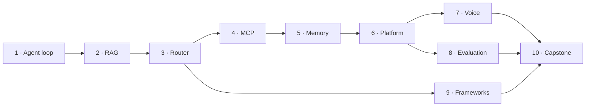

# Програма курсу

Десять етапів, ~45–55 годин. Кожен етап самодостатній: можна почати з будь-якого, якщо
розумієш терміни з [глосарію](GLOSSARY.md).

**Статус на 2026-08-25:** скелет матеріалізовано, **усі десять етапів завершено**.

---

## Порядок і залежності

Стрілка — «спирається на», а не «неможливо без». Етап 9 залежить лише від етапу 3, тож його
можна пройти одразу після нього.

## Три акти

| Акт | Етапи | Що відбувається |
|---|---|---|
| **I. Будуємо** | 1–5 | Кожен етап додає агенту нову здатність. Наприкінці є всі блоки, але не система. |
| **II. Зшиваємо** | 6 | Блоки стають одним сервісом на справжньому сервері за HTTPS. |
| **III. Перевіряємо** | 7–9 | Нічого нового не додається. Перевіряється те, що вже є: латентність, якість, вибір інструмента. |
| **Фінал** | 10 | Переписуємо начисто, обґрунтовуючи кожне рішення, і деплоїмо вдруге. |

---

## Етапи

Позначення статусу: ⬜ не почато · 🟡 в роботі · ✅ готово

### ✅ 1 · Agent loop — 2–3 год

**Мета:** зрозуміти, що агент — це цикл, а не модель.
**Будуєш:** ReAct-цикл з нуля, без фреймворку. Валідація аргументів за JSON-схемою,
ліміт кроків, гейт підтвердження для незворотних дій.
**Розумієш:** чому LLM не виконує функції сам; що всередині `tool_call`; три режими
відмови зі статті — нескінченний цикл, вигадані аргументи, небезпечна дія.
**Доказ:** підробка, що зациклюється, зупиняється лімітом; криві аргументи не доходять
до інструмента.
**Залежності:** —
**Готово:** 30 перевірок (15 на режими відмови), демо 0.12 с, перевірки 1.4 с,
`loop.py` 116/120 рядків, `gate.py` 36, `validate.py` 48/60. Пройшов незалежне рев'ю:
[протокол](docs/features/s01-agent-loop/_review/review-2026-08-23.md).
[Урок](stages/s01_agent_loop/README.md)

### ⬜ 2 · RAG — 3–4 год

**Мета:** перестати вважати retrieval магією.
**Будуєш:** embed → косинусна близькість → top-k → відповідь із посиланням на джерело.
Чанкінг. Плюс `DECISION.md` — дерево «RAG чи fine-tuning» як робочий чекліст.
**Розумієш:** що embedding — це координати змісту; як розмір чанка міняє відповідь;
навіщо provenance.
**Доказ:** на детермінованому ембеддері запит «скільки днів на повернення» дає топ-1 =
політика повернень, а відповідь містить цитату.
**Залежності:** 1

### ✅ 3 · Router — 4–5 год

**Мета:** побачити, що supervisor — це той самий агент, у якого інструменти є агентами.
**Будуєш:** спершу **власний міні-граф на ~60 рядків**, потім той самий результат на
LangGraph. Схема стану проєктується свідомо, з лічильником round-trips.
**Розумієш:** чому один роздутий агент програє трьом вузьким; чому схема стану — найдорожче
для зміни рішення; коли supervisor надлишковий.
**Доказ:** 6 запитів потрапляють до правильних спеціалістів; цикл ревізій зупиняється лімітом.
**Залежності:** 1

### ✅ 4 · MCP — 3–4 год

**Мета:** відділити логіку агента від інтеграцій.
**Будуєш:** MCP-сервер і stdio-клієнт; агент етапу 3 переходить із локальних функцій
на MCP без зміни своєї логіки.
**Розумієш:** ролі host / client / server; різницю tools, resources, prompts; чому
`list_tools()` робить інтеграцію дискаверабельною; чому кілька добре продуманих
інструментів краще за мапу всіх ендпоінтів API.
**Доказ:** парсер бере виділений блок, а не всю відповідь — проза навколо даних
ігнорується, а її відсутність стає окремим названим станом; чужа схема не валить
реєстр, а дубльоване імʼя не затінює перше оголошення.
**Залежності:** 3

### ✅ 5 · Memory — 3–4 год

**Мета:** зрозуміти, що пам'ять — не фіча моделі, а система навколо неї.
**Будуєш:** короткочасну (вікно + сумаризація при переповненні) і довготривалу
(extract → store → retrieve), спершу на словнику, потім із семантичним пошуком.
**Розумієш:** чому «зберігати все» деградує якість (context rot); що робити з
суперечливими фактами; навіщо TTL.
**Доказ:** факт із першої сесії доступний у другій — **і** нерелевантний факт у контекст
не потрапляє з названою причиною. Друга половина важливіша за першу: перевірка, що
стверджує лише «чуже не дійшло», лишається зеленою на порожній видачі.
**Залежності:** 2

### ✅ 6 · Platform — 6–8 год · **перший деплой**

**Мета:** побачити, що продакшн — це нудно і що саме в цьому суть.
**Будуєш:** FastAPI зшиває етапи 1–5. Автентифікація, rate limit, бюджетний запобіжник,
`/healthz`, `/metrics`. `docker compose` + Caddy + HTTPS на справжній VM.
**Розумієш:** класифікатор проти повного supervisor — справжній компроміс, не догма;
чому Prometheus не відповідає на питання «чому агент так вирішив»; **чому `--workers 2`
зламав фонову задачу** — пастку відтворюємо навмисно й виправляємо.
**Доказ:** `deploy/smoke.sh` проходить проти реального HTTPS-URL.
**Залежності:** 5

### ✅ 7 · Voice — 5–6 год

**Мета:** отримати число «до» і число «після».
**Будуєш:** один конвеєр двічі — батчевий і стрімінговий, обидва з вимірюванням. Barge-in
із порогом VAD і мінімальною тривалістю. Prefetch для повільного інструмента.
Реальний режим: мікрофон у браузері → WebSocket → Whisper → LLM → Piper.
**Розумієш:** звідки взялися 600 мс; що таке time-to-first-audio; чому p95 важливіший за
середнє; скільки коштує синхронний виклик інструмента в голосі.
**Доказ:** стрімінг у 3.5 раза швидший до першого звуку (1574 -> 450 мс), і виграш
розкладено на дві різні частини; 100 мс шуму не перериває, 80 мс мовлення не перериває,
300 мс мовлення — перериває.
**Залежності:** 6

### ✅ 8 · Evaluation — 4–5 год

**Мета:** перестати казати «начебто працює».
**Будуєш:** харнес на трьох рівнях **поверх трейсів, які збираються з етапу 1**. 21 кейс,
9 із них крайні — за спостережною властивістю трейсу, не за міткою. Детермінований чек плюс
LLM-as-judge з детекторами біасу над ним. Online-семплінг 10 % трафіку детермінованим хешем.
**Розумієш:** чому шлях важливіший за пункт призначення; коли суддя-LLM виправданий, а коли
це дорога заміна `==`; чому «не оцінено» — третій стан і чому знаменник — усі кейси.
**Доказ:** перестановка відповідей місцями змінює вердикт судді — 3 перевороти з 3, і нуль
із 3 на стабільному судді. Position bias видно на власних даних, а не в переказі.
**Залежності:** 6

### ✅ 9 · Frameworks — 3–4 год

**Мета:** обирати інструмент за обмеженням, а не за хайпом.
**Будуєш:** один таск (research → writer) **чотири** рази — включно з базовою лінією без
жодного фреймворка. Контракт задачі виконуваний, тож відхилення ловиться, а не помічається.
Міряєш токени на межі провайдера, виконані рядки пакета й «місць прози» → таблиця з **власними**
числами.
**Розумієш:** явну проти неявної координації; що фреймворк — це риштування, а не архітектура;
у якій **валюті** платить кожен.
**Доказ:** твої числа або підтверджують твердження статті 9, або ні. Тут — не підтвердили:
LangGraph додає **нуль** токенів понад запит, але виконує 1895 рядків за автора там, де базова
лінія виконує нуль. Платять різним, тож переможця немає.
**Залежності:** 3

### ✅ 10 · Capstone — 8–10 год · **другий деплой**

**Мета:** зібрати судження, а не конспект.
**Будуєш:** support-агент для інтернет-магазину, зібраний із дев'яти етапів, — і **вимір
самого складання**: скільки рядків кожного етапу виконується на запит і скільки коштували
перехідники. `ARCHITECTURE.md` обґрунтовує кожне рішення посиланням на етап-джерело, і
посилання **розбирається кодом**, а не читається очима.
**Розумієш:** що курс учив не десяти темам, а вмінню робити ті самі компроміси в системі,
про яку туторіалу ще ніхто не написав. І що «імпортує» — не те саме, що «використовує».
**Доказ:** e2e на підробці — 6 сценаріїв, кожен звіряє гілку, склад частин, покликані
інструменти й фінальний стан; етап 6 імпортує етап 2 і виконує з нього **нуль** рядків —
заміряно, не заявлено.
**Залежності:** 7, 8, 9
**Готово:** 32 перевірки (16 на режими відмови), 6 частин працюють і 3 свідомо не ввімкнені,
173 виконані рядки етапів проти 12 перехідників (7 %), 24 рішення з джерелом і 0 битих
посилань. Другий деплой піднімається застосунком етапу 6, без власного HTTP-шару; прогін
проти справжнього HTTPS лишається `НЕ ПЕРЕВІРЕНО` — він потребує піднятої машини.
[Урок](stages/s10_capstone/README.md)

---

## Як робиться етап

Послідовність, гейти й уроки з попередніх етапів — [PLAYBOOK.md](PLAYBOOK.md).
Читати перед стартом кожного етапу, а не один раз.

## Що означає «етап завершено»

Не «код написано», а всі дев'ять пунктів:

1. `README.md` (UA): «що ти зможеш після цього етапу» → канон зі статті → міст на наш
   домен → «що зламати».
2. `README.en.md` — один екран англійською.
3. `python -m stages.sNN_slug.run` працює на профілі `local` **без API-ключа**.
4. `python -m stages.sNN_slug.check` зелений офлайн, і серед перевірок є **щонайменше одна
   на режим відмови**.
5. `exercises.md` — 3–4 завдання з очікуваним результатом; `solutions/` — еталони.
6. `CHECKLIST.md` — «я зрозумів / я запустив / я пояснив».
7. Нові терміни в [GLOSSARY.md](GLOSSARY.md).
8. Статус оновлено тут.
9. Етапи 6 і 10 додатково: `deploy/smoke.sh` проходить проти реального URL.

Пункт 4 — найважливіший. Зелений щасливий шлях не доводить нічого про те, що станеться,
коли піде не так.
