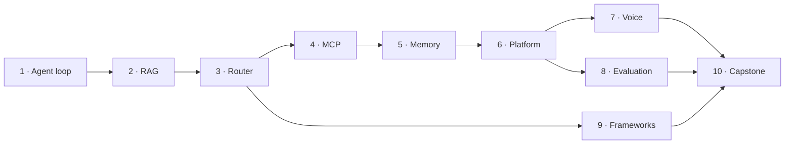

# Curriculum

Ten stages, roughly 45–55 hours. Each one stands on its own: you can start anywhere, provided
the terms in the [glossary](GLOSSARY.md) mean something to you.

**Status as of 2026-08-26: all ten stages are finished.**

---

## Order and dependencies

An arrow means "builds on", not "impossible without". Stage 9 depends only on stage 3, so it
can be taken straight after it.

## Three acts

| Act | Stages | What happens |
|---|---|---|
| **I. Build** | 1–5 | Each stage gives the agent one new capability. At the end you have every block and no system. |
| **II. Join** | 6 | The blocks become one service on a real server behind HTTPS. |
| **III. Check** | 7–9 | Nothing new is added. What already exists gets examined: latency, quality, choice of tool. |
| **Finale** | 10 | Reassemble cleanly, justify every decision, and deploy a second time. |

---

## The stages

### ✅ 1 · Agent loop — 2–3 h

**Goal:** understand that an agent is a loop, not a model.
**You build:** a ReAct loop from scratch, no framework. Argument validation against a JSON
schema, a step limit, and a confirmation gate for irreversible actions.
**You understand:** why an LLM does not call functions itself; what is inside a `tool_call`;
three failure modes — the endless loop, invented arguments, the dangerous action taken "just
in case".
**The proof:** a fake that loops forever is stopped by the limit; malformed arguments never
reach the tool.
**Depends on:** —
**Done:** 30 checks (15 on failure modes), demo 0.12 s, checks 1.4 s, `loop.py` 116/120 lines,
`gate.py` 36, `validate.py` 48/60. Passed an independent review:
[record](docs/features/s01-agent-loop/_review/review-2026-08-23.md).
[Lesson](stages/s01_agent_loop/README.md)

### ✅ 2 · RAG — 3–4 h

**Goal:** stop treating retrieval as magic.
**You build:** embed → cosine similarity → top-k → an answer that cites its source. Chunking.
Plus `DECISION.md` — the "RAG or fine-tuning" tree as a working checklist.
**You understand:** that an embedding is coordinates of meaning; how chunk size changes the
answer; what provenance is for.
**The proof:** on a deterministic embedder, "how many days do I have to return this" puts the
returns policy at rank one, and the answer carries the quotation.
**Depends on:** 1
**Done:** 49 checks (24 on failure modes).
[Lesson](stages/s02_rag/README.md)

### ✅ 3 · Router — 4–5 h

**Goal:** see that a supervisor is the same agent, with other agents as its tools.
**You build:** first **your own mini-graph in about 60 lines**, then the same result on
LangGraph. The state schema is designed deliberately, with a round-trip counter.
**You understand:** why one bloated agent loses to three narrow ones; why the state schema is
the most expensive decision to change later; when a supervisor is overkill.
**The proof:** six requests reach the right specialists; the revision loop is stopped by its
limit.
**Depends on:** 1
**Done:** 38 checks (20 on failure modes).
[Lesson](stages/s03_router/README.md)

### ✅ 4 · MCP — 3–4 h

**Goal:** separate the agent's logic from its integrations.
**You build:** an MCP server and a stdio client; the stage 3 agent moves from local functions
to MCP without changing its own logic.
**You understand:** the host / client / server roles; the difference between tools, resources
and prompts; why `list_tools()` makes an integration discoverable; why a few well-considered
tools beat a map of every API endpoint.
**The proof:** the parser takes the marked block rather than the whole reply — prose around the
data is ignored, and its absence becomes a named state of its own; a foreign schema does not
break the registry, and a duplicate name does not shadow the first declaration.
**Depends on:** 3
**Done:** 36 checks (21 on failure modes).
[Lesson](stages/s04_mcp/README.md)

### ✅ 5 · Memory — 3–4 h

**Goal:** understand that memory is not a model feature but a system around it.
**You build:** short-term (a window plus summarisation on overflow) and long-term (extract →
store → retrieve), first on a dictionary and then with semantic search.
**You understand:** why "store everything" degrades quality (context rot); what to do with
contradicting facts; what a TTL is for.
**The proof:** a fact from the first session is available in the second — **and** an irrelevant
fact stays out of the context with a named reason. The second half matters more than the first:
a check that only asserts "someone else's data did not arrive" stays green on an empty result.
**Depends on:** 2
**Done:** 42 checks (27 on failure modes).
[Lesson](stages/s05_memory/README.md)

### ✅ 6 · Platform — 6–8 h · **first deploy**

**Goal:** see that production is boring, and that this is exactly the point.
**You build:** FastAPI joins stages 1–5. Authentication, rate limiting, a budget breaker,
`/healthz`, `/metrics`. `docker compose` plus Caddy and HTTPS on a real VM.
**You understand:** a classifier against a full supervisor — a real trade-off, not dogma; why
Prometheus cannot answer "why did the agent decide that"; **why `--workers 2` broke the
background job** — the trap is reproduced deliberately and then fixed.
**The proof:** `deploy/smoke.sh` passes against a real HTTPS URL.
**Depends on:** 5
**Done:** 69 checks (57 on failure modes); smoke against live HTTPS.
[Lesson](stages/s06_platform/README.md)

### ✅ 7 · Voice — 5–6 h

**Goal:** get a number for "before" and a number for "after".
**You build:** one pipeline twice — batch and streaming, both instrumented. Barge-in with a VAD
threshold and a minimum duration. Prefetch for a slow tool. Live mode: browser microphone →
WebSocket → Whisper → LLM → Piper.
**You understand:** where the 600 ms came from; what time-to-first-audio is; why p95 matters
more than the mean; what a synchronous tool call costs inside a voice turn.
**The proof:** streaming is 3.5× faster to first audio (1574 → 450 ms), and the gain is split
into two distinct parts; 100 ms of noise does not interrupt, 80 ms of speech does not interrupt,
300 ms of speech does.
**Depends on:** 6
**Done:** 44 checks (37 on failure modes).
[Lesson](stages/s07_voice/README.md)

### ✅ 8 · Evaluation — 4–5 h

**Goal:** stop saying "seems to work".
**You build:** a harness on three levels **over the traces collected since stage 1**. 21 cases,
9 of them edge cases — by an observable property of the trace, not by a label. A deterministic
check plus LLM-as-judge with bias detectors above it. Online sampling of 10 % of traffic by a
deterministic hash.
**You understand:** why the path matters more than the destination; when a model judge is
justified and when it is an expensive replacement for `==`; why "unscored" is a third state and
why the denominator is every case.
**The proof:** swapping the answers around changes the judge's verdict — three flips out of
three, and zero out of three on a steady judge. Position bias shown on your own data rather
than quoted.
**Depends on:** 6
**Done:** 31 checks (15 on failure modes).
[Lesson](stages/s08_eval/README.md)

### ✅ 9 · Frameworks — 3–4 h

**Goal:** choose a tool by your constraint rather than by the noise around it.
**You build:** one task (research → writer) **four** times, including a baseline with no
framework at all. The task contract is executable, so a deviation is caught rather than
noticed. You measure tokens at the provider boundary, executed lines of the package, and
"prose places" → a table of **your own** numbers.
**You understand:** explicit against implicit coordination; that a framework is scaffolding
rather than architecture; which **currency** each one charges in.
**The proof:** your numbers either support the usual claim or they do not. Here they did not:
LangGraph adds **zero** tokens above the request but executes 1895 lines on your behalf where
the baseline executes none. They charge in different currencies, so there is no winner.
**Depends on:** 3
**Done:** 28 checks (12 on failure modes).
[Lesson](stages/s09_frameworks/README.md)

### ✅ 10 · Capstone — 8–10 h · **second deploy**

**Goal:** assemble judgement rather than notes.
**You build:** a support agent for an online shop, assembled from nine stages — and a
**measurement of the assembly itself**: how many lines of each stage execute per request, and
what the adapters between them cost. `ARCHITECTURE.md` justifies every decision by citing a
source stage, and the citation is **parsed by code** rather than read by eye.
**You understand:** that the course taught not ten topics but the habit of making the same
trade-offs in a system nobody has written a tutorial about. And that "imports" is not the same
as "uses".
**The proof:** end-to-end on a fake — six scenarios, each checking the branch, the parts that
took part, the tools called and the final state; stage 6 imports stage 2 and executes **zero**
of its lines — measured, not asserted.
**Depends on:** 7, 8, 9
**Done:** 32 checks (16 on failure modes), 6 parts execute and 3 are deliberately not wired,
173 executed stage lines against 12 adapter lines (7 %), 24 decisions with a source and 0
dangling citations. The second deploy is served by stage 6's application with no HTTP layer of
its own; the run against a real HTTPS domain stays `NOT EVALUATED` — it needs a live machine.
[Lesson](stages/s10_capstone/README.md)

---

## How a stage gets made

The sequence, the gates and the lessons already paid for: [PLAYBOOK.md](PLAYBOOK.md). Read it
before starting each stage, not once.

## What "the stage is finished" means

Not "the code is written", but all nine of these:

1. `README.md` — the lesson: "what you will be able to do after this stage" → the canonical
   idea → the bridge to our own domain → "what to break".
2. `README.md` opens with a short orientation block, so a reader landing from an article knows
   within one screen what the stage is and how to run it.
3. `python -m stages.sNN_slug.run` works on the `local` profile **with no API key**.
4. `python -m stages.sNN_slug.check` is green offline, and at least **one check covers a
   failure mode**.
5. `exercises.md` — three or four tasks with expected results; `solutions/` — the references.
6. `CHECKLIST.md` — "I understood / I ran / I explained".
7. New terms added to [GLOSSARY.md](GLOSSARY.md).
8. Status updated here.
9. Stages 6 and 10 additionally: `deploy/smoke.sh` passes against a real URL.

Item 4 is the important one. A green happy path proves nothing about what happens when things
go wrong.
