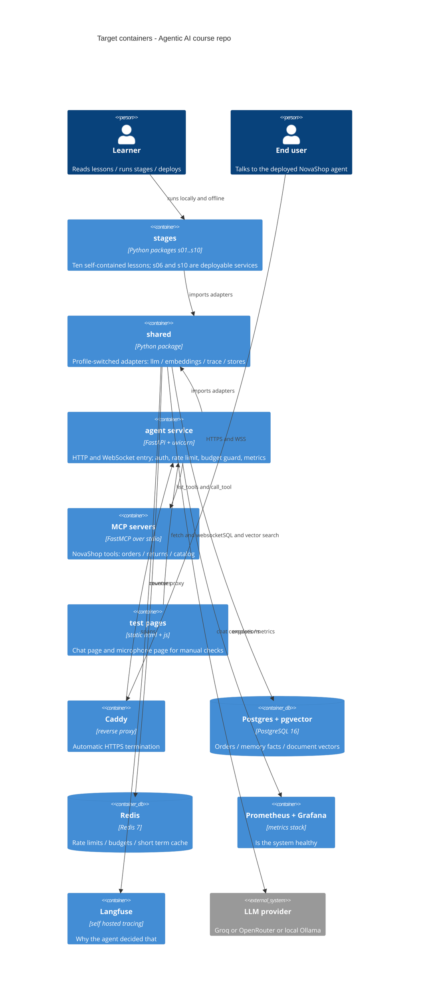

# Architecture map — Agentic AI (навчально-продакшн курс)

> **Цільовий** фундамент (`mode: greenfield-bootstrap`), а не скан наявного коду — репозиторій
> порожній, окрім `docs/` (статті-джерела) і `planning/`. C4 та інвентар модулів описують те,
> що `scaffold` зараз матеріалізує. Конвенції — правила, яких дотримується кожен подальший етап.
>
> **Стан:** скелет матеріалізовано `scaffold`-ом 2026-08-22 (S1–S7 зелені). Машинні ключі
> нижче — команди, які реально спрацювали, а не заплановані.
>
> Режим лишається `greenfield-bootstrap`, бо жодного етапу ще не написано. Щойно з'явиться
> перший (`stages/s01_agent_loop/`), варто перезапустити `survey` у brownfield-режимі —
> він замінить посилання на спеку реальними `file:line` і перевірить, чи не розійшлись
> конвенції з кодом.
>
> Джерело всіх рішень: [`planning/2026-08-22-agentic-ai-course-design.md`](../planning/2026-08-22-agentic-ai-course-design.md).
> Фундаментальна сесія (G2–G4) **не проводилась**: користувач прямо вказав, що рішення вже
> прийняті у спеці й перепитувати їх не треба.

## Stack

- **Language / runtime:** Python 3.11+ — спека §7
- **Packaging:** один інсталюваний пакет, `pyproject.toml` з extras на етап
  (`[s03]`, `[s04]`, `[s09]`, `[voice]`, `[prod]`, `[dev]`) — спека §7.
  Це те, що дозволяє етапу 10 **імпортувати** зрілі модулі етапів 1–9, а не копіювати їх.
- **Frameworks:** FastAPI + uvicorn (сервіс), FastMCP (MCP-сервери), LangGraph / CrewAI /
  Google ADK (лише етап 9, за extras), APScheduler (фонові задачі)
- **LLM-доступ:** SDK `openai` як єдиний клієнт — через `base_url` покриває OpenAI, Groq,
  OpenRouter, Ollama, LM Studio
- **Build / test / lint:**
  - build — `pip install -e .[dev]`
  - test — `python scripts/check_all.py` (офлайн, без API-ключа, детермінований)
  - lint — `ruff check .` (лінт + формат одним інструментом)

## C4 — цільова система

## Module inventory

| Module | Path | Layers | Wired at | Responsibility |
|---|---|---|---|---|
| `shared` | `shared/` | адаптери (ports+infra) | імпорт із `stages/*` | Профіле-залежні реалізації: LLM, embeddings, trace, stores, config |
| `stages.s01_agent_loop` | `stages/s01_agent_loop/` | lesson | `run.py`, `check.py` | ReAct-цикл з нуля, валідація, ліміт кроків, HITL |
| `stages.s02_rag` | `stages/s02_rag/` | lesson | `run.py`, `check.py` | embed → cosine → top-k → generate, цитування |
| `stages.s03_router` | `stages/s03_router/` | lesson | `run.py`, `check.py` | Свій міні-граф, потім LangGraph; supervisor |
| `stages.s04_mcp` | `stages/s04_mcp/` | lesson + server | `server.py`, `run.py` | FastMCP-сервер + stdio-клієнт |
| `stages.s05_memory` | `stages/s05_memory/` | lesson | `run.py`, `check.py` | short/long-term, extract→store→retrieve |
| `stages.s06_platform` | `stages/s06_platform/` | **service** | `app.py` (ASGI) | Перший деплойний сервіс: зшиває s01–s05 |
| `stages.s07_voice` | `stages/s07_voice/` | lesson + service | `pipeline.py`, `ws.py` | Батч vs стрім, barge-in, WebSocket-голос |
| `stages.s08_eval` | `stages/s08_eval/` | lesson | `harness.py`, `run.py` | 3-рівнева оцінка поверх трейсів |
| `stages.s09_frameworks` | `stages/s09_frameworks/` | lesson ×3 | `lg.py`, `crew.py`, `adk.py` | Один таск трьома фреймворками |
| `stages.s10_capstone` | `stages/s10_capstone/` | **service** | `app.py` (ASGI) | Фінальний сервіс; імпортує s01–s09 |
| `scripts` | `scripts/` | tooling | CLI | `check_all.py`, `migrate.py` |
| `deploy` | `deploy/` | infra | — | `docker-compose.yml` (Postgres+pgvector, Redis) готовий; Dockerfile, Caddy, systemd, RUNBOOK — етап 6 |

## Conventions (правила, яких дотримується кожен новий етап)

Репозиторій порожній, тож посилання ведуть на **рішення у спеці**, а не на код. `scaffold`
матеріалізує їх у файли; після цього `survey` перезапускається в brownfield-режимі й замінить
ці посилання на реальні `file:line`.

- **Іменування модулів:** `stages/sNN_slug/`, запуск `python -m stages.sNN_slug.run` —
  спека §6. Префікс `s` обов'язковий: ім'я Python-пакета не може починатись із цифри.
- **Перемикання оточення:** усе через `APP_PROFILE=local|prod` + адаптери в `shared/`,
  ніколи через розгалуження коду — спека §5.1, ADR-0002.
- **Доступ до LLM:** лише `shared/llm.get_client()`; жодного прямого `openai.OpenAI()`
  у коді етапів — спека §7, ADR-0003.
- **Трасування:** кожен крок агента пише в `shared/trace`; трасування присутнє з етапу 1,
  а не додається на етапі 8 — спека §5.2, ADR-0005.
- **Перевірки:** кожен етап має `check.py` з голими `assert`, що виконується офлайн на
  `shared/fake_llm`; **обов'язково хоча б одна перевірка на режим відмови** — спека §5.3, §11, ADR-0006.
- **Помилки:** єдиний конверт відповіді сервісу `{"error": {"code", "message"}}`;
  ліміти й бюджет повертають `429` / `402`, не `500` — спека §8.2.
- **ID:** зовнішні ідентифікатори — префіксовані ULID-подібні рядки (`ord_`, `ses_`, `trc_`),
  генеруються застосунком, не БД.
- **Persistence:** Postgres 16 + `pgvector` як єдине сховище (без окремого векторного сервісу);
  Redis лише для лічильників і TTL-кешу — ADR-0004.
- **Міграції:** пронумеровані `migrations/NNNN_name.up.sql` / `.down.sql`, застосовує
  `scripts/migrate.py`; Alembic — коли схема почне часто змінюватись — спека §7.
- **Секрети:** лише `.env` поза git; `.env.example` / `.env.prod.example` як шаблони — спека §8.2.
- **Мова:** проза й уроки — українською, код/ідентифікатори/docstrings/комміти — англійською — спека §10.
- **Комміти:** без згадок AI-асистента в будь-якому вигляді (правило репозиторію).

## Datastores

| Store | Engine | Accessed via | Notes |
|---|---|---|---|
| Основна БД | PostgreSQL 16 + `pgvector` | `shared/stores/` | Замовлення NovaShop, факти пам'яті, вектори документів. У профілі `local` замінюється на in-memory реалізацію того ж інтерфейсу |
| Лічильники | Redis 7 | `shared/stores/` | Token bucket rate-limit, бюджетні лічильники, TTL-кеш. У `local` — in-process dict |
| Трейси | JSONL у `traces/` (local) → Langfuse (prod) | `shared/trace.py` | Той самий запис, два стоки |

## Frontend / UI foundation

Мінімальний фронтенд, свідомо. Дві статичні сторінки без збірки й без фреймворка — вони існують,
щоб **вручну постукати** в сервіс, а не як продукт.

- **Component library / design system:** немає і не планується. Дві сторінки не виправдовують
  дизайн-систему — ставити React заради них було б саме тією надмірністю, проти якої аргументує стаття 6.
- **Design tokens:** кілька CSS-змінних у `<style>` кожної сторінки
- **Styling approach:** vanilla CSS у самому файлі, без збірки
- **Shared primitives:** немає
- **State / data-fetching:** `fetch` + `WebSocket` напряму
- **Closest UI precedent:** `deploy/web/chat.html` (текстовий чат) і `deploy/web/mic.html`
  (мікрофон, етап 7) — обидві створює `scaffold`/етап 6

**Правило на майбутнє:** якщо сторінок стане більше трьох або з'явиться реальний UI —
це окреме рішення з власним ADR, а не тихе додавання фреймворка.

## Where things live / closest precedents

- **Новий навчальний етап** → `stages/sNN_slug/`, за зразком `stages/s01_agent_loop/`
  (README.md + README.en.md + exercises.md + solutions/ + CHECKLIST.md + код + check.py).
- **Новий адаптер** (провайдер, сховище, стік трейсів) → `shared/`, з обома реалізаціями
  (`local` і `prod`) за одним інтерфейсом; ніколи не `if PROFILE == ...` у коді етапу.
- **Новий інструмент агента** → MCP-tool у `stages/s04_mcp/server.py` або
  `stages/s10_capstone/mcp/`; за правилом статті 6 — менше інструментів із чистими payload,
  а не мапа всіх ендпоінтів.
- **Нова інфраструктура** → `deploy/`, з оновленням `deploy/RUNBOOK.md`.

## Constraints & known tech-debt

- **Читач не має платити, щоб пройти курс.** `check_all.py` не ходить у мережу взагалі.
  Будь-яке рішення, що вимагає API-ключа для базової перевірки, — порушення фундаменту.
- **Одна VM, ≥4 ГБ RAM.** Повний стек (app+pg+redis+caddy+prometheus+grafana+langfuse) не
  влазить у 2 ГБ, тож `docker compose` має три профілі (`core` / `observability` / `full`).
- **Один uvicorn-воркер за замовчуванням** через APScheduler. Це не недогляд, а відтворення
  пастки зі статті 6; етап 6 показує проблему і виносить планувальник в окремий процес.
- **Локальний Whisper на CPU повільний.** Це зміст уроку 7, не баг — але в README мають бути
  чесні очікувані числа.
- **`docs/` містить повні тексти чужих статей.** Прийнятно для приватного репозиторію;
  перед публікацією потребує рішення — спека §14.
- **Версії LangGraph / CrewAI / ADK ламаються між релізами.** Запінені в `pyproject.toml`;
  смоук у `check.py` ловить розрив рано.

## Reconciliation with the authored architecture doc

Авторського `docs/architecture.md` немає. Є два документи, з якими ця карта узгоджена:

1. [`planning/2026-08-22-agentic-ai-course-design.md`](../planning/2026-08-22-agentic-ai-course-design.md) —
   **джерело істини** для всіх рішень нижче. Карта не суперечить йому ніде; вона перекладає
   його рішення у форму, яку читають подальші SDD-скіли.
2. [`planning/00-prior-cursor-plan.md`](../planning/00-prior-cursor-plan.md) — попередній план.
   Частково скасований (спека §2): деплой, systemd і Prometheus перенесено з «поза scope» у scope,
   провайдер став pluggable, шлях запуску виправлено на `stages.sNN_slug`.
