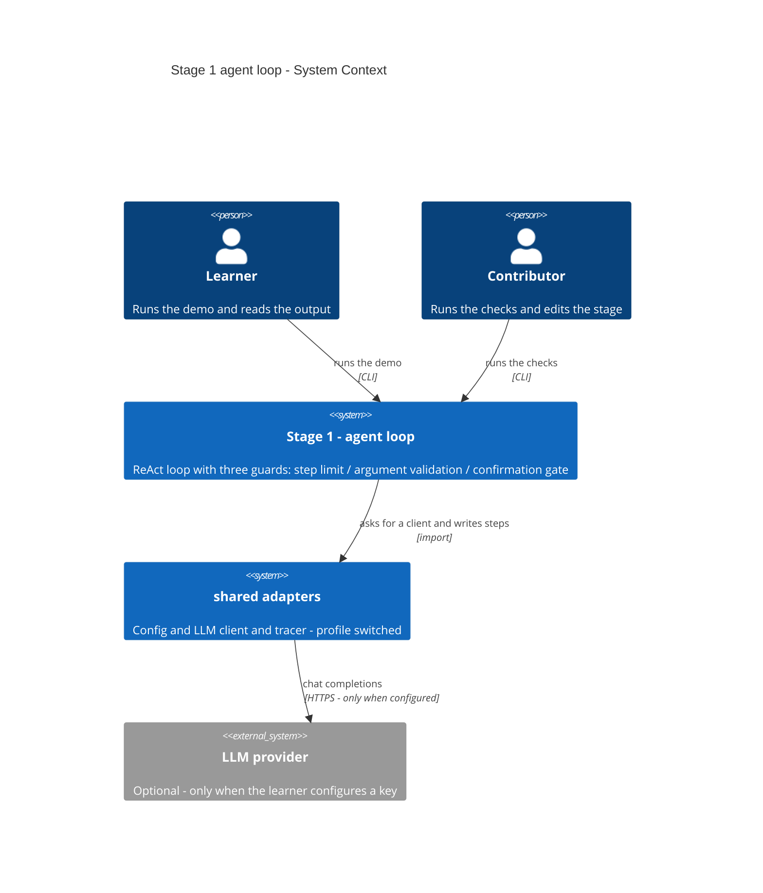
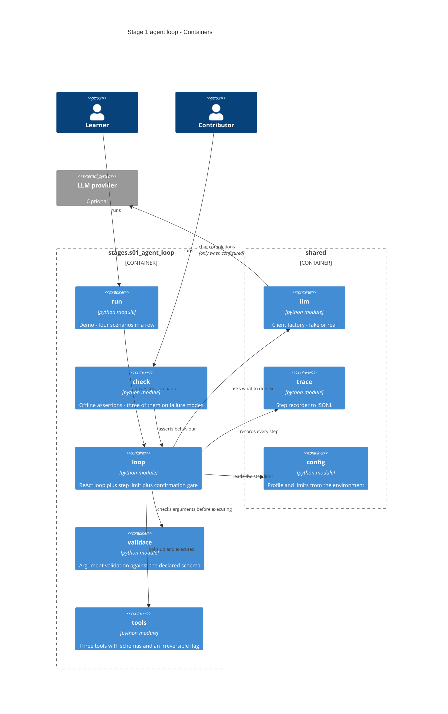

# Software Architecture Document — s01-agent-loop

## 1. Introduction and goals

**Intent.** Перший етап курсу будує цикл агента з нуля — без жодного агентного фреймворку — щоб
Learner побачив, що агент це звичайний цикл навколо звичайних функцій, а не магія. Разом із
циклом етап закладає три захисні механізми (ліміт кроків, валідація аргументів, гейт
підтвердження незворотної дії), які успадковують усі дев'ять наступних етапів.

**Top-3 quality goals (1-liners; full scenarios in §10):**

1. **Прозорість механіки** — кожен крок циклу видно в коді й у виводі; жодної абстракції, що
   ховає рішення моделі.
2. **Детермінована перевірюваність** — режими відмови перевіряються офлайн і повторювано.
3. **Нульовий поріг входу** — працює без API-ключа, без мережі, без зовнішніх сервісів.

**Stakeholders.**

| Role | Interest | Sign-off owner? |
|---|---|---|
| Learner | Проходить етап: читає урок, запускає демо, робить вправи | No |
| Contributor | Пише й супроводжує етап; успадковує його патерни на етапах 2–10 | No |
| Tech Lead | Затвердження SAD | Yes |

## 2. Constraints

**Technical.**
- Python ≥3.11 (машина розробки — 3.14.3)
- SDK `openai` 3.3.1 — **лише через** `shared/llm`, ніколи напряму (ADR репозиторію 0003)
- Жодного агентного фреймворку: LangGraph з'являється на етапі 3
- `ruff` 0.16, довжина рядка ≤100, набір правил `E, F, I, UP, B`
- Профіль перемикає адаптери, не гілки коду (ADR репозиторію 0002)

**Organisational.**
- Бюджет читача: 2–3 години (CURRICULUM)
- Етап блокує етапи 2–10 — це вузьке місце всього курсу
- Виконавець один; паралелізму немає (`max_parallel_agents: 1`)

**Conventions.**
- [CONVENTIONS.md](../../../CONVENTIONS.md) — структура етапу, мова, стиль, комміти
- Ролі й доменні об'єкти — [CONTEXT.md](../../../CONTEXT.md), канонічно
- Перевірки — голі `assert`, обов'язково ≥1 на режим відмови (ADR репозиторію 0006)
- Трасування присутнє з цього етапу (ADR репозиторію 0005)
- ID трейсу — префіксований рядок, генерується застосунком

**Regulatory / external.**
- N/A — публічний навчальний матеріал, персональних даних немає, фікстури вигадані.

## 3. Context and scope

Етап — самодостатній Python-пакет із двома входами: демонстраційний прогін для Learner і набір
перевірок для Contributor. Обидва працюють **офлайн за замовчуванням**. Межа довіри проходить
там, де рішення моделі перетворюється на виконання коду: усе, що приходить від моделі,
вважається неперевіреним, доки не пройшло валідацію (і підтвердження — для незворотних дій).

<!-- brownfield: скелет матеріалізовано в цій же сесії; `shared/` містить config, llm, fake_llm,
     trace, check_runner. Карта `docs/architecture-map.md` відображає комміт 9ee4e25 і відстає
     на артефакти специфікації — коду вона не стосується, тож повторний скан нічого б не додав. -->

**External systems (in / out):**

| Actor or system | Type | Interaction |
|---|---|---|
| Learner | Person | Запускає демо, читає вивід, робить вправи |
| Contributor | Person | Запускає перевірки, змінює код етапу |
| `shared` (адаптери репозиторію) | System (internal) | Дає клієнт моделі, трасувальник, конфігурацію |
| LLM provider | System (external) | **Опційний.** Задіяний лише коли Learner сам налаштував ключ |
| Файл трейсів | System (internal, через `shared`) | Приймає записи кроків; читається етапом 8. Окремим вузлом у C4 L1 не показаний — доступ лише через `shared` |

**C4 Context (L1):**



## 4. Solution strategy

**Top strategic choices (the seeds for ADRs):**

1. **Цикл будується з нуля, без фреймворку.** Фреймворк на першому етапі приховав би саме
   те, що етап має показати — як рішення моделі перетворюється на виклик функції. LangGraph
   приходить на етапі 3, коли читач уже знає, що саме той фреймворк за нього робить.

2. **Три захисні механізми — окремі, видимі одиниці, а не рядки всередині циклу.** Ліміт
   кроків, валідація аргументів і гейт підтвердження успадковуються всіма наступними етапами.
   Якщо вони розчиняться в тілі циклу, читач їх не побачить і не перенесе. → **ADR-0001**
   (декомпозиція), **ADR-0002** (гейт), **ADR-0003** (валідація).

3. **Підробний клієнт — основа перевірок, а не заглушка.** Режими відмови (зациклення, криві
   аргументи) на справжній моделі невідтворювані. Сценарій підробки і є специфікацією поведінки
   моделі, записаною кодом.

4. **Демо і перевірка — два різні входи з різними гарантіями.** Демо показує й може звертатися
   до справжнього провайдера, якщо той налаштований. Перевірка **завжди** детермінована й
   офлайн, навіть коли ключ заданий — інакше вона перестала б бути перевіркою.

**Target surface.** `cli` + `library-sdk`: етап запускається двома командами в терміналі й
водночас лишається імпортованим пакетом — етап 10 імпортує зріле з етапів 1–9 (ADR
репозиторію 0001). Обидві поверхні наявні одночасно; це не вибір між ними.

## 5. Building block view

Проста модульна розкладка за відповідальністю, без шарів `domain/app/infra`. Гексагональна
розкладка на 180 рядках коду дала б п'ять рівнів вкладеності заради церемонії, і читач вчив би
розкладку замість агента. Межа проста: **один модуль — одна відповідальність, кожен вкладається
в один екран.**

**Internal decomposition:**

```
stages/s01_agent_loop/
├── loop.py       цикл ReAct: крок → рішення моделі → виконання → спостереження
│                 сюди ж ліміт кроків і гейт підтвердження незворотної дії
├── validate.py   перевірка аргументів проти оголошеної схеми інструмента
├── tools.py      реєстр трьох інструментів разом зі схемами й познакою незворотності
├── run.py        демо: чотири сценарії підряд
├── check.py      перевірки, ≥3 з них на режими відмови
├── data/         фікстури NovaShop
└── solutions/    еталонні розв'язки вправ
```

**C4 Container (L2):**



## 6. Runtime view

**Critical flow 1: крок із викликом інструмента, включно з відмовою валідації**

```mermaid
sequenceDiagram
    actor Learner
    participant Run as run
    participant Loop as loop
    participant LLM as shared.llm
    participant Val as validate
    participant Tools as tools
    participant Trace as shared.trace

    Learner->>Run: starts the demo
    Run->>Loop: run the task with the tool registry
    Loop->>Trace: record run_start
    loop until a final answer or the step limit
        Loop->>LLM: send history and tool schemas
        LLM-->>Loop: a tool request or a final answer
        Loop->>Trace: record llm_call
        alt the model asked for a tool
            Loop->>Val: check the arguments against the schema
            alt arguments do not match
                Val-->>Loop: rejection with the reason
                Loop->>Trace: record tool_rejected
                Note over Loop: the tool is never reached - the reason goes back as the step result
            else arguments match
                Loop->>Tools: execute the tool
                Tools-->>Loop: result
                Loop->>Trace: record tool_call
            end
        else the model answered
            Loop->>Trace: record run_end
        end
    end
    Loop-->>Run: final answer or a stopped-by-limit notice
    Run-->>Learner: printed transcript
```

**Critical flow 2: гейт підтвердження незворотної дії**

```mermaid
sequenceDiagram
    actor Learner
    participant Loop as loop
    participant Tools as tools

    Note over Learner,Tools: first run - no confirmation given
    Loop->>Tools: look up the requested tool
    Tools-->>Loop: found and marked irreversible
    Note over Loop: the tool is NOT executed
    Loop-->>Learner: describes what would happen and how to confirm

    Note over Learner,Tools: second run - confirmation given
    Learner->>Loop: repeats the run with confirmation
    Loop->>Tools: execute the tool
    Tools-->>Loop: result
    Loop-->>Learner: final answer
```

## 7. Deployment view

<!-- N/A: етап не розгортається. Це локальний CLI + імпортований пакет; жодної інфраструктури
     він не додає. Перший деплой — етап 6, який і принесе Dockerfile, Caddy та systemd. -->

## 8. Crosscutting concepts

| Concept | Convention | Where defined |
|---|---|---|
| Трасування | `trace_run(...)` навколо прогону, `step(kind, ...)` на кожен крок; поля `stage="s01"` | `shared/trace.py`, ADR репозиторію 0005 |
| Доступ до моделі | Лише через фабрику клієнта; демо передає сценарій підробки, перевірка — завжди підробка | `shared/llm.py`, ADR репозиторію 0003 |
| Обробка помилок | Відмова валідації — **не** виняток: це результат кроку, який повертається моделі. Виняток лишається для помилок програміста | `validate.py`, §6 flow 1 |
| Ліміт кроків | Читається з конфігурації, не хардкодиться; крок = одна ітерація циклу | `shared/config.py`, spec AC-02 |
| Незворотність | Познака на інструменті в реєстрі, а не список імен усередині циклу | `tools.py`, ADR-0002 |
| ID | `trace_id` вигляду `trc_…`, генерує застосунок | CONVENTIONS.md |
| Мова | Проза українською, ідентифікатори англійською; системний промпт — див. §11 OQ | CONVENTIONS.md |
| Перевірки | Голі `assert`, docstring у рядок, префікс `ВІДМОВА ·` на перевірках режимів відмови | ADR репозиторію 0006 |
| Спостережуваність | Той самий трейс, що читає етап 8; жодного окремого логера на цьому етапі | `shared/trace.py` |

## 9. Architecture decisions

Два простори нумерації, не плутати: `docs/adr/` — рішення **репозиторію** (0001–0006),
`docs/features/s01-agent-loop/adr/` — рішення **цього етапу** (нижче).

| # | Title | Status | Section |
|---|---|---|---|
| 0001 | Розкласти етап на чотири модулі за відповідальністю | Accepted | §5 |
| 0002 | Підтверджувати незворотну дію окремим повторним запуском | Accepted | §4, §6 |
| 0003 | Валідувати аргументи власним кодом усередині етапу | Accepted | §4, §8 |

ADR-файли: `docs/features/s01-agent-loop/adr/NNNN-*.md`.

## 10. Quality requirements

**QG-1. Прозорість механіки**
- **When:** Learner уперше відкриває код етапу після прочитання уроку.
- **Then:** модуль циклу вкладається в **≤ 120 рядків** виконуваного коду (без docstrings,
  коментарів і порожніх рядків), модуль валідації — у **≤ 60 рядків**; урок читається за
  **≤ 25 хв** (**≤ 2500 слів** за нормою 100 слів/хв).
- **How verify:** підрахунок виконуваних рядків обох модулів і слів уроку перед закриттям етапу.

**QG-2. Детермінована перевірюваність**
- **When:** Contributor запускає перевірки без налаштованого провайдера.
- **Then:** прогін завершується за **≤ 2 с**, робить **рівно 0** мережевих звернень і містить
  **≥ 3** перевірки на режими відмови; повторні запуски дають ідентичний результат.
- **How verify:** зведення `check_all`; перевірка детермінізму — три послідовні прогони
  того самого сценарію дають однаковий вивід.

**QG-3. Нульовий поріг входу**
- **When:** Learner проходить SETUP на чистій машині.
- **Then:** до першого зеленого прогону — **≤ 5 команд**; демонстраційний прогін без
  провайдера завершується за **≤ 1 с**.
- **How verify:** послідовність команд у SETUP; ручний замір тривалості демо, зафіксований в уроці.

## 11. Risks and technical debt

| Risk / debt | Severity | Mitigation | Owner |
|---|---|---|---|
| Open question: модель без підтримки tool-calling | Open question | Розпізнати відсутність підтримки й повідомити зрозуміло, назвавши перевірені моделі — замість незрозумілого збою всередині циклу. Resolve before `sdd:implement` | Contributor |
| Open question: мова системного промпту й описів інструментів | Open question | Дефолт — англійська (як у статтях і в дикій природі; слабкі моделі помиляються рідше). Resolve before `sdd:implement` | Contributor |
| Ліміт «≤ 120 рядків» може виявитись затісним для циклу з трьома захистами | Medium | Міряти виконуваний код на першій же реалізації; при перевищенні — виносити гейт підтвердження окремим модулем, а не роздувати ліміт | Contributor |
| Підробка розходиться з поведінкою справжнього SDK при зміні версії | Medium | Форма відповіді перевіряється окремо (`arguments` — рядок JSON); розрив ловиться перевіркою ядра, а не етапом | Contributor |
| Читач переоцінить зелену перевірку й вирішить, що агент «добрий» | Low | Урок прямо каже: перевірки міряють логіку навколо моделі, а не якість моделі; якість — етап 8 | Contributor |

**Accepted debt (acceptable in v1, plan to fix later):**
- Валідація живе в етапі й дублюватиметься на етапах 3–4. Свідомо: підйом у спільний шар —
  вправа етапу 3 (ADR-0003).
- Реєстр інструментів — простий словник без версіювання схем. Для трьох інструментів
  достатньо; версіювання стає темою етапу 4 разом із MCP.
- Агент не має пам'яті між прогонами. Це видима вада, яку розв'язує етап 5.

## 12. Glossary

Канонічні ролі й доменні об'єкти — [CONTEXT.md](../../../CONTEXT.md); терміни курсу —
[GLOSSARY.md](../../../GLOSSARY.md). Нижче лише те, що вводить саме цей етап.

| Term | Meaning |
|---|---|
| Step (крок) | Одна ітерація циклу: одне звернення до моделі плюс виконання всіх інструментів, які вона попросила в цій відповіді. Прохання про три інструменти одразу лишається **одним** кроком |
| Tool registry (реєстр інструментів) | Відповідність «ім'я → функція + схема + познака незворотності». Єдине джерело правди про те, що агенту дозволено |
| Guard (захист) | Один із трьох механізмів, що стоять між рішенням моделі й наслідком: ліміт кроків, валідація аргументів, гейт підтвердження |
| Confirmation gate (гейт підтвердження) | Механізм, що не дає виконати незворотний інструмент без явного підтвердження людини |
| Scenario (сценарій демо) | Один із чотирьох прогонів, які демо показує підряд; кожен ілюструє свій acceptance criterion |
| Rejection (відмова валідації) | Результат кроку, а не виняток: пояснення повертається моделі, і цикл продовжується |
