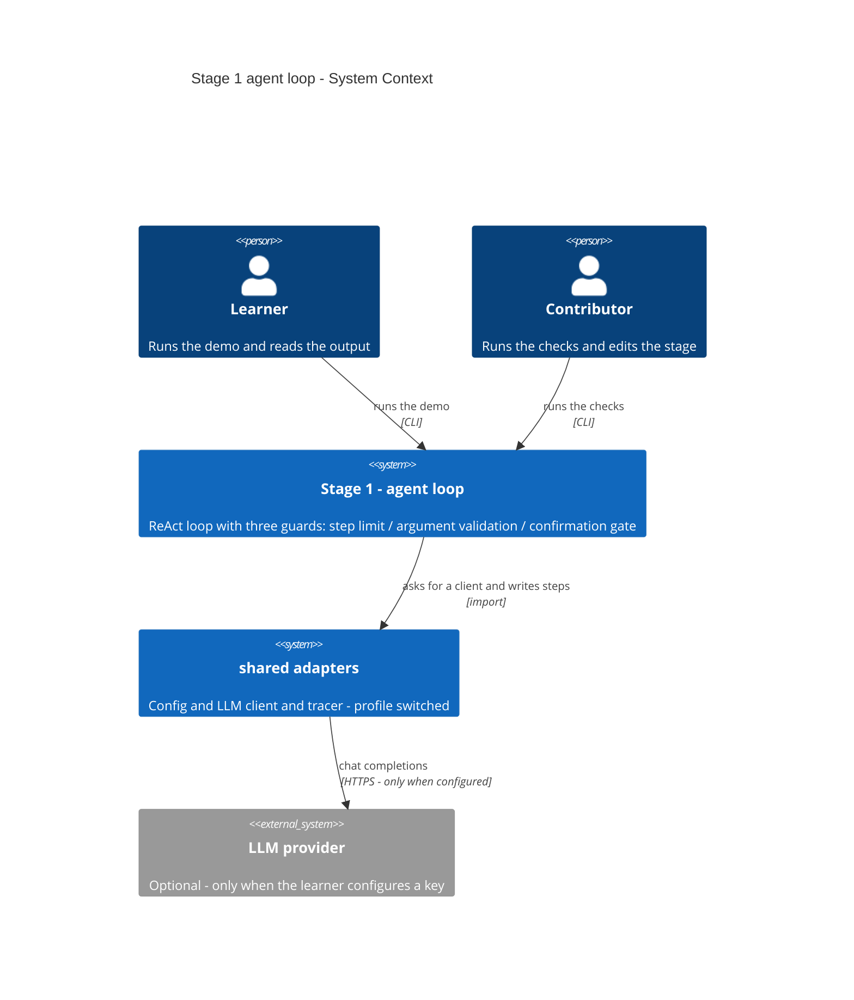
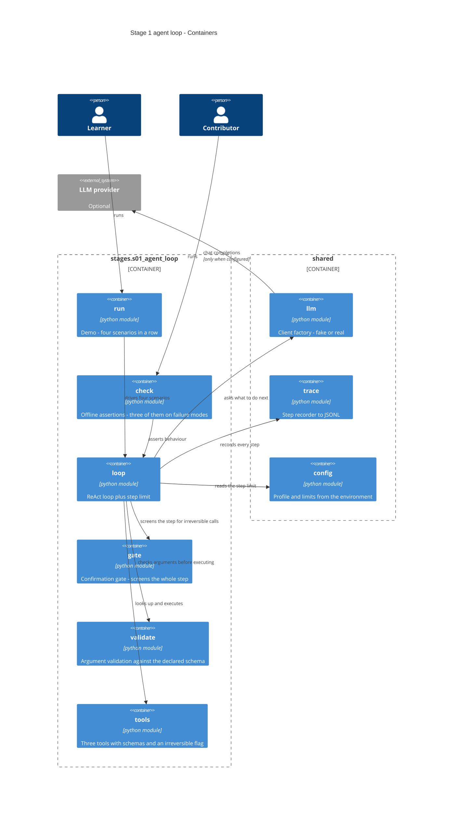

# Software Architecture Document — s01-agent-loop

## 1. Introduction and goals

**Intent.** The first stage of the course builds an agent loop from scratch — with no agent
framework at all — so that the Learner sees that an agent is an ordinary loop around ordinary
functions rather than magic. Along with the loop the stage lays down three guards (the step
limit, argument validation, the confirmation gate on an irreversible action) that all nine
following stages inherit.

**Top-3 quality goals (1-liners; full scenarios in §10):**

1. **Transparent mechanics** — every step of the loop is visible in the code and in the output;
   no abstraction hides the model's decision.
2. **Deterministic checkability** — failure modes are checked offline and repeatably.
3. **Zero barrier to entry** — it works with no API key, no network, no external services.

**Stakeholders.**

| Role | Interest | Sign-off owner? |
|---|---|---|
| Learner | Works through the stage: reads the lesson, runs the demo, does the exercises | No |
| Contributor | Writes and maintains the stage; inherits its patterns at stages 2–10 | No |
| Tech Lead | Approves the SAD | Yes |

## 2. Constraints

**Technical.**
- Python ≥3.11 (development machine — 3.14.3)
- The `openai` SDK 3.3.1 — **only through** `shared/llm`, never directly (repository ADR 0003)
- No agent framework: LangGraph appears at stage 3
- `ruff` 0.16, line length ≤100, rule set `E, F, I, UP, B`
- The profile switches adapters, not code branches (repository ADR 0002)

**Organisational.**
- Reader's budget: 2–3 hours (CURRICULUM)
- The stage blocks stages 2–10 — it is the bottleneck of the whole course
- One implementer; there is no parallelism (`max_parallel_agents: 1`)

**Conventions.**
- [CONVENTIONS.md](../../../CONVENTIONS.md) — stage structure, language, style, commits
- Roles and domain objects — [CONTEXT.md](../../../CONTEXT.md), canonical
- Checks are bare `assert`, mandatorily ≥1 on a failure mode (repository ADR 0006)
- Tracing is present from this stage (repository ADR 0005)
- The trace ID is a prefixed string, generated by the application

**Regulatory / external.**
- N/A — public teaching material, no personal data, the fixtures are invented.

## 3. Context and scope

The stage is a self-contained Python package with two entry points: the demo run for the Learner
and the set of checks for the Contributor. Both work **offline by default**. The line of trust
runs where the model's decision turns into executed code: everything arriving from the model is
treated as unverified until it has passed validation (and confirmation, for irreversible actions).

<!-- brownfield: the skeleton was materialised in this same session; `shared/` holds config, llm,
     fake_llm, trace, check_runner. The map `docs/architecture-map.md` reflects commit 9ee4e25 and
     lags on the specification artefacts — it does not concern the code, so a re-scan would have
     added nothing. -->

**External systems (in / out):**

| Actor or system | Type | Interaction |
|---|---|---|
| Learner | Person | Runs the demo, reads the output, does the exercises |
| Contributor | Person | Runs the checks, changes the stage's code |
| `shared` (repository adapters) | System (internal) | Supplies the model client, the tracer, the configuration |
| LLM provider | System (external) | **Optional.** Involved only when the Learner has configured a key themselves |
| Trace file | System (internal, through `shared`) | Accepts step records; read by stage 8. Not shown as a separate node in C4 L1 — access goes only through `shared` |

**C4 Context (L1):**



## 4. Solution strategy

**Top strategic choices (the seeds for ADRs):**

1. **The loop is built from scratch, with no framework.** A framework at the first stage would
   hide exactly what the stage has to show — how the model's decision turns into a function call.
   LangGraph arrives at stage 3, when the reader already knows what that framework is doing for
   them.

2. **The three guards are separate, visible units, not lines inside the loop.** The step limit,
   argument validation and the confirmation gate are inherited by every stage that follows. If
   they dissolve into the body of the loop, the reader will not see them and will not carry them
   forward. → **ADR-0001** (decomposition), **ADR-0002** (the gate), **ADR-0003** (validation).

3. **The fake client is the foundation of the checks, not a stub.** Failure modes (runaway loops,
   malformed arguments) cannot be reproduced against a real model. The fake's script *is* the
   specification of the model's behaviour, written as code.

4. **The demo and the checks are two different entry points with different guarantees.** The demo
   shows things and may reach out to a real provider if one is configured. The checks are
   **always** deterministic and offline, even when a key is set — otherwise they would stop being
   checks.

**Target surface.** `cli` + `library-sdk`: the stage is launched by two commands in a terminal
and at the same time stays an importable package — stage 10 imports what matured at stages 1–9
(repository ADR 0001). Both surfaces exist at once; this is not a choice between them.

## 5. Building block view

A plain modular layout by responsibility, without `domain/app/infra` layers. A hexagonal layout
over 180 lines of code would give five levels of nesting for the sake of ceremony, and the reader
would learn the layout instead of the agent. The rule is simple: **one module, one
responsibility, each fitting on one screen.**

**Internal decomposition:**

```
stages/s01_agent_loop/
├── loop.py       the ReAct loop: step → the model's decision → execution → observation
│                 the step limit lives here too
├── gate.py       the confirmation gate: screens the WHOLE step before executing anything
├── validate.py   checks arguments against a tool's declared schema
├── tools.py      the registry of three tools with their schemas and an irreversibility flag
├── run.py        the demo: four scenarios in a row
├── check.py      the checks, ≥3 of them on failure modes
├── data/         NovaShop fixtures
└── solutions/    reference solutions to the exercises
```

**C4 Container (L2):**



## 6. Runtime view

**Critical flow 1: a step with a tool call, including a validation rejection**

```mermaid
sequenceDiagram
    actor Learner
    participant Run as run
    participant Loop as loop
    participant LLM as shared.llm
    participant Val as validate
    participant Tools as tools
    participant Trace as shared.trace

    Learner->>Run: starts the demo
    Run->>Loop: run the task with the tool registry
    Loop->>Trace: record run_start
    loop until a final answer or the step limit
        Loop->>LLM: send history and tool schemas
        LLM-->>Loop: a tool request or a final answer
        Loop->>Trace: record llm_call
        alt the model asked for a tool
            Loop->>Val: check the arguments against the schema
            alt arguments do not match
                Val-->>Loop: rejection with the reason
                Loop->>Trace: record tool_rejected
                Note over Loop: the tool is never reached - the reason goes back as the step result
            else arguments match
                Loop->>Tools: execute the tool
                Tools-->>Loop: result
                Loop->>Trace: record tool_call
            end
        else the model answered
            Loop->>Trace: record run_end
        end
    end
    Loop-->>Run: final answer or a stopped-by-limit notice
    Run-->>Learner: printed transcript
```

**Critical flow 2: the confirmation gate on an irreversible action**

```mermaid
sequenceDiagram
    actor Learner
    participant Loop as loop
    participant Tools as tools

    Note over Learner,Tools: first run - no confirmation given
    Loop->>Tools: look up the requested tool
    Tools-->>Loop: found and marked irreversible
    Note over Loop: the tool is NOT executed
    Loop-->>Learner: describes what would happen and how to confirm

    Note over Learner,Tools: second run - confirmation given
    Learner->>Loop: repeats the run with confirmation
    Loop->>Tools: execute the tool
    Tools-->>Loop: result
    Loop-->>Learner: final answer
```

## 7. Deployment view

<!-- N/A: the stage is not deployed. It is a local CLI plus an importable package; it adds no
     infrastructure of any kind. The first deployment is stage 6, which brings the Dockerfile,
     Caddy and systemd with it. -->

## 8. Crosscutting concepts

| Concept | Convention | Where defined |
|---|---|---|
| Tracing | `trace_run(...)` around the run, `step(kind, ...)` on every step; fields `stage="s01"` | `shared/trace.py`, repository ADR 0005 |
| Model access | Only through the client factory; the demo passes the fake's script, the checks always use the fake | `shared/llm.py`, repository ADR 0003 |
| Error handling | A validation rejection is **not** an exception: it is the step's result, returned to the model. Exceptions stay for programmer errors | `validate.py`, §6 flow 1 |
| Step limit | Read from configuration, not hard-coded; a step = one iteration of the loop | `shared/config.py`, spec AC-02 |
| Irreversibility | A flag on the tool in the registry; the gate screens **the whole step**, not an individual call | `tools.py`, `gate.py`, stage ADR 0002 |
| Tool error | An exception out of `tool.func` is the step's result (`tool_error`), not the death of the run | `loop.py` |
| IDs | A `trace_id` of the form `trc_…`, generated by the application | CONVENTIONS.md |
| Language | Prose and identifiers in English; the system prompt — see §11 OQ | CONVENTIONS.md |
| Checks | Bare `assert`, a one-line docstring, the prefix `FAILURE ·` on failure-mode checks | repository ADR 0006 |
| Observability | The same trace stage 8 reads; no separate logger at this stage | `shared/trace.py` |

## 9. Architecture decisions

Two numbering spaces, not to be confused: `docs/adr/` holds **repository** decisions (0001–0006),
`docs/features/s01-agent-loop/adr/` holds the decisions of **this stage** (below).

| # | Title | Status | Section |
|---|---|---|---|
| 0001 | Split the stage into four responsibility modules | Accepted | §5 |
| 0002 | Confirm an irreversible action by a separate repeat run | Accepted | §4, §6 |
| 0003 | Validate arguments with hand-written code inside the stage | Accepted | §4, §8 |

ADR files: `docs/features/s01-agent-loop/adr/NNNN-*.md`.

## 10. Quality requirements

**QG-1. Transparent mechanics**
- **When:** the Learner opens the stage's code for the first time after reading the lesson.
- **Then:** the loop module fits into **≤ 120 lines** of executable code (excluding docstrings,
  comments and blank lines), the validation module into **≤ 60 lines**; the lesson reads in
  **≤ 25 min** (**≤ 2500 words** at 100 words/min).
- **How verify:** count the executable lines of both modules and the words of the lesson before
  the stage closes.

**QG-2. Deterministic checkability**
- **When:** the Contributor runs the checks with no provider configured.
- **Then:** the run finishes in **≤ 2 s**, makes **exactly 0** network calls and contains **≥ 3**
  checks on failure modes; repeated runs give an identical result.
- **How verify:** the `check_all` summary; determinism is checked by three consecutive runs of the
  same scenario producing the same output.

**QG-3. Zero barrier to entry**
- **When:** the Learner goes through SETUP on a clean machine.
- **Then:** to the first green run — **≤ 5 commands**; the demo run with no provider finishes in
  **≤ 1 s**.
- **How verify:** the command sequence in SETUP; a manual measurement of the demo's duration,
  recorded in the lesson.

## 11. Risks and technical debt

| Risk / debt | Severity | Mitigation | Owner |
|---|---|---|---|
| Open question: a model without tool-calling support | Open question | Detect the missing support and say so clearly, naming the verified models — instead of an incomprehensible failure inside the loop. Resolve before `sdd:implement` | Contributor |
| Open question: the language of the system prompt and the tool descriptions | Open question | Default is English (as in the articles and in the wild; weak models make fewer mistakes). Resolve before `sdd:implement` | Contributor |
| ~~The "≤ 120 lines" limit may turn out too tight~~ **IT FIRED** | — | The mitigation was applied: after the review the gate was moved out into `gate.py`. `loop.py` stayed at 116/120, `gate.py` is 36 | Contributor |
| The fake diverges from the real SDK's behaviour when the version changes | Medium | The shape of the response is checked separately (`arguments` is a JSON string); the break is caught by a core check, not by the stage | Contributor |
| The reader overrates a green check and decides the agent is "good" | Low | The lesson says outright: the checks measure the logic around the model, not the model's quality; quality is stage 8 | Contributor |

**Accepted debt (acceptable in v1, plan to fix later):**
- Validation lives inside the stage and will be duplicated at stages 3–4. Deliberate: lifting it
  into the shared layer is an exercise at stage 3 (ADR-0003).
- The tool registry is a plain dictionary with no schema versioning. Enough for three tools;
  versioning becomes a topic at stage 4 together with MCP.
- The agent has no memory between runs. That is a visible flaw, and stage 5 resolves it.

## 12. Glossary

Canonical roles and domain objects — [CONTEXT.md](../../../CONTEXT.md); course terms —
[GLOSSARY.md](../../../GLOSSARY.md). Below only what this stage itself introduces.

| Term | Meaning |
|---|---|
| Step | One iteration of the loop: one call to the model plus running every tool it asked for in that response. Asking for three tools at once is still **one** step |
| Tool registry | The mapping "name → function + schema + irreversibility flag". The single source of truth about what the agent is allowed to do |
| Guard | One of the three mechanisms standing between the model's decision and its consequence: the step limit, argument validation, the confirmation gate |
| Confirmation gate | The mechanism that stops an irreversible tool from running without an explicit human confirmation |
| Scenario (demo scenario) | One of the four runs the demo shows in a row; each illustrates its own acceptance criterion |
| Rejection (validation rejection) | The result of a step, not an exception: the explanation goes back to the model and the loop continues |
