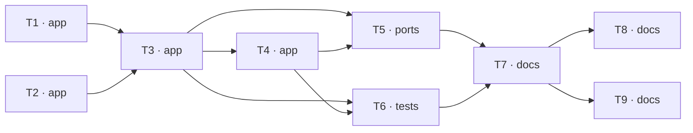

# Epic — s01-agent-loop

> **Spec:** [spec.md](../spec.md) · **Design:** [sad.md](../sad.md) · **ADRs:** [adr/](../adr/)
> Даних-моделі й контракту API цей етап не має — він нічого не персистить і нічого не публікує.

## Goal

Побудувати цикл агента з нуля разом із трьома захисними механізмами, які успадкують усі
дев'ять наступних етапів. Наприкінці Learner має робочий агент, запущений власноруч, і може
словами пояснити, чому модель не виконує функції сама — [spec §2](../spec.md).

## Scope

- **In:** шари `app` (реєстр, валідація, цикл, гейт), `ports` (демо), `tests` (перевірки),
  `docs` (урок, вправи, глосарій). Поверхні — `cli` + `library-sdk`.
- **Out:** фреймворки (етап 3), справжні сервіси (етап 4), пам'ять між сесіями (етап 5),
  вимірювання затримки (етап 7), оцінка якості моделі (етап 8) — [spec §3](../spec.md).

## Task map

## Tasks

See [tracker.md](./tracker.md) for status. Machine contract: [tasks.json](../tasks.json).

| # | Task | Layer | Blocked by | DoD (short) |
|---|---|---|---|---|
| T1 | Реєстр трьох інструментів зі схемами й познакою незворотності | app | — | Реєстр повертає три записи; кожен має функцію, схему й прапорець |
| T2 | Валідація аргументів інструмента проти оголошеної схеми | app | — | Три випадки невідповідності дають зрозуміле пояснення українською |
| T3 | Цикл ReAct із трасуванням і лімітом кроків | app | T1, T2 | Щасливий шлях: модель обирає інструмент, отримує результат, дає відповідь |
| T4 | Гейт підтвердження незворотної дії | app | T3 | Без підтвердження незворотна функція не викликається жодного разу |
| T5 | Демо: чотири сценарії підряд і банер джерела відповідей | ports | T3, T4 | Запуск без ключа завершується успішно, без мережевих звернень |
| T6 | Перевірки етапу: щасливі шляхи і три режими відмови | tests | T3, T4 | Дев'ять перевірок відповідають дев'яти рядкам таблиці покриття |
| T7 | Урок етапу: канон статті, міст на NovaShop, «що зламати» | docs | T5, T6 | Урок ≤ 2500 слів (spec §6: ≤ 25 хв читання) |
| T8 | Вправи, еталонні розв'язки й чекліст етапу | docs | T7 | Чотири завдання, кожне з явним очікуваним результатом |
| T9 | Терміни етапу в глосарій, статус етапу в програму | docs | T7 | Кожен виділений термін уроку має визначення в глосарії (KPI 100%) |

## Risks / Hard rules

- Модуль циклу ≤ 120 рядків, модуль валідації ≤ 60 рядків виконуваного коду — [spec §6](../spec.md).
  Перевищення означає, що гейт треба виносити окремим модулем, а не роздувати ліміт ([sad §11](../sad.md)).
- Жодного `if profile == ...` у коді етапу — розгалуження живе у фабриках `shared/`.
- Жодного прямого створення клієнта моделі — лише через фабрику у `shared`.
- Усе працює офлайн і без API-ключа. Перевірка, що потребує мережі, — зламана перевірка.
- Приведення типів у валідації заборонене ([ADR-0003](../adr/0003-hand-written-argument-validation-inside-the-stage.md)).
