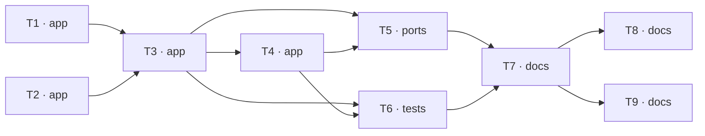

# Epic — s01-agent-loop

> **Spec:** [spec.md](../spec.md) · **Design:** [sad.md](../sad.md) · **ADRs:** [adr/](../adr/)
> This stage has no data model and no API contract — it persists nothing and publishes nothing.

## Goal

Build an agent loop from scratch together with the three guards that all nine following stages
will inherit. By the end the Learner has a working agent they started themselves, and can explain
in words why the model does not execute functions on its own — [spec §2](../spec.md).

## Scope

- **In:** the `app` layer (registry, validation, loop, gate), `ports` (the demo), `tests` (the
  checks), `docs` (lesson, exercises, glossary). Surfaces — `cli` + `library-sdk`.
- **Out:** frameworks (stage 3), real services (stage 4), memory between sessions (stage 5),
  latency measurement (stage 7), model-quality evaluation (stage 8) — [spec §3](../spec.md).

## Task map

## Tasks

See [tracker.md](./tracker.md) for status. Machine contract: [tasks.json](../tasks.json).

| # | Task | Layer | Blocked by | DoD (short) |
|---|---|---|---|---|
| T1 | A registry of three tools with schemas and an irreversibility flag | app | — | The registry returns three entries; each has a function, a schema and a flag |
| T2 | Validate tool arguments against the declared schema | app | — | Three kinds of mismatch produce a comprehensible explanation |
| T3 | The ReAct loop with tracing and a step limit | app | T1, T2 | Happy path: the model picks a tool, gets a result, gives an answer |
| T4 | The confirmation gate on an irreversible action | app | T3 | Without confirmation the irreversible function is never called |
| T5 | The demo: four scenarios in a row and a banner naming the source of answers | ports | T3, T4 | A run with no key finishes successfully, with no network calls |
| T6 | Stage checks: happy paths and three failure modes | tests | T3, T4 | Nine checks match the nine rows of the coverage table |
| T7 | The stage lesson: the article's canon, the bridge to NovaShop, "what to break" | docs | T5, T6 | The lesson is ≤ 2500 words (spec §6: ≤ 25 min reading) |
| T8 | Exercises, reference solutions and the stage checklist | docs | T7 | Four exercises, each with an explicit expected result |
| T9 | The stage's terms into the glossary, the stage's status into the curriculum | docs | T7 | Every highlighted term of the lesson has a glossary definition (KPI 100%) |

## Risks / Hard rules

- The loop module ≤ 120 lines, the validation module ≤ 60 lines of executable code —
  [spec §6](../spec.md). Going over means the gate has to move out into its own module rather than
  the limit being inflated ([sad §11](../sad.md)).
- No `if profile == ...` in stage code — the branching lives in the factories under `shared/`.
- No direct construction of a model client — only through the factory in `shared`.
- Everything works offline and with no API key. A check that needs the network is a broken check.
- Type coercion in validation is forbidden
  ([ADR-0003](../adr/0003-hand-written-argument-validation-inside-the-stage.md)).
