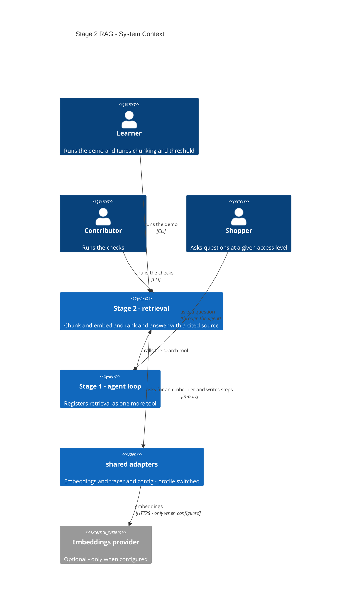
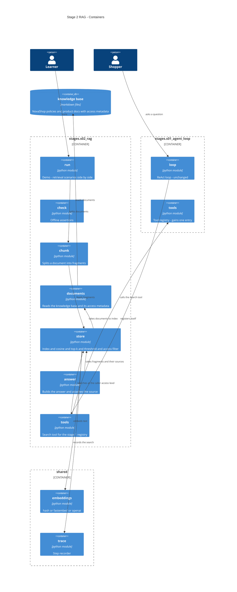
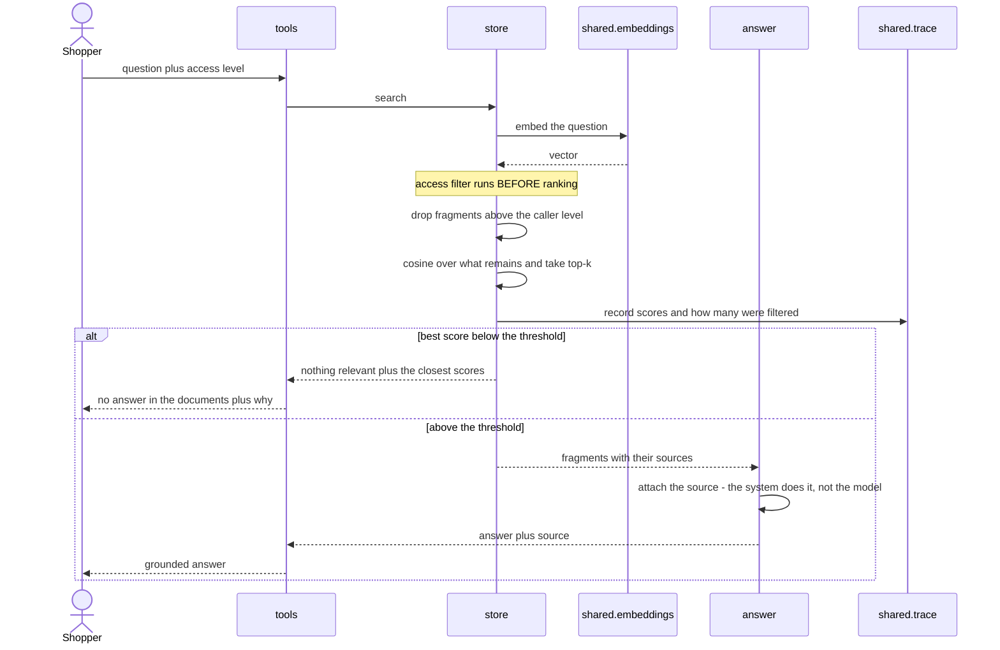
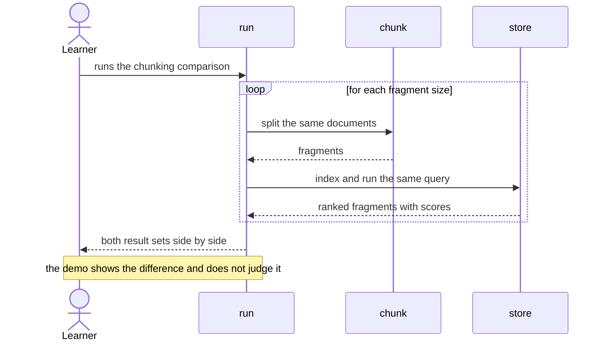

# Software Architecture Document — s02-rag

## 1. Introduction and goals

**Intent.** Етап 2 будує retrieval вручну: нарізку документів, ембеддинги, косинусну близькість,
відбір top-k і складання відповіді з обов'язковою цитатою. Мета — щоб Learner побачив, що
«знайти релевантне» це арифметика й сортування, а не магія, і щоб отриманий пошук став
звичайним інструментом для агента з етапу 1.

**Top-3 quality goals (1-liners; full scenarios in §10):**

1. **Прозорість пошуку** — усі числа, за якими ухвалено рішення, видно у виводі.
2. **Неможливість негрунтованої відповіді** — відповідь без названого джерела не існує як стан.
3. **Детермінізм** — той самий запит дає той самий результат, офлайн, без ключа.

**Stakeholders.**

| Role | Interest | Sign-off owner? |
|---|---|---|
| Learner | Проходить етап: читає урок, запускає демо, робить вправи | No |
| Shopper | Персонаж домену: ставить питання, не має бачити внутрішніх документів | No |
| Contributor | Пише й супроводжує етап | No |
| Tech Lead | Затвердження SAD | Yes |

## 2. Constraints

**Technical.**
- Python ≥3.11; етап додає до спільного шару адаптер ембеддингів
- Жодної векторної бази: пошук по десятках фрагментів — сортування списку (spec §3)
- `numpy` як єдина нова залежність етапу (extra `[s02]`); `fastembed` — опційно, `[embed]`
- Профіль перемикає адаптери, не гілки коду (ADR репозиторію 0002)
- Реєстр інструментів і цикл з етапу 1 **не змінюються** — етап додає інструмент, не переписує цикл

**Organisational.**
- Бюджет читача: 3–4 години (CURRICULUM)
- Етап блокує 5 (пам'ять використає ті самі ембеддинги) і 6 (база знань іде в сервіс)

**Conventions.**
- [CONVENTIONS.md](../../../CONVENTIONS.md) · [PLAYBOOK.md](../../../PLAYBOOK.md)
- Ролі — [CONTEXT.md](../../../CONTEXT.md), канонічно
- Перевірки — голі `assert`, ≥1 на режим відмови (ADR репозиторію 0006)
- Трасування з етапу 1 (ADR репозиторію 0005)

**Regulatory / external.**
- N/A — вигадана база знань, персональних даних немає.

## 3. Context and scope

Етап — самодостатній пакет із двома входами (демо й перевірки) плюс один інструмент, який
реєструє агент з етапу 1. Межа довіри проходить у двох місцях: **рівень доступу питальника**
(що йому дозволено бачити) і **межа даних і інструкцій** (знайдений текст є даними, навіть
якщо виглядає як команда).

<!-- brownfield: етап 1 завершено; `shared/` містить config, llm, fake_llm, trace, check_runner.
     Адаптера ембеддингів ще немає — його створює цей етап. Карта `docs/architecture-map.md`
     свіжа станом на етап 1. -->

**External systems (in / out):**

| Actor or system | Type | Interaction |
|---|---|---|
| Learner | Person | Запускає демо, змінює нарізку й поріг, читає вивід |
| Contributor | Person | Запускає перевірки, править пошук |
| Shopper | Person (у домені) | Ставить питання; має рівень доступу, який обмежує видачу |
| `shared` (адаптери) | System (internal) | Дає ембеддер, трасувальник, конфігурацію |
| База знань NovaShop | System (internal) | Файли політик і описів товарів із метаданими доступу |
| Embeddings provider | System (external) | **Опційний.** Задіяний лише коли Learner налаштував |

**C4 Context (L1):**



## 4. Solution strategy

**Top strategic choices (the seeds for ADRs):**

1. **Пошук будується вручну на детермінованому ембеддері.** Бібліотека дала б працюючий
   пошук і нульове розуміння. Хеш-ембеддер за словами дає і те, і те: він працює, і водночас
   **явно не знаходить синоніми** — що робить межу видимою й перетворює перехід на справжні
   ембеддинги з обіцянки на висновок. → **ADR-0001**.

2. **Право доступу — параметр пошуку, а не турбота викликача.** Фільтр стоїть усередині
   пошуку й застосовується **до** відбору top-k. Інакше кожен, хто викликає пошук, мусить
   пам'ятати про фільтр — а забути його легко, і наслідок мовчазний. → **ADR-0002**.

3. **Джерело до відповіді додає система, а не модель.** Вигадане посилання виглядає точно
   так само, як справжнє; модель, якій довірили цитувати саму себе, робить систему
   невідрізненною від галюцинації рівно там, де цитата мала цю проблему зняти. → **ADR-0003**.

4. **Retrieval — інструмент, а не окрема система.** Агент з етапу 1 отримує його через той
   самий реєстр; цикл не змінюється жодним рядком. Це не архітектурне рішення, а перевірка
   тези етапу 1: інструмент — звичайна функція зі схемою.

**Target surface.** `cli` + `library-sdk`, як і на етапі 1: дві команди в терміналі плюс
імпортований пакет. Альтернатив немає — ADR не породжується.

**Поріг відсікання** — явне число в конфігурації, не відносне порівняння з найкращим
результатом. Відносне правило («візьми все, що не гірше за 80% від топ-1») дає інший результат
на кожному запиті й не піддається поясненню; абсолютний поріг видно, і його можна покрутити,
що й стає вправою. Рішення не перетнуло поріг blast-radius: воно локальне й оборотне.

## 5. Building block view

Та сама розкладка за відповідальністю, що й на етапі 1: один модуль — одна відповідальність,
кожен вкладається в один екран.

**Internal decomposition:**

```
stages/s02_rag/
├── chunk.py      нарізка документа на фрагменти; ≤50 рядків
├── documents.py  читання бази знань, метадані, рівень доступу
├── store.py      індекс + косинус + top-k + поріг + фільтр доступу; ≤80 рядків
├── answer.py     складання відповіді: цитата додається системою
├── tools.py      інструмент пошуку для реєстру агента з етапу 1 (міст)
├── run.py        демо
├── check.py      перевірки
├── data/         база знань NovaShop із метаданими рівня доступу
└── DECISION.md   чекліст «RAG чи fine-tuning»

shared/
└── embeddings.py адаптер: hash | fastembed | openai (новий)
```

**C4 Container (L2):**



## 6. Runtime view

**Critical flow 1: запит, поріг і фільтр доступу**



**Critical flow 2: нарізка змінює видачу**



## 7. Deployment view

<!-- N/A: етап не розгортається — локальний CLI плюс імпортований пакет. База знань
     потрапляє у сервіс на етапі 6 разом із Postgres і pgvector. -->

## 8. Crosscutting concepts

| Concept | Convention | Where defined |
|---|---|---|
| Ембеддинги | Лише через адаптер спільного шару; етап не створює векторів сам | `shared/embeddings.py`, ADR репозиторію 0002 |
| Рівень доступу | Параметр пошуку; фільтр **до** відбору top-k | `store.py`, ADR-0002 |
| Цитування | Джерело додає система з переліку знайденого; модель не цитує | `answer.py`, ADR-0003 |
| Поріг релевантності | Явне число з конфігурації, не відносне правило | `shared/config.py`, §4 |
| Дані проти інструкцій | Знайдений текст іде моделі окремим позначеним блоком як **дані** | `answer.py`, spec §6.1 |
| Трасування | Пошук пише оцінки й кількість відсіяного; етап 8 це читатиме | `shared/trace.py` |
| Помилки індексації | Зіпсований документ називається й пропускається; база лишається робочою | `store.py`, AC-08b |
| Перевірки | Голі `assert`, ≥3 на режими відмови | ADR репозиторію 0006 |

## 9. Architecture decisions

Два простори нумерації: `docs/adr/` — рішення репозиторію (0001–0006),
`docs/features/s02-rag/adr/` — рішення цього етапу.

| # | Title | Status | Section |
|---|---|---|---|
| 0001 | Використати хеш-ембеддер за словами як навчальний за замовчуванням | Accepted | §4 |
| 0002 | Фільтрувати за рівнем доступу до відбору top-k, усередині пошуку | Accepted | §4, §6 |
| 0003 | Додавати джерело системою, а не просити цитувати модель | Accepted | §4, §8 |
| 0004 | Замінити дві ситуації чекліста й третій вердикт (правка AC-07) | Accepted | §4 |

ADR-файли: `docs/features/s02-rag/adr/NNNN-*.md`.

## 10. Quality requirements

**QG-1. Прозорість пошуку**
- **When:** Learner запускає демо на детермінованому ембеддері.
- **Then:** індексація бази знань — **≤ 0.5 с**, один пошуковий запит — **≤ 50 мс**; кожен
  знайдений фрагмент показаний з числовою оцінкою; модуль пошуку — **≤ 80 рядків**
  виконуваного коду, модуль нарізки — **≤ 50 рядків**; урок читається за **≤ 25 хв**
  (**≤ 2500** слів за нормою 100 слів/хв).
- **How verify:** заміри у виводі демо; підрахунок виконуваних рядків обох модулів і слів уроку.

  Обсяг уроку стоїть саме тут не випадково: пояснення, яке не вміщається в двадцять п'ять
  хвилин, перестає бути прозорим незалежно від того, наскільки прозорий код під ним.

**QG-2. Неможливість негрунтованої відповіді**
- **When:** будь-який запит, зокрема той, на який у базі немає відповіді.
- **Then:** **100%** виданих відповідей містять назване джерело; коли поріг не досягнуто,
  відповідь не формується взагалі, а прогін завершується успішно.
- **How verify:** перевірка проходить контрольний набір і стверджує обидві властивості;
  окрема перевірка на режим відмови — запит поза базою знань.

**QG-3. Детермінізм і офлайн**
- **When:** Contributor запускає перевірки без налаштованого провайдера.
- **Then:** прогін — **≤ 2 с**, демо — **≤ 1 с**, мережевих звернень **рівно 0**; три
  послідовні прогони того самого запиту дають ідентичний порядок фрагментів.
- **How verify:** зведення перевірок; прогін із заблокованим сокетом; порівняння трьох прогонів.

## 11. Risks and technical debt

| Risk / debt | Severity | Mitigation | Owner |
|---|---|---|---|
| Open question: рівень доступу як параметр пошуку чи фільтр на рівні виклику | Open question | Дефолт — параметр пошуку (ADR-0002): інакше кожен викликач мусить пам'ятати про фільтр. Resolve before `sdd:implement` | Contributor |
| Хеш-ембеддер не знаходить синоніми — читач може вирішити, що RAG узагалі не працює | Medium | Це не вада, а зміст уроку. Урок показує розрив числом і прямо каже, що саме він мотивує справжні ембеддинги | Contributor |
| ~~Розбір метаданих доступу fail-open~~ **СПРАЦЮВАВ** | — | Дефолт `public` робив внутрішній документ публічним при будь-якій похибці у frontmatter: без закривальної лінії, з BOM, з друкарською помилкою в ключі, з відступом, з іншим регістром, з помилкою у значенні. Шість мовчазних шляхів, жодного схожого на помилку. Ризику **не було в реєстрі** — його не передбачив ніхто, знайшло незалежне рев'ю. Виправлено на fail-closed, шість форм закріплено перевіркою | Contributor |
| ~~Дві теми донавчання випали з курсу~~ **ПРИЙНЯТО** | Low | ADR-0004 прибрав із чекліста «брак прикладів» і «вартість вузької масової задачі». Перше не має опори в коді етапу, друге потребує розрахунку вартості, якого етап 2 не дає. Адреса прогалини — етап 8, де зʼявляється вимірювання | Contributor |
| ~~Ліміт «≤80 рядків» для пошуку затісний~~ **СПРАЦЮВАВ** | — | Перша реалізація дала 98/80. Мітигація вгадала факт, але не місце: виносити треба було **не фільтр**. Фільтр — чотири рядки, і суть ADR-0002 саме в тому, що вони стоять усередині пошуку; винести їх означало б сховати те, що має бути на видноті. Винесено **завантаження документів** (`documents.py`) — окрема відповідальність, 30 рядків. Пошук: 71/80 | Contributor |
| Ін'єкція через знайдений документ показана, але не розв'язана | Medium | Свідомо: повний захист потребує рівня, якого на етапі 2 немає. Урок називає межу прямо, щоб читач не вважав задачу закритою | Contributor |
| Фільтр доступу перевірено лише на двох рівнях | Low | Двох достатньо, щоб показати механізм; ієрархія рівнів — тема етапу 6 |

**Accepted debt (acceptable in v1, plan to fix later):**
- Індекс живе в пам'яті й будується щоразу заново. Для десятків документів це мілісекунди;
  персистентність приходить із `pgvector` на етапі 6.
- Нарізка — за розміром, без урахування структури документа. Нарізка за заголовками —
  очевидне покращення й хороша вправа, але вона ускладнила б модуль понад ліміт §10.
- Немає реранкера й гібридного пошуку. Свідомо (spec §3): їх немає сенсу додавати, доки
  немає чим міряти — вимірювання приходить на етапі 8.

## 12. Glossary

Канонічні ролі — [CONTEXT.md](../../../CONTEXT.md); терміни курсу — [GLOSSARY.md](../../../GLOSSARY.md).
Нижче лише те, що вводить цей етап.

| Term | Meaning |
|---|---|
| Chunk (фрагмент) | Частина документа, яка індексується й знаходиться окремо. Розмір фрагмента — рішення, що змінює результат пошуку |
| Embedding (ембеддинг) | Список чисел, що представляє зміст тексту. Близькі за змістом тексти мають близькі списки — на цьому й тримається пошук |
| Cosine similarity | Міра близькості двох ембеддингів. Число від −1 до 1; більше означає ближче |
| Top-k | Стільки найближчих фрагментів беремо. Не «всі релевантні», а фіксована кількість найкращих |
| Relevance threshold (поріг релевантності) | Число, нижче якого фрагмент вважається недостатньо близьким. Саме воно перетворює «нічого не знайшлося» на передбачений стан |
| Grounding (обґрунтування) | Властивість відповіді спиратися на конкретний знайдений фрагмент, а не на пам'ять моделі |
| Provenance (походження) | Назване джерело у відповіді. Без нього обґрунтована відповідь і галюцинація виглядають однаково |
| Access level (рівень доступу) | Познака документа й параметр пошуку. Фільтр за ним застосовується до відбору top-k |
