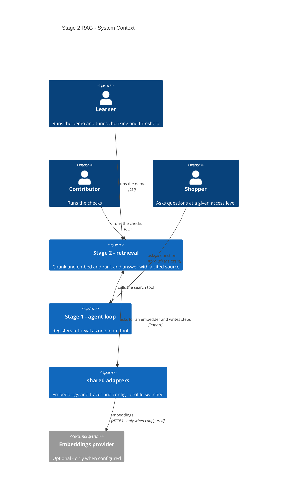
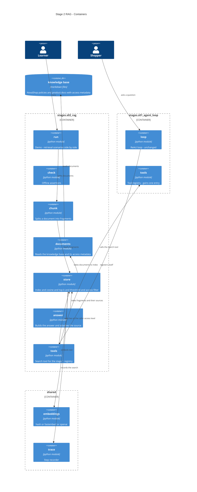
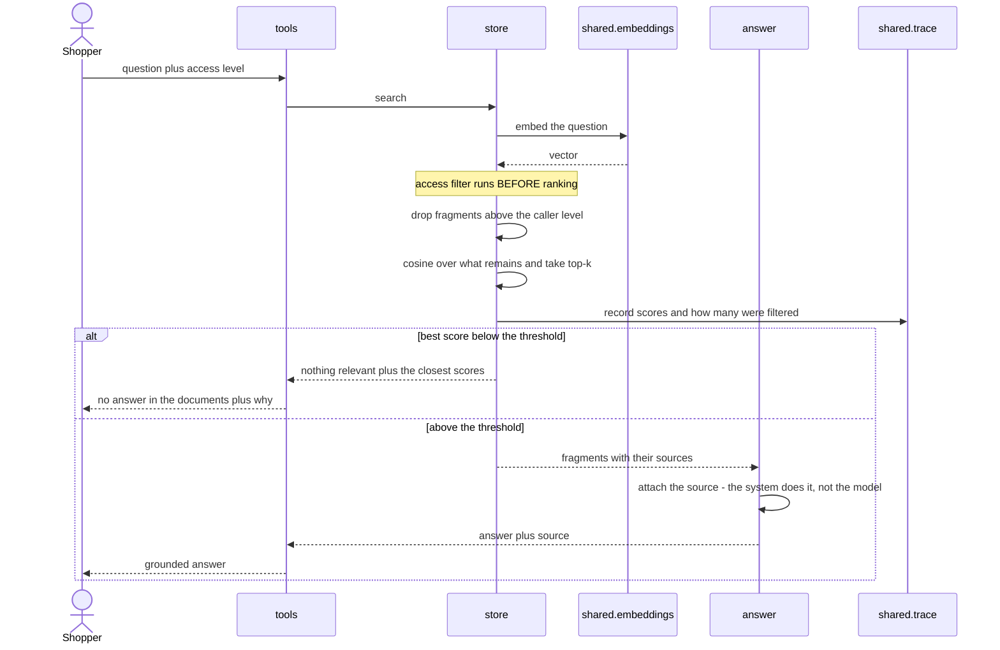
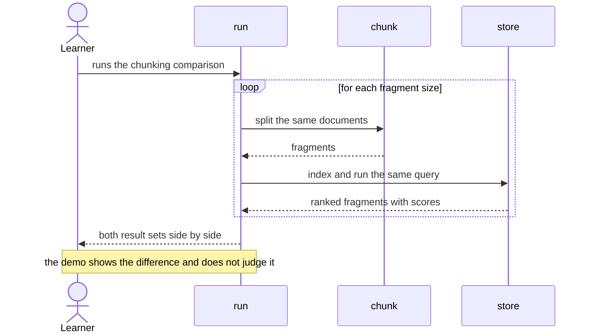

# Software Architecture Document — s02-rag

## 1. Introduction and goals

**Intent.** Stage 2 builds retrieval by hand: chunking documents, embeddings, cosine closeness,
the top-k selection and composing an answer with a mandatory citation. The aim is for the Learner
to see that "find the relevant thing" is arithmetic and sorting rather than magic, and for the
resulting search to become an ordinary tool for the agent from stage 1.

**Top-3 quality goals (1-liners; full scenarios in §10):**

1. **Transparent search** — every number a decision was made on is visible in the output.
2. **An ungrounded answer is impossible** — an answer with no named source does not exist as a state.
3. **Determinism** — the same query gives the same result, offline, with no key.

**Stakeholders.**

| Role | Interest | Sign-off owner? |
|---|---|---|
| Learner | Works through the stage: reads the lesson, runs the demo, does the exercises | No |
| Shopper | A character in the domain: asks questions, must not see internal documents | No |
| Contributor | Writes and maintains the stage | No |
| Tech Lead | Approves the SAD | Yes |

## 2. Constraints

**Technical.**
- Python ≥3.11; the stage adds an embeddings adapter to the shared layer
- No vector database: searching across dozens of fragments is sorting a list (spec §3)
- `numpy` as the stage's only new dependency (extra `[s02]`); `fastembed` — optional, `[embed]`
- The profile switches adapters, not code branches (repository ADR 0002)
- The tool registry and the loop from stage 1 **do not change** — the stage adds a tool, it does
  not rewrite the loop

**Organisational.**
- Reader's budget: 3–4 hours (CURRICULUM)
- The stage blocks 5 (memory will use the same embeddings) and 6 (the knowledge base goes into the
  service)

**Conventions.**
- [CONVENTIONS.md](../../../CONVENTIONS.md) · [PLAYBOOK.md](../../../PLAYBOOK.md)
- Roles — [CONTEXT.md](../../../CONTEXT.md), canonical
- Checks are bare `assert`, ≥1 on a failure mode (repository ADR 0006)
- Tracing from stage 1 (repository ADR 0005)

**Regulatory / external.**
- N/A — an invented knowledge base, no personal data.

## 3. Context and scope

The stage is a self-contained package with two entry points (the demo and the checks) plus one
tool that the agent from stage 1 registers. The line of trust runs in two places: **the asker's
access level** (what they are allowed to see) and **the boundary between data and instructions**
(retrieved text is data, even when it looks like a command).

<!-- brownfield: stage 1 is finished; `shared/` holds config, llm, fake_llm, trace, check_runner.
     There is no embeddings adapter yet — this stage creates it. The map
     `docs/architecture-map.md` is fresh as of stage 1. -->

**External systems (in / out):**

| Actor or system | Type | Interaction |
|---|---|---|
| Learner | Person | Runs the demo, changes the chunking and the threshold, reads the output |
| Contributor | Person | Runs the checks, edits the search |
| Shopper | Person (in the domain) | Asks questions; has an access level that limits the results |
| `shared` (adapters) | System (internal) | Supplies the embedder, the tracer, the configuration |
| NovaShop knowledge base | System (internal) | Policy and product-description files with access metadata |
| Embeddings provider | System (external) | **Optional.** Involved only when the Learner has configured it |

**C4 Context (L1):**



## 4. Solution strategy

**Top strategic choices (the seeds for ADRs):**

1. **Search is built by hand on a deterministic embedder.** A library would give a working search
   and zero understanding. A hash embedder over words gives both: it works, and at the same time
   it **explicitly fails to find synonyms** — which makes the boundary visible and turns the move
   to real embeddings from a promise into a conclusion. → **ADR-0001**.

2. **The access right is a parameter of the search, not the caller's concern.** The filter stands
   inside the search and is applied **before** the top-k selection. Otherwise everyone who calls
   the search has to remember the filter — and forgetting it is easy, and the consequence is
   silent. → **ADR-0002**.

3. **The source is attached to the answer by the system, not by the model.** An invented reference
   looks exactly like a real one; a model trusted to cite itself makes the system
   indistinguishable from a hallucination in precisely the place the citation was meant to remove
   that problem. → **ADR-0003**.

4. **Retrieval is a tool, not a separate system.** The agent from stage 1 gets it through the same
   registry; the loop does not change by a single line. This is not an architectural decision but
   a test of stage 1's thesis: a tool is an ordinary function with a schema.

**Target surface.** `cli` + `library-sdk`, as at stage 1: two commands in a terminal plus an
importable package. There are no alternatives — no ADR is spawned.

**The cut-off threshold** is an explicit number in configuration, not a relative comparison with
the best result. A relative rule ("take everything no worse than 80% of the top-1") gives a
different result on every query and does not lend itself to explanation; an absolute threshold is
visible and can be turned, which is what becomes an exercise. The decision did not cross the
blast-radius threshold: it is local and reversible.

## 5. Building block view

The same layout by responsibility as at stage 1: one module, one responsibility, each fitting on
one screen.

**Internal decomposition:**

```
stages/s02_rag/
├── chunk.py      splits a document into fragments; ≤50 lines
├── documents.py  reads the knowledge base, metadata, access level
├── store.py      index + cosine + top-k + threshold + access filter; ≤80 lines
├── answer.py     composing the answer: the citation is attached by the system
├── tools.py      the search tool for the stage 1 agent's registry (the bridge)
├── run.py        the demo
├── check.py      the checks
├── data/         the NovaShop knowledge base with access-level metadata
└── DECISION.md   the "RAG or fine-tuning" checklist

shared/
└── embeddings.py the adapter: hash | fastembed | openai (new)
```

**C4 Container (L2):**



## 6. Runtime view

**Critical flow 1: a query, the threshold and the access filter**



**Critical flow 2: chunking changes the results**



## 7. Deployment view

<!-- N/A: the stage is not deployed — a local CLI plus an importable package. The knowledge base
     lands in a service at stage 6, together with Postgres and pgvector. -->

## 8. Crosscutting concepts

| Concept | Convention | Where defined |
|---|---|---|
| Embeddings | Only through the shared-layer adapter; the stage never builds vectors itself | `shared/embeddings.py`, repository ADR 0002 |
| Access level | A parameter of the search; the filter runs **before** the top-k selection | `store.py`, ADR-0002 |
| Citation | The source is attached by the system from the list of what was found; the model does not cite | `answer.py`, ADR-0003 |
| Relevance threshold | An explicit number from configuration, not a relative rule | `shared/config.py`, §4 |
| Data versus instructions | Retrieved text goes to the model in a separate marked block, as **data** | `answer.py`, spec §6.1 |
| Tracing | The search writes the scores and how many were filtered out; stage 8 will read that | `shared/trace.py` |
| Indexing errors | A broken document is named and skipped; the base stays usable | `store.py`, AC-08b |
| Checks | Bare `assert`, ≥3 on failure modes | repository ADR 0006 |

## 9. Architecture decisions

Two numbering spaces: `docs/adr/` holds repository decisions (0001–0006),
`docs/features/s02-rag/adr/` holds this stage's decisions.

| # | Title | Status | Section |
|---|---|---|---|
| 0001 | Use a word-hash embedder as the teaching default | Accepted | §4 |
| 0002 | Filter by access level before the top-k selection, inside the search | Accepted | §4, §6 |
| 0003 | Attach the source with the system rather than asking the model to cite | Accepted | §4, §8 |
| 0004 | Replace two checklist situations and the third verdict (an amendment to AC-07) | Accepted | §4 |

ADR files: `docs/features/s02-rag/adr/NNNN-*.md`.

## 10. Quality requirements

**QG-1. Transparent search**
- **When:** the Learner runs the demo on the deterministic embedder.
- **Then:** indexing the knowledge base — **≤ 0.5 s**, one search query — **≤ 50 ms**; every
  fragment found is shown with a numeric score; the search module is **≤ 80 lines** of executable
  code, the chunking module **≤ 50 lines**; the lesson reads in **≤ 25 min** (**≤ 2500** words at
  100 words/min).
- **How verify:** the measurements in the demo's output; a count of the executable lines of both
  modules and of the lesson's words.

  The lesson's length stands here for a reason: an explanation that does not fit into twenty-five
  minutes stops being transparent no matter how transparent the code beneath it is.

**QG-2. An ungrounded answer is impossible**
- **When:** any query, including one the base holds no answer to.
- **Then:** **100%** of the answers issued contain a named source; when the threshold is not
  reached, no answer is composed at all and the run finishes successfully.
- **How verify:** a check works through the control set and asserts both properties; a separate
  failure-mode check on a query outside the knowledge base.

**QG-3. Determinism and offline**
- **When:** the Contributor runs the checks with no provider configured.
- **Then:** the run is **≤ 2 s**, the demo **≤ 1 s**, network calls **exactly 0**; three
  consecutive runs of the same query give an identical order of fragments.
- **How verify:** the check summary; a run with the socket blocked; a comparison of three runs.

## 11. Risks and technical debt

| Risk / debt | Severity | Mitigation | Owner |
|---|---|---|---|
| Open question: the access level as a search parameter or a filter at the call site | Open question | Default is a search parameter (ADR-0002): otherwise every caller has to remember the filter. Resolve before `sdd:implement` | Contributor |
| The hash embedder does not find synonyms — the reader may decide RAG does not work at all | Medium | This is not a flaw but the substance of the lesson. The lesson shows the gap as a number and says outright that it is exactly what motivates real embeddings | Contributor |
| ~~Parsing of access metadata fails open~~ **IT FIRED** | — | The `public` default made an internal document public on any slip in the frontmatter: no closing line, a BOM, a typo in the key, an indent, a different case, a mistake in the value. Six silent paths, none of them looking like an error. The risk **was not in the register** — nobody foresaw it, an independent review found it. Fixed to fail-closed, the six forms nailed down by a check | Contributor |
| ~~Two fine-tuning topics dropped out of the course~~ **ACCEPTED** | Low | ADR-0004 removed "not enough examples" and "the cost of a narrow high-volume task" from the checklist. The first has no support in the stage's code, the second needs a cost calculation that stage 2 does not provide. The address of the gap is stage 8, where measurement appears | Contributor |
| ~~The "≤80 lines" limit for the search is too tight~~ **IT FIRED** | — | The first implementation came to 98/80. The mitigation guessed the fact but not the place: what had to move out was **not the filter**. The filter is four lines, and the whole point of ADR-0002 is that they stand inside the search; moving them out would mean hiding what has to be in plain sight. What moved out was **document loading** (`documents.py`) — a separate responsibility, 30 lines. The search: 71/80 | Contributor |
| Injection through a retrieved document is shown but not solved | Medium | Deliberate: full protection needs a level stage 2 does not have. The lesson names the boundary outright, so the reader does not think the problem is closed | Contributor |
| The access filter is only checked at two levels | Low | Two are enough to show the mechanism; a hierarchy of levels is a stage 6 topic |

**Accepted debt (acceptable in v1, plan to fix later):**
- The index lives in memory and is rebuilt from scratch every time. For dozens of documents that
  is milliseconds; persistence arrives with `pgvector` at stage 6.
- Chunking is by size, with no regard for the document's structure. Chunking by headings is an
  obvious improvement and a good exercise, but it would push the module past the §10 limit.
- There is no reranker and no hybrid search. Deliberate (spec §3): there is no sense adding them
  while there is nothing to measure with — measurement arrives at stage 8.

## 12. Glossary

Canonical roles — [CONTEXT.md](../../../CONTEXT.md); course terms — [GLOSSARY.md](../../../GLOSSARY.md).
Below only what this stage introduces.

| Term | Meaning |
|---|---|
| Chunk | A part of a document that is indexed and found on its own. The fragment size is a decision that changes the search result |
| Embedding | A list of numbers representing the meaning of a text. Texts close in meaning have close lists — that is what search rests on |
| Cosine similarity | A measure of how close two embeddings are. A number from −1 to 1; larger means closer |
| Top-k | How many of the closest fragments we take. Not "all the relevant ones" but a fixed number of the best |
| Relevance threshold | The number below which a fragment counts as not close enough. It is exactly what turns "nothing was found" into an anticipated state |
| Grounding | The property of an answer resting on a specific retrieved fragment rather than on the model's memory |
| Provenance | The named source in an answer. Without it a grounded answer and a hallucination look the same |
| Access level | A flag on a document and a parameter of the search. The filter on it is applied before the top-k selection |
