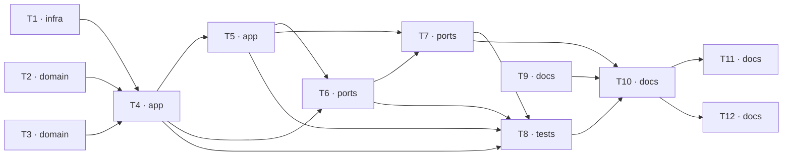

# Epic — s02-rag

> **Spec:** [spec.md](../spec.md) · **Design:** [sad.md](../sad.md) · **ADRs:** [adr/](../adr/)
> The stage has no data model and no API contract: the index lives in memory, there is no public surface.

## Goal

Build retrieval by hand, so that "find the relevant thing" stops being magic, and hand the result
to the agent from stage 1 as an ordinary tool — [spec §2](../spec.md).

## Scope

- **In:** `infra` (the embeddings adapter), `domain` (chunking, the knowledge base), `app`
  (search, answer), `ports` (the tool, the demo), `tests`, `docs`. Surfaces — `cli` +
  `library-sdk`.
- **Out:** training models, a vector database, rerankers, optimising search quality —
  [spec §3](../spec.md).

## Task map

## Tasks

See [tracker.md](./tracker.md) for status. Machine contract: [tasks.json](../tasks.json).

| # | Task | Layer | Blocked by | DoD (short) |
|---|---|---|---|---|
| T1 | An embeddings adapter in the shared layer: hash / fastembed / openai | infra | — | The hash embedder is deterministic: the same text gives the same vector across processes |
| T2 | Splitting documents into fragments | domain | — | The fragments cover the whole text with no loss |
| T3 | The NovaShop knowledge base with access-level metadata | domain | — | There is a returns document that has to be found by a literal question |
| T4 | Index, cosine, top-k, threshold and the access filter | app | T1, T2, T3 | A literal question gives top-1 = the returns document, with visible scores |
| T5 | Composing an answer with a source the system attaches | app | T4 | Every answer issued carries a source from the list of what was found |
| T6 | The search tool for the stage 1 agent's registry | ports | T4, T5 | The stage 1 agent picks that tool itself on a policy question |
| T7 | The demo: search, threshold, chunking and the access filter side by side | ports | T5, T6 | A run with no key succeeds, with no network calls |
| T8 | The stage checks following the coverage table | tests | T4, T5, T6, T7 | Thirteen checks match the thirteen rows of the coverage table |
| T9 | DECISION.md — the "RAG or fine-tuning" checklist | docs | — | Six situations, exactly one answer for each |
| T10 | The stage lesson: the canon, the bridge to NovaShop, the boundaries | docs | T7, T8, T9 | The lesson is ≤ 2500 words (spec §6) |
| T11 | Exercises, reference solutions and the checklist | docs | T10 | Four exercises with an explicit expected result |
| T12 | The stage's terms into the glossary, the status into the curriculum | docs | T10 | Every highlighted term of the lesson has a glossary definition |

## Risks / Hard rules

- **The access filter is applied BEFORE the top-k selection**
  ([ADR-0002](../adr/0002-filter-by-access-level-before-top-k.md)).
  The check asserts both properties: the internal thing did not leak **and** the permitted thing
  did not disappear.
- **The source is attached by the system, not the model**
  ([ADR-0003](../adr/0003-system-attaches-the-source.md)).
- **The loop and the registry of stage 1 are not edited** — the stage adds a tool, it does not
  rewrite the agent.
- The search module ≤ 80 lines, chunking ≤ 50 ([spec §6](../spec.md)). Going over means moving a
  module out, not inflating the limit.
- Everything works offline with no API key.
