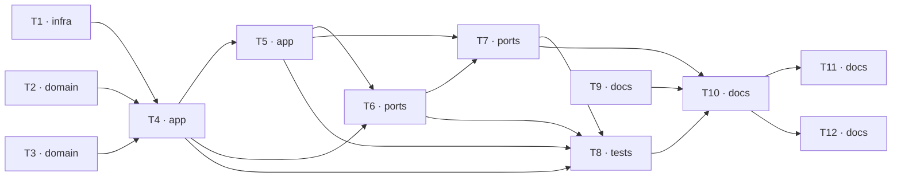

# Epic — s02-rag

> **Spec:** [spec.md](../spec.md) · **Design:** [sad.md](../sad.md) · **ADRs:** [adr/](../adr/)
> Даних-моделі й контракту API етап не має: індекс живе в пам'яті, публічної поверхні немає.

## Goal

Побудувати retrieval вручну, щоб «знайти релевантне» перестало бути магією, і віддати
результат агентові з етапу 1 як звичайний інструмент — [spec §2](../spec.md).

## Scope

- **In:** `infra` (адаптер ембеддингів), `domain` (нарізка, база знань), `app` (пошук,
  відповідь), `ports` (інструмент, демо), `tests`, `docs`. Поверхні — `cli` + `library-sdk`.
- **Out:** тренування моделей, векторна база, реранкери, оптимізація якості пошуку —
  [spec §3](../spec.md).

## Task map

## Tasks

See [tracker.md](./tracker.md) for status. Machine contract: [tasks.json](../tasks.json).

| # | Task | Layer | Blocked by | DoD (short) |
|---|---|---|---|---|
| T1 | Адаптер ембеддингів у спільному шарі: hash | fastembed | openai | infra | — | Хеш-ембеддер детермінований: той самий текст дає той самий вектор між процесами |
| T2 | Нарізка документів на фрагменти | domain | — | Фрагменти покривають увесь текст без втрат |
| T3 | База знань NovaShop із метаданими рівня доступу | domain | — | Є документ про повернення, який має знайтися за дослівним питанням |
| T4 | Індекс, косинус, top-k, поріг і фільтр доступу | app | T1, T2, T3 | Дослівне питання дає топ-1 = документ про повернення, з видимими оцінками |
| T5 | Складання відповіді з джерелом, яке додає система | app | T4 | Кожна видана відповідь несе джерело з переліку знайденого |
| T6 | Інструмент пошуку для реєстру агента з етапу 1 | ports | T4, T5 | Агент з етапу 1 сам обирає цей інструмент на питання про політику |
| T7 | Демо: пошук, поріг, нарізка й фільтр доступу поруч | ports | T5, T6 | Запуск без ключа успішний, без мережевих звернень |
| T8 | Перевірки етапу за таблицею покриття | tests | T4, T5, T6, T7 | Тринадцять перевірок відповідають тринадцяти рядкам таблиці покриття |
| T9 | DECISION.md — чекліст «RAG чи fine-tuning» | docs | — | Шість ситуацій, для кожної рівно одна відповідь |
| T10 | Урок етапу: канон, міст на NovaShop, межі | docs | T7, T8, T9 | Урок ≤ 2500 слів (spec §6) |
| T11 | Вправи, еталонні розв'язки й чекліст | docs | T10 | Чотири завдання з явним очікуваним результатом |
| T12 | Терміни етапу в глосарій, статус у програму | docs | T10 | Кожен виділений термін уроку має визначення в глосарії |

## Risks / Hard rules

- **Фільтр доступу застосовується ДО відбору top-k** ([ADR-0002](../adr/0002-filter-by-access-level-before-top-k.md)).
  Перевірка стверджує обидві властивості: внутрішнє не витекло **і** дозволене не зникло.
- **Джерело додає система, не модель** ([ADR-0003](../adr/0003-system-attaches-the-source.md)).
- **Цикл і реєстр етапу 1 не редагуються** — етап додає інструмент, не переписує агента.
- Модуль пошуку ≤ 80 рядків, нарізки ≤ 50 ([spec §6](../spec.md)). Перевищення — виносити
  модуль, не роздувати ліміт.
- Усе працює офлайн без API-ключа.
