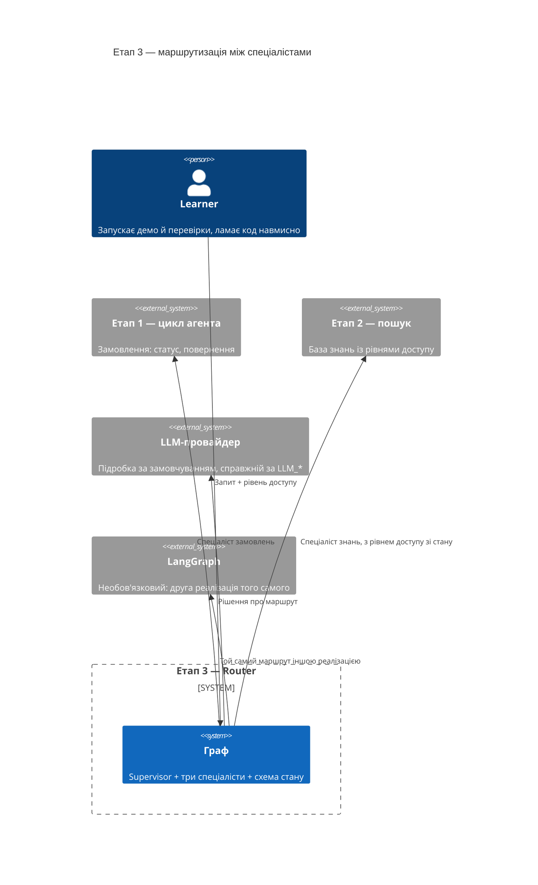
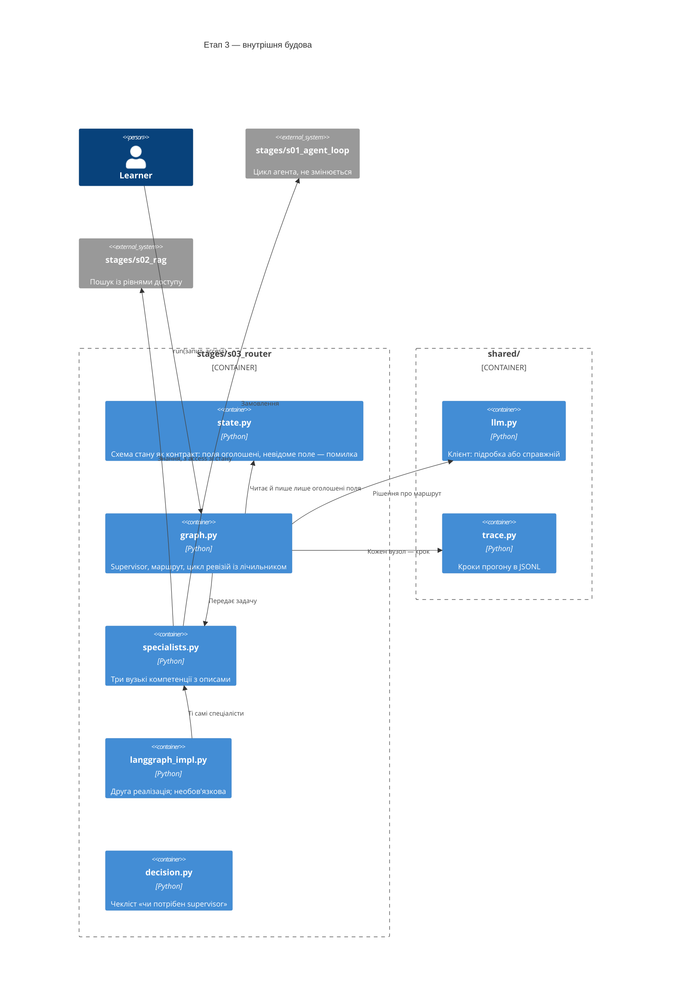
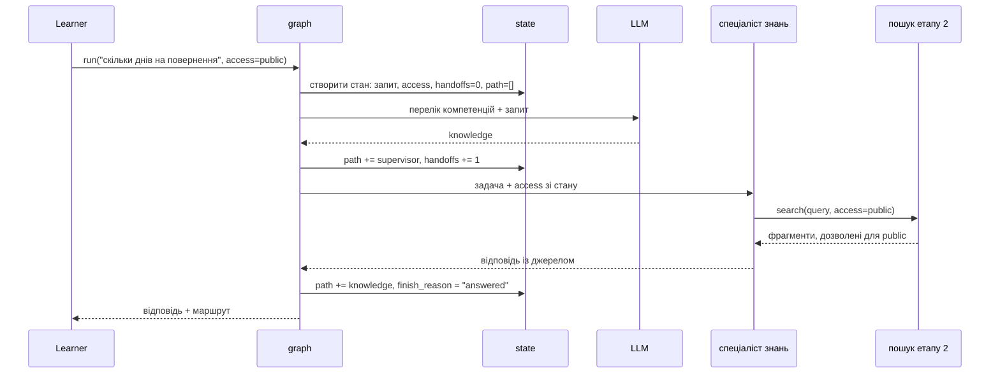

# SAD — s03-router

## 1. Introduction and goals

Етап 3 показує, що **supervisor — це той самий агент, у якого інструменти є агентами**. Із
цього речення випливає вся структура: нової архітектури не з'являється, з'являється рівень
над уже написаним.

Три цілі, кожна перевіряється:

1. Читач бачить маршрутизацію як послідовність вузлів, а не як «модель якось вирішує».
2. Читач бачить **схему стану як рішення**: що в ній є, хто це читає, і чому додати поле
   через півроку дорожче за все інше в графі.
3. Читач має чекліст «чи потрібен тут supervisor», бо частіше за все — не потрібен.

## 2. Constraints

| # | Обмеження | Звідки |
|---|---|---|
| C-1 | Офлайн, без ключа до API | правило курсу: перевірка, що потребує мережі, зламана |
| C-2 | Цикл етапу 1 не змінюється жодним рядком | етап 3 додає рівень, не переписує нижній |
| C-3 | Власний граф ≤ 80 виконуваних рядків | NFR-1: більше — і це вже не «видно цілком» |
| C-4 | LangGraph — необов'язковий extra `[s03]` | NFR-5: етап проходиться без встановлення |
| C-5 | `if profile == ...` у коді етапу заборонено | ADR репозиторію 0002 |
| C-6 | Проза українською, код англійською | CONVENTIONS.md |

## 3. Context and scope

Learner запускає демо або перевірки. Граф отримує запит **разом із рівнем доступу
питальника** й повертає відповідь із маршрутом. Спеціалісти — це вже написаний код етапів
1–2 плюс один новий, найпростіший.



**У межах:** маршрутизація, схема стану, цикл ревізій із лімітом, передача рівня доступу,
друга реалізація на LangGraph, чекліст «чи потрібен supervisor».

**Поза межами:** пам'ять між прогонами (етап 5), винесення спеціалістів у процеси (етапи
4 і 6), порівняння фреймворків (етап 9), вимірювання якості маршрутизації (етап 8).

## 4. Solution strategy

| Рішення | Вибір | Чому |
|---|---|---|
| Порядок подачі | Власний граф, потім LangGraph | Читач, який побачив бібліотеку першою, запам'ятає її як магію. ADR-0001 |
| Схема стану | Оголошений контракт із фіксованим набором полів | Вільний словник ховає найдорожче рішення етапу за зручністю. ADR-0002 |
| Рівень доступу | Поле стану, не аргумент виклику | Передача — місце, де права зникають найтихіше. ADR-0003 |
| Маршрут | Рішення моделі за переліком компетенцій | Регулярка ховає саме те, заради чого етап існує. ADR-0004 |
| Ліміт ревізій | Лічильник у стані, дефолт малий | Той самий патерн, що ліміт кроків етапу 1 |
| Спеціалісти | Уже написаний код етапів 1–2 плюс один новий | Supervisor складається з наявного — у цьому теза |

## 5. Building block view

```
stages/s03_router/
├── state.py        схема стану: оголошені поля, лічильники, причина завершення
├── specialists.py  три спеціалісти: замовлення (етап 1), знання (етап 2), підрахунки
├── graph.py        supervisor + маршрутизація + цикл ревізій; ≤80 рядків
├── langgraph_impl.py  той самий граф на LangGraph; імпортується лише за наявності
├── decision.py     чекліст «чи потрібен supervisor», кодом
├── run.py          демо
├── check.py        перевірки
└── DECISION.md     проза чекліста
```

**C4 Container (L2):**



**Чому `state.py` окремо від `graph.py`.** Схема стану — це контракт між усіма вузлами, і
вона переживе будь-який із них. Тримати її в тому самому файлі, що й логіку маршрутизації,
означало б показувати її як деталь реалізації графа — тоді як етап існує, зокрема, щоб
показати зворотне.

## 6. Runtime view

**Потік 1 — запит доходить до спеціаліста (AC-01, AC-05).**



**Потік 2 — ревізія й ліміт (AC-03).**


**Потік 3 — компетенції немає (AC-04).**

```mermaid
sequenceDiagram
    participant G as graph
    participant M as LLM
    participant S as state

    G->>M: перелік компетенцій + "яка погода в Києві"
    M-->>G: none
    G->>S: finish_reason = "no_specialist", path = [supervisor]
    Note over G,S: жодного спеціаліста не викликано;<br/>відповідь називає доступні компетенції
```

## 7. Deployment view

`<!-- N/A: етап виконується локально як модуль. Розгортання — етап 6. -->`

## 8. Crosscutting concepts

| Аспект | Як вирішено |
|---|---|
| Профілі | Етап не має розгалуження за профілем; клієнт приходить із `shared/llm.py` |
| Трейс | Кожен вузол — крок із назвою, лічильниками й причиною; читає етап 8 |
| Помилки | Виняток спеціаліста стає результатом кроку, а не падінням графа (AC-08b) |
| Права доступу | Поле стану; перевіряється в обидва боки (AC-05, AC-05b) і на підвищення (AC-05c) |
| Детермінізм | Маршрут дає підробка за записаним сценарієм; справжня модель — ручний чекліст |

## 9. Architecture decisions

| # | Рішення | Статус | Де відбилось |
|---|---|---|---|
| 0001 | Власний міні-граф перед LangGraph | Accepted | §4, §5 |
| 0002 | Схема стану — оголошений контракт, не вільний словник | Accepted | §4, §5, §8 |
| 0003 | Рівень доступу подорожує у стані, не в аргументах | Accepted | §4, §8 |
| 0004 | Маршрут обирає модель за переліком компетенцій | Accepted | §4, §6 |

## 10. Quality requirements

| Сценарій | When | Then | How verify |
|---|---|---|---|
| Маршрутизація | Шість запитів із AC-01 | 6 із 6 у правильного спеціаліста | перевірка e2e з переліком очікуваних маршрутів |
| Розмір графа | Підрахунок виконуваних рядків `graph.py` | ≤ 80 | перевірка бюджету рядків |
| Незалежність від LangGraph | Прогін без extra `[s03]` | усі перевірки зелені, AC-06 позначений непройденим | CI без extra |
| Час уроку | `wc -w README.md` | ≤ 2500 слів | перевірка звірки чисел |
| Частка відмов | Лічильник перевірок | ≥ 1/3 | перевірка лічильника |

## 11. Risks and technical debt

| Ризик | Тяжкість | Мітигація | Власник |
|---|---|---|---|
| **Ліміт «≤80 рядків» для графа затісний** | Medium | Досвід етапу 2: ризик такого роду **спрацьовує**, і мітигація вгадує факт, не місце. Виносити треба буде **не** маршрутизацію (у ній суть), а або складання підсумкової відповіді, або оцінку «чи задовольняє» | Contributor |
| **Рівень доступу губиться на передачі й ніхто не помічає** | High | Три окремі критерії — витік, втрата, підвищення. Досвід етапу 2: перевірка лише на витік лишається зеленою у двох із трьох випадків | Contributor |
| **Маршрут на підробці не той, що на справжній моделі** | Medium | Названо прямо в §«Чого план не доводить» і в ручному чеклісті; вимірювання — етап 8 | Contributor |
| **LangGraph-версія розійдеться з власною після оновлення бібліотеки** | Low | AC-06 порівнює маршрути й падає при розбіжності; версія закріплена в extra | Contributor |
| **Чекліст «чи потрібен supervisor» розійдеться з кодом** | Low | Досвід етапу 2: правила кодом, перевірка закріплює склад — назви ситуацій і присутність усіх вердиктів | Contributor |

## 12. Glossary

| Термін | Значення в цьому етапі |
|---|---|
| Supervisor | Агент, чиї інструменти — інші агенти. Вирішує, кому віддати задачу, і чи готова відповідь |
| Спеціаліст | Агент із вузьким набором інструментів і одним описом компетенції |
| Handoff | Передача задачі від supervisor'а спеціалістові. Лічиться у стані |
| Схема стану | Оголошений набір полів, які вузли мають право читати й писати |
| Цикл ревізій | Повернення задачі спеціалістові після незадовільної відповіді. Обмежений лічильником |
| Вузол | Крок графа: supervisor або спеціаліст. Потрапляє у `path` і у трейс |
