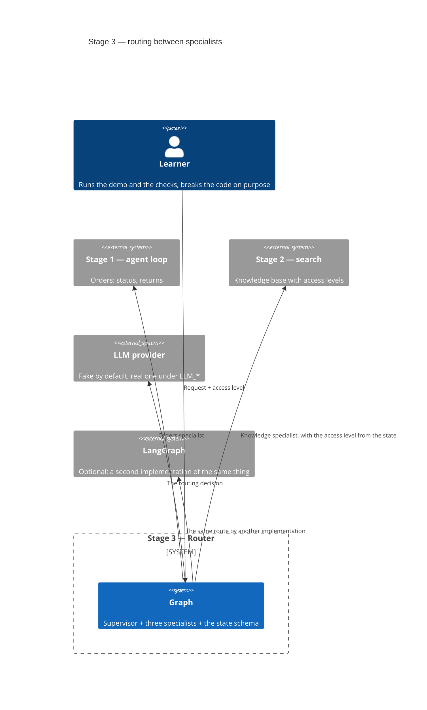
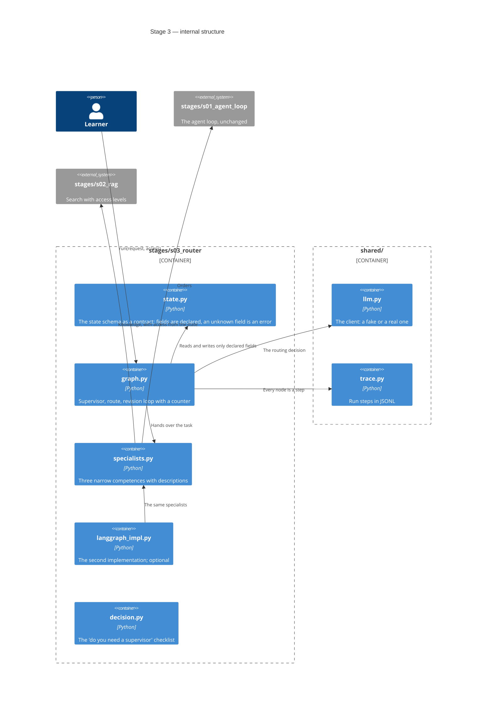
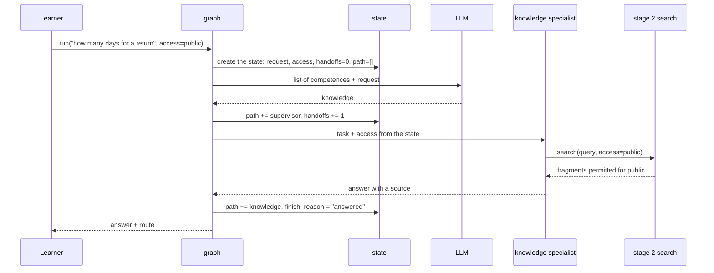
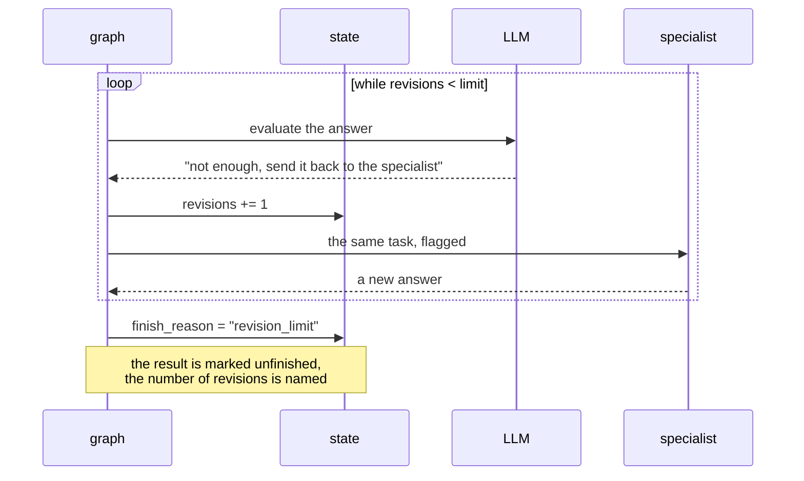

# SAD — s03-router

## 1. Introduction and goals

Stage 3 shows that **a supervisor is that same agent, with agents for tools**. The whole
structure follows from that sentence: no new architecture appears, what appears is a layer above
what is already written.

Three goals, each of them checked:

1. The reader sees routing as a sequence of nodes rather than as "the model somehow decides".
2. The reader sees the **state schema as a decision**: what is in it, who reads that, and why
   adding a field six months from now costs more than anything else in the graph.
3. The reader has a "do you need a supervisor here" checklist, because most of the time the
   answer is no.

## 2. Constraints

| # | Constraint | Where from |
|---|---|---|
| C-1 | Offline, with no API key | the course rule: a check that needs the network is broken |
| C-2 | The stage 1 loop does not change by a single line | stage 3 adds a layer, it does not rewrite the one below |
| C-3 | Our own graph ≤ 80 executable lines | NFR-1: any more and it is no longer "visible in one piece" |
| C-4 | LangGraph is an optional `[s03]` extra | NFR-5: the stage can be completed without installing it |
| C-5 | `if profile == ...` is forbidden in the stage's code | repository ADR 0002 |
| C-6 | Everything published is written in English | CONVENTIONS.md |

## 3. Context and scope

The Learner runs the demo or the checks. The graph receives a request **together with the
asker's access level** and returns an answer with the route. The specialists are the code
already written in stages 1–2 plus one new, simplest one.



**In scope:** routing, the state schema, the revision loop with a limit, passing the access
level, a second implementation on LangGraph, the "do you need a supervisor" checklist.

**Out of scope:** memory between runs (stage 5), moving specialists into processes (stages 4 and
6), comparing frameworks (stage 9), measuring the quality of routing (stage 8).

## 4. Solution strategy

| Decision | Choice | Why |
|---|---|---|
| Order of presentation | Our own graph, then LangGraph | A reader who sees the library first will remember it as magic. ADR-0001 |
| State schema | A declared contract with a fixed set of fields | A free-form dictionary hides the stage's most expensive decision behind convenience. ADR-0002 |
| Access level | A state field, not a call argument | The handoff is where rights disappear most quietly. ADR-0003 |
| Route | A model's decision from a list of competences | A regular expression hides the very thing the stage exists for. ADR-0004 |
| Revision limit | A counter in the state, with a small default | The same pattern as the step limit at stage 1 |
| Specialists | The code already written in stages 1–2 plus one new one | A supervisor is assembled from what exists — that is the thesis |

## 5. Building block view

```
stages/s03_router/
├── state.py        the state schema: declared fields, counters, finish reason
├── specialists.py  three specialists: orders (stage 1), knowledge (stage 2), totals
├── graph.py        supervisor + routing + revision loop; ≤80 lines
├── langgraph_impl.py  the same graph on LangGraph; imported only when present
├── decision.py     the "do you need a supervisor" checklist, in code
├── run.py          the demo
├── check.py        the checks
└── DECISION.md     the checklist in prose
```

**C4 Container (L2):**



**Why `state.py` is separate from `graph.py`.** The state schema is the contract between all the
nodes, and it will outlive any one of them. Keeping it in the same file as the routing logic
would present it as an implementation detail of the graph — whereas the stage exists, among other
things, to show the opposite.

## 6. Runtime view

**Flow 1 — a request reaches a specialist (AC-01, AC-05).**



**Flow 2 — revision and the limit (AC-03).**



**Flow 3 — there is no such competence (AC-04).**

```mermaid
sequenceDiagram
    participant G as graph
    participant M as LLM
    participant S as state

    G->>M: list of competences + "what is the weather in Kyiv"
    M-->>G: none
    G->>S: finish_reason = "no_specialist", path = [supervisor]
    Note over G,S: no specialist was called;<br/>the answer names the available competences
```

## 7. Deployment view

`<!-- N/A: the stage runs locally as a module. Deployment is stage 6. -->`

## 8. Crosscutting concepts

| Aspect | How it is solved |
|---|---|
| Profiles | The stage has no branching on profile; the client arrives from `shared/llm.py` |
| Trace | Every node is a step with a name, counters and a reason; stage 8 reads it |
| Errors | A specialist's exception becomes the result of a step, not a crash of the graph (AC-08b) |
| Access rights | A state field; checked in both directions (AC-05, AC-05b) and against escalation (AC-05c) |
| Determinism | The route comes from the fake following a recorded script; a real model gets a manual checklist |

## 9. Architecture decisions

| # | Decision | Status | Where it shows |
|---|---|---|---|
| 0001 | A hand-rolled mini-graph before LangGraph | Accepted | §4, §5 |
| 0002 | The state schema is a declared contract, not a free-form dictionary | Accepted | §4, §5, §8 |
| 0003 | The access level travels in the state, not in the arguments | Accepted | §4, §8 |
| 0004 | The model picks the route from a list of competences | Accepted | §4, §6 |

## 10. Quality requirements

| Scenario | When | Then | How verify |
|---|---|---|---|
| Routing | The six requests from AC-01 | 6 out of 6 at the right specialist | an e2e check with the list of expected routes |
| Graph size | Counting the executable lines of `graph.py` | ≤ 80 | a line-budget check |
| Independence from LangGraph | A run without the `[s03]` extra | all checks green, AC-06 marked not passed | CI without the extra |
| Lesson time | `wc -w README.md` | ≤ 2500 words | the number-reconciliation check |
| Share of failure modes | A counter over the checks | ≥ 1/3 | a counter check |

## 11. Risks and technical debt

| Risk | Severity | Mitigation | Owner |
|---|---|---|---|
| **The "≤80 lines" limit for the graph is too tight** | Medium | The lesson of stage 2: a risk of this kind **does fire**, and the mitigation guesses the fact, not the place. What will have to move out is **not** the routing (that is the substance) but either the assembly of the final answer or the "is this satisfactory" evaluation | Contributor |
| **The access level is lost on the handoff and nobody notices** | High | Three separate criteria — leak, loss, escalation. The lesson of stage 2: a check for a leak alone stays green in two cases out of three | Contributor |
| **The route on the fake is not the route on a real model** | Medium | Named plainly in §"What the plan does not prove" and in the manual checklist; measurement is stage 8 | Contributor |
| **The LangGraph version will drift from our own after a library update** | Low | AC-06 compares the routes and fails on a divergence; the version is pinned in the extra | Contributor |
| **The "do you need a supervisor" checklist will drift from the code** | Low | The lesson of stage 2: the rules live in code, and a check pins the contents — the names of the situations and the presence of every verdict | Contributor |

## 12. Glossary

| Term | Meaning in this stage |
|---|---|
| Supervisor | An agent whose tools are other agents. Decides who gets the task, and whether the answer is ready |
| Specialist | An agent with a narrow tool set and one description of its competence |
| Handoff | The passing of a task from the supervisor to a specialist. Counted in the state |
| State schema | The declared set of fields nodes have the right to read and write |
| Revision loop | Sending a task back to a specialist after an unsatisfactory answer. Bounded by a counter |
| Node | A step of the graph: the supervisor or a specialist. Lands in `path` and in the trace |
