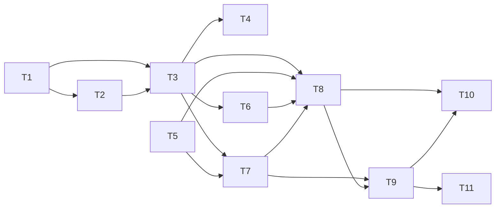

# Epic — s03-router

Routing between specialists: a supervisor whose tools are the agents of stages 1 and 2.

- [Specification](../spec.md) — 12 criteria, 5 on failure modes, 3 on authorization
- [SAD](../sad.md) — Arc42 + C4, 5 diagrams
- [ADR](../adr/) — 4 decisions: the order of presentation, the state schema, rights in the
  state, the route chosen by the model

## Dependency graph

**Two parallel starts:** T1 (the state schema) and T5 (the checklist) depend on nothing and on
each other not at all. The rest queues up behind T3 — the graph.

**The most expensive task is T1**, and not by volume. The state schema is the contract between
all the nodes; a mistake in it costs as much as the number of nodes that manage to rely on it.
That is why it comes first and why it has an ADR of its own (0002).

## Order

1. **T1, T5** — in parallel, no dependencies
2. **T2** — specialists on the state schema
3. **T3** — the graph; this is where the line limit starts to bite (SAD §11)
4. **T4** — three checks on rights: leak, loss, escalation
5. **T6, T7** — LangGraph and the demo
6. **T8** — filling out the checks to full coverage + the mutation run
7. **T9–T11** — the lesson, the exercises, the glossary
