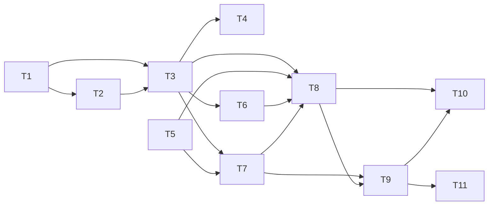

# Epic — s03-router

Маршрутизація між спеціалістами: supervisor, чиї інструменти — агенти етапів 1 і 2.

- [Специфікація](../spec.md) — 12 критеріїв, 5 на режими відмови, 3 на авторизацію
- [SAD](../sad.md) — Arc42 + C4, 5 діаграм
- [ADR](../adr/) — 4 рішення: порядок подачі, схема стану, права у стані, маршрут моделлю

## Граф залежностей

**Два паралельні старти:** T1 (схема стану) і T5 (чекліст) не залежать ні від чого й ні від
одного. Решта вишиковується за T3 — графом.

**Найдорожча задача — T1**, і не за обсягом. Схема стану є контрактом між усіма вузлами;
помилка в ній коштує стільки, скільки вузлів устигне на неї спертися. Саме тому вона перша
й саме тому має власний ADR (0002).

## Порядок

1. **T1, T5** — паралельно, без залежностей
2. **T2** — спеціалісти на схемі стану
3. **T3** — граф; тут же ліміт рядків почне тиснути (SAD §11)
4. **T4** — три перевірки на права: витік, втрата, підвищення
5. **T6, T7** — LangGraph і демо
6. **T8** — добір перевірок до повного покриття + мутаційний прогін
7. **T9–T11** — урок, вправи, глосарій
