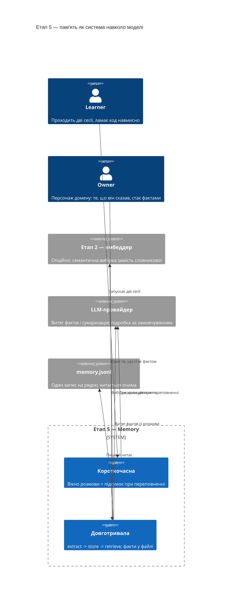
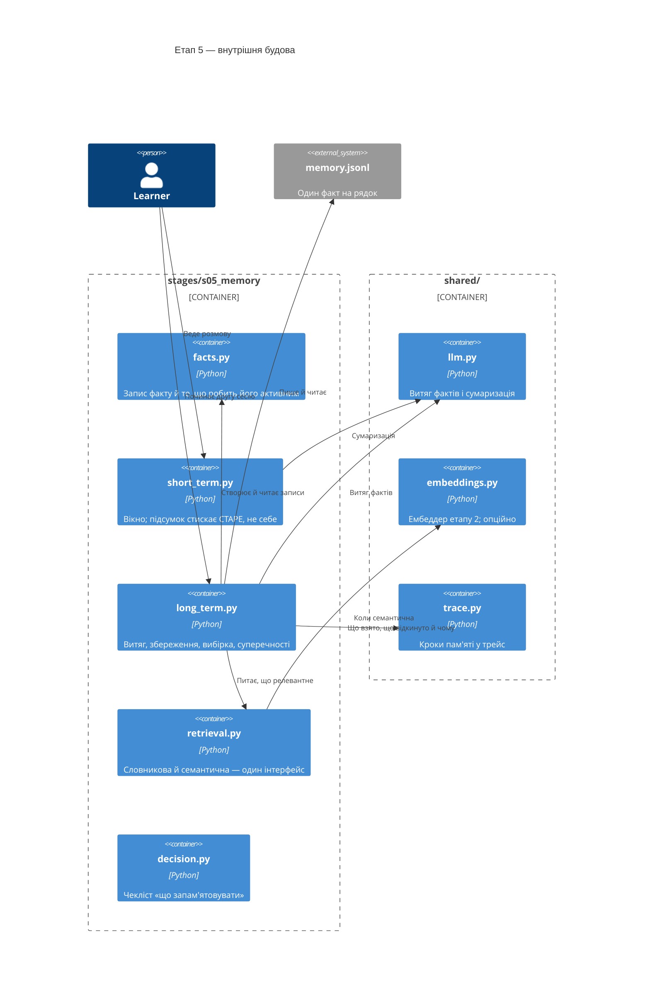
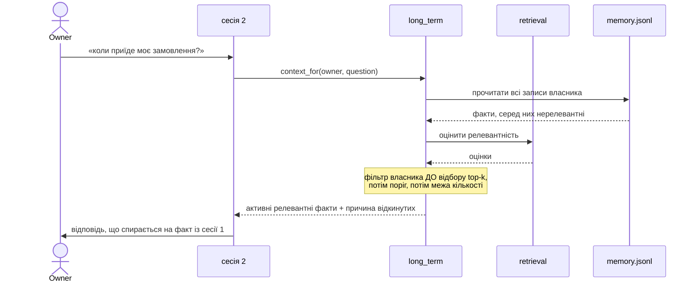

# SAD — s05-memory

## 1. Introduction and goals

Етап 5 показує, що **пам'ять — це система навколо моделі, а не її властивість**. Модель не
пам'ятає нічого; усе, що виглядає як пам'ять, хтось поклав у контекст перед викликом.

Із цього одразу випливає, чому етап не про збереження:

> **Що більше нерелевантного в контексті, то гірша відповідь. Обмеження є на токени, а не
> на дурниці.**

Три цілі, кожна перевіряється:

1. Читач бачить, що короткочасна й довготривала пам'ять розв'язують різні задачі.
2. Читач бачить, що вибірка з пам'яті — **та сама** задача, що пошук етапу 2, із тими самими
   межами.
3. Читач будує перевірку на **селективність**, а не на збереження.

## 2. Constraints

| # | Обмеження | Звідки |
|---|---|---|
| C-1 | Офлайн, без ключа, без сховища | правило курсу; файл замість БД до етапу 6 |
| C-2 | Довготривала ≤ 90 рядків, короткочасна ≤ 50 | NFR-1, NFR-2 |
| C-3 | Семантична вибірка необов'язкова | NFR-6: словникова працює завжди |
| C-4 | Ембеддер — той самий, що на етапі 2 | теза: це та сама задача, а не нова |
| C-5 | Власник — поле запису, не аргумент вибірки | §6.1; урок етапу 3 про рівень доступу |
| C-6 | Проза українською, код англійською | CONVENTIONS.md |

## 3. Context and scope



**У межах:** вікно й сумаризація, витяг/збереження/вибірка фактів, суперечності, TTL,
ізоляція власників, дві реалізації вибірки, чекліст «що запам'ятовувати».

**Поза межами:** сховище в БД (етап 6), багатокористувацька модель, графи знань, зв'язки
між фактами, оптимізація вибірки (етап 8).

## 4. Solution strategy

| Рішення | Вибір | Чому |
|---|---|---|
| Дві пам'яті | Окремі модулі з окремими задачами | Плутати їх — найчастіша помилка; вони не замінюють одна одну |
| Сховище | JSONL-файл, один запис на рядок | Читається очима; етап 6 замінить тим самим інтерфейсом. ADR-0001 |
| Суперечності | Тема факту, не зміст | Порівняння змісту — це вже вивід. ADR-0002 |
| Протухання | TTL у записі, перевірка при вибірці | Видалення при записі втратило б історію. ADR-0003 |
| Власник | Поле запису; фільтр **до** відбору top-k | Урок етапів 2 і 3. ADR-0004 |
| Вибірка | Один інтерфейс, дві реалізації | Показати, що це та сама задача, що пошук |

## 5. Building block view

```
stages/s05_memory/
├── facts.py        запис факту: власник, тема, текст, час, TTL, статус
├── short_term.py   вікно розмови + підсумок при переповненні; ≤50 рядків
├── long_term.py    extract -> store -> retrieve, суперечності, TTL; ≤90 рядків
├── retrieval.py    дві реалізації вибірки на одному інтерфейсі
├── decision.py     чекліст «що запам'ятовувати»
├── run.py          демо: дві сесії поспіль
├── check.py        перевірки
└── DECISION.md     проза чекліста
```

**C4 Container (L2):**



**Чому `retrieval.py` окремо.** Дві реалізації на одному інтерфейсі — це і є доказ тези
«вибірка з пам'яті = пошук етапу 2». Усередині `long_term.py` вони виглядали б як `if`, і
теза перетворилась би на деталь реалізації.

**Чому `facts.py` окремо.** Питання «що робить факт активним» — це чотири умови (власник,
статус, TTL, поріг), і вони мають бути видимі разом. Розкидані по місцях використання вони
перестають читатися як одне правило.

## 6. Runtime view

**Потік 1 — друга сесія бачить факт першої (AC-02, AC-03).**



**Потік 2 — суперечність (AC-04).**

```mermaid
sequenceDiagram
    participant L as long_term
    participant F as memory.jsonl

    L->>L: новий факт, тема «адреса»
    L->>F: знайти активний факт тієї ж теми того ж власника
    F-->>L: старий факт
    L->>F: старий -> статус "replaced", час заміни
    L->>F: новий -> статус "active"
    Note over L,F: обидва лишаються у файлі;<br/>у вибірку йде один
```

**Потік 3 — переповнення вікна (AC-01, AC-01b).**

```mermaid
sequenceDiagram
    participant S as short_term
    participant M as модель

    S->>S: повідомлень більше за вікно
    S->>M: стиснути НАЙСТАРІШІ, підсумок не чіпати
    M-->>S: підсумок
    Note over S: хвіст лишається дослівно;<br/>кількість стиснутого — число
```

## 7. Deployment view

`<!-- N/A: файл у теці етапу. Сховище — етап 6. -->`

## 8. Crosscutting concepts

| Аспект | Як вирішено |
|---|---|
| Трейс | Що взято у контекст, що відкинуто й **чому** — окремі кроки |
| Помилки | Зіпсований запис названо й пропущено; решта пам'яті робоча (AC-09b) |
| Довіра | Текст факту писав користувач: у промпт іде як дані, у позначеному блоці |
| Ізоляція | Власник — поле запису; фільтр до відбору; перевіряється в обидва боки |
| Детермінізм | Витяг і сумаризація — підробка за сценарієм; час подається явно |

## 9. Architecture decisions

| # | Рішення | Статус | Де відбилось |
|---|---|---|---|
| 0001 | JSONL-файл, а не БД і не пам'ять процесу | Accepted | §4, §5 |
| 0002 | Суперечність за темою факту, не за змістом | Accepted | §4, §6 |
| 0003 | Протухання при вибірці, а не видалення при записі | Accepted | §4, §6 |
| 0004 | Власник — поле запису; фільтр до відбору top-k | Accepted | §4, §8 |

## 10. Quality requirements

| Сценарій | When | Then | How verify |
|---|---|---|---|
| Селективність | Питання з нерелевантним фактом у пам'яті | Факт не в контексті, причина названа | unit-перевірка |
| Ізоляція | Дві пам'яті, схожі факти | Чужий не дійшов, свій дійшов | дві дзеркальні перевірки |
| Розмір модулів | Підрахунок виконуваних рядків | ≤90 і ≤50 | перевірка бюджету |
| Без ембеддера | Прогін на базовій установці | Зелено; словникова вибірка | `scripts/clean_install.py` |
| Час набору | `python -m stages.s05_memory.check` | ≤5 с | замір у `check_all` |

## 11. Risks and technical debt

| Ризик | Тяжкість | Мітигація | Власник |
|---|---|---|---|
| **Перевірка доводить збереження замість селективності** | High | Це головна вада, яку етап може мати. Тому AC-03 і AC-06b — окремі критерії з окремими перевірками, а не пункти всередині інших. Досвід етапів 2–4: дзеркальна половина не з'являється сама | Contributor |
| **Ліміт рядків `long_term` затісний** | Medium | Досвід трьох етапів поспіль: ризик спрацьовує, і мітигація вгадує факт, не місце. Виносити треба буде **не** вибірку (вона вже окремо), а витяг фактів — він єдиний потребує моделі | Contributor |
| **Час у перевірках робить їх мигтливими** | High | Час подається **явно** параметром, ніде не береться з `datetime.now()` усередині логіки. Інакше перевірка TTL проходить уночі й падає вдень | Contributor |
| **Суперечність за темою пропустить справжню суперечність** | Medium | Названо в §«Чого план не доводить» і в ADR-0002. Не мітигується — обмежується й називається | Contributor |
| **Текст факту вплине на модель** | Medium | Клієнт не покладається на модель: порядок, поріг і власник — його рішення. Перевірка AC-06c стверджує механізм, не поведінку моделі | Contributor |

## 12. Glossary

| Термін | Значення в цьому етапі |
|---|---|
| Короткочасна пам'ять | Вікно поточної розмови плюс підсумок витісненого. Живе один прогін |
| Довготривала пам'ять | Факти, що переживають сесію. Живуть у файлі |
| Факт | Плаский запис: власник, тема, текст, час, TTL, статус |
| Тема | Про що факт («адреса», «ім'я»). За нею визначається суперечність |
| Статус | `active` або `replaced`. У вибірку йде лише перший |
| Context rot | Погіршення відповіді через нерелевантне в контексті. Не помилка — деградація |
| Селективність | Здатність **не** взяти те, що не потрібне. Головна властивість етапу |
