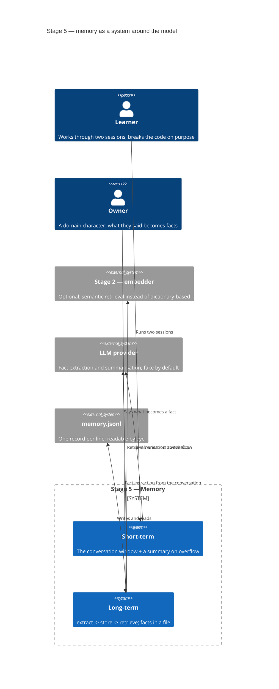
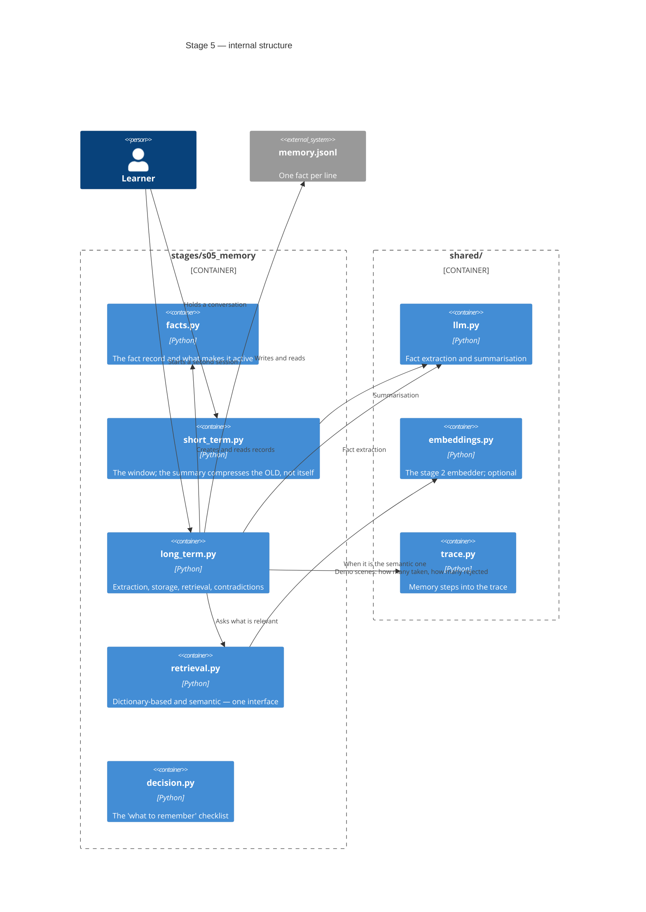
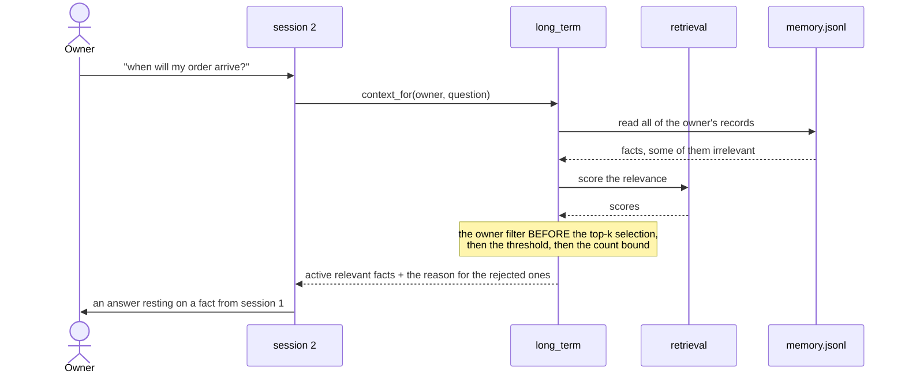

# SAD — s05-memory

## 1. Introduction and goals

Stage 5 shows that **memory is a system around the model, not a property of it**. The model
remembers nothing; everything that looks like memory was put into the context by somebody before
the call.

From which it follows immediately why the stage is not about storage:

> **The more irrelevant material there is in the context, the worse the answer. The limit is on
> tokens, not on nonsense.**

Three goals, each of them checked:

1. The reader sees that short-term and long-term memory solve different problems.
2. The reader sees that retrieval from memory is **the same** problem as the stage 2 search, with
   the same boundaries.
3. The reader builds a check for **selectivity** rather than for storage.

## 2. Constraints

| # | Constraint | Where from |
|---|---|---|
| C-1 | Offline, no key, no datastore | the course rule; a file instead of a database until stage 6 |
| C-2 | Long-term ≤ 90 lines, short-term ≤ 50 | NFR-1, NFR-2 |
| C-3 | Semantic retrieval is optional | NFR-6: the dictionary-based one always works |
| C-4 | The embedder is the same one as at stage 2 | the thesis: this is the same problem, not a new one |
| C-5 | The owner is a field of the record, not an argument of the retrieval | §6.1; the lesson of stage 3 about the access level |
| C-6 | Everything published is written in English | CONVENTIONS.md |

## 3. Context and scope



**In scope:** the window and summarisation, extracting/storing/retrieving facts, contradictions,
TTL, isolation between owners, two retrieval implementations, the "what to remember" checklist.

**Out of scope:** a datastore in a database (stage 6), the multi-user model, knowledge graphs,
relationships between facts, optimising retrieval (stage 8).

## 4. Solution strategy

| Decision | Choice | Why |
|---|---|---|
| Two memories | Separate modules with separate jobs | Confusing them is the commonest mistake; they do not substitute for each other |
| Datastore | A JSONL file, one record per line | Readable by eye; stage 6 will swap it out behind the same interface. ADR-0001 |
| Contradictions | The fact's topic, not its content | Comparing content is already inference. ADR-0002 |
| Expiry | A TTL in the record, checked at retrieval | Deleting on write would lose the history. ADR-0003 |
| Owner | A field of the record; the filter sits **before** the top-k selection | The lesson of stages 2 and 3. ADR-0004 |
| Retrieval | One interface, two implementations | To show that this is the same problem as search |

## 5. Building block view

```
stages/s05_memory/
├── facts.py        the fact record: owner, topic, text, time, TTL, status
├── short_term.py   the conversation window + a summary on overflow; ≤50 lines
├── long_term.py    extract -> store -> retrieve, contradictions, TTL; ≤90 lines
├── retrieval.py    two retrieval implementations behind one interface
├── decision.py     the "what to remember" checklist
├── run.py          the demo: two sessions in a row
├── check.py        the checks
└── DECISION.md     the checklist in prose
```

**C4 Container (L2):**



**Why `retrieval.py` is separate.** Two implementations behind one interface is itself the proof
of the thesis "retrieval from memory = the stage 2 search". Inside `long_term.py` they would look
like an `if`, and the thesis would turn into an implementation detail.

**Why `facts.py` is separate.** The question "what makes a fact active" is four conditions (owner,
status, TTL, threshold), and they have to be visible together. Scattered across their points of
use they stop reading as one rule.

## 6. Runtime view

**Flow 1 — the second session sees the first one's fact (AC-02, AC-03).**



**Flow 2 — a contradiction (AC-04).**

```mermaid
sequenceDiagram
    participant L as long_term
    participant F as memory.jsonl

    L->>L: a new fact, topic "address"
    L->>F: find the active fact on the same topic for the same owner
    F-->>L: the old fact
    L->>F: the old one -> status "replaced", the replacement time
    L->>F: the new one -> status "active"
    Note over L,F: both stay in the file;<br/>one goes into retrieval
```

**Flow 3 — the window overflows (AC-01, AC-01b).**

```mermaid
sequenceDiagram
    participant S as short_term
    participant M as model

    S->>S: more messages than the window
    S->>M: compress the OLDEST, leave the summary alone
    M-->>S: the summary
    Note over S: the tail stays verbatim;<br/>the amount compressed is a number
```

## 7. Deployment view

`<!-- N/A: a file in the stage's directory. The datastore is stage 6. -->`

## 8. Crosscutting concepts

| Aspect | How it is solved |
|---|---|
| Trace | The demo writes a step per scene with counters. The reason for a rejection lives in `Context.skipped` and in the output, **not** in the trace — stage 8 will read traces, and then that difference becomes a task rather than debt |
| Errors | A corrupted record is named and skipped; the rest of the memory works (AC-09b) |
| Trust | The text of a fact was written by a user: it goes into the prompt as data, inside a marked block |
| Isolation | The owner is a field of the record; the filter sits before the selection; checked in both directions |
| Determinism | Extraction and summarisation come from the fake following a script; time is supplied explicitly |

## 9. Architecture decisions

| # | Decision | Status | Where it shows |
|---|---|---|---|
| 0001 | A JSONL file, not a database and not process memory | Accepted | §4, §5 |
| 0002 | A contradiction by the fact's topic, not by its content | Accepted | §4, §6 |
| 0003 | Expiry at retrieval, not deletion on write | Accepted | §4, §6 |
| 0004 | The owner is a field of the record; the filter sits before the top-k selection | Accepted | §4, §8 |

## 10. Quality requirements

| Scenario | When | Then | How verify |
|---|---|---|---|
| Selectivity | A question with an irrelevant fact in memory | The fact is not in the context, the reason is named | a unit check |
| Isolation | Two memories, similar facts | Somebody else's did not arrive, your own did | two mirror checks |
| Module size | Counting the executable lines | ≤90 and ≤50 | a budget check |
| Without the embedder | A run on a base install | Green; dictionary-based retrieval | `scripts/clean_install.py` |
| Suite time | `python -m stages.s05_memory.check` | ≤30 s | a measurement in `check_all` |

## 11. Risks and technical debt

| Risk | Severity | Mitigation | Owner |
|---|---|---|---|
| **A check proves storage instead of selectivity** | High | This is the main defect the stage can have. Which is why AC-03 and AC-06b are separate criteria with separate checks, rather than clauses inside other ones. The lesson of stages 2–4: the mirror half does not appear by itself | Contributor |
| **The `long_term` line limit is too tight** | Medium | **The risk fired at review, and the mitigation turned out to be the right one.** Fixing the findings brought the module to 90 out of 90; what was moved out was fact extraction (`extraction.py`) — exactly what was named here. After the move, 79 out of 90 | Contributor |
| **Time in the checks makes them flicker** | High | Time is supplied **explicitly** as a parameter and is never taken from `datetime.now()` inside the logic. Otherwise a TTL check passes at night and fails in the daytime | Contributor |
| **Contradiction by topic will miss a real contradiction** | Medium | Named in §"What the plan does not prove" and in ADR-0002. Not mitigated — bounded and named | Contributor |
| **The text of a fact will affect the model** | Medium | The client does not rely on the model: the order, the threshold and the owner are its own decision. The AC-06c check asserts a mechanism, not a model's behaviour | Contributor |

## 12. Glossary

| Term | Meaning in this stage |
|---|---|
| Short-term memory | The window of the current conversation plus a summary of what was pushed out. Lives for one run |
| Long-term memory | Facts that outlive the session. They live in a file |
| Fact | A flat record: owner, topic, text, time, TTL, status |
| Topic | What a fact is about ("address", "name"). A contradiction is decided by it |
| Status | `active` or `replaced`. Only the first goes into retrieval |
| Context rot | The answer degrading because of irrelevant material in the context. Not an error — a degradation |
| Selectivity | The ability **not** to take what is not needed. The stage's main property |
