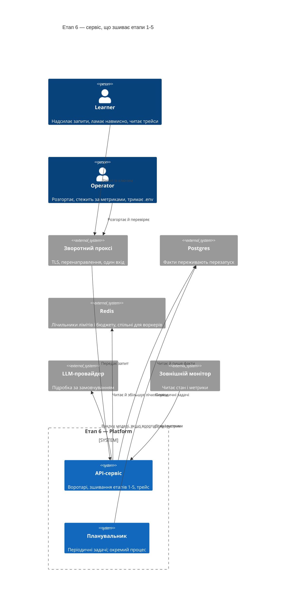
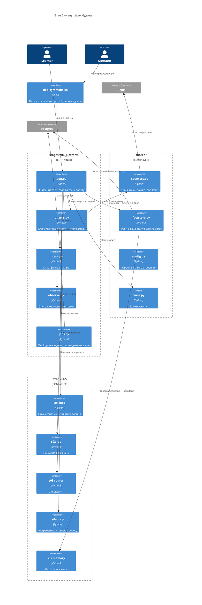
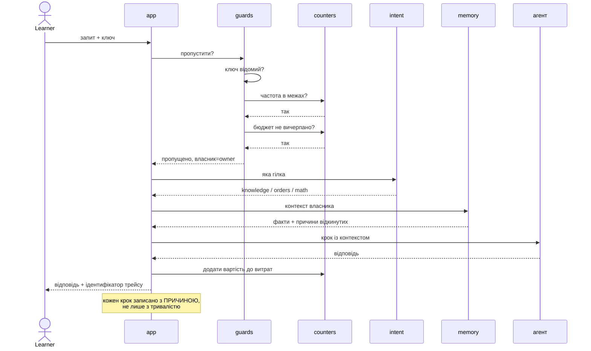
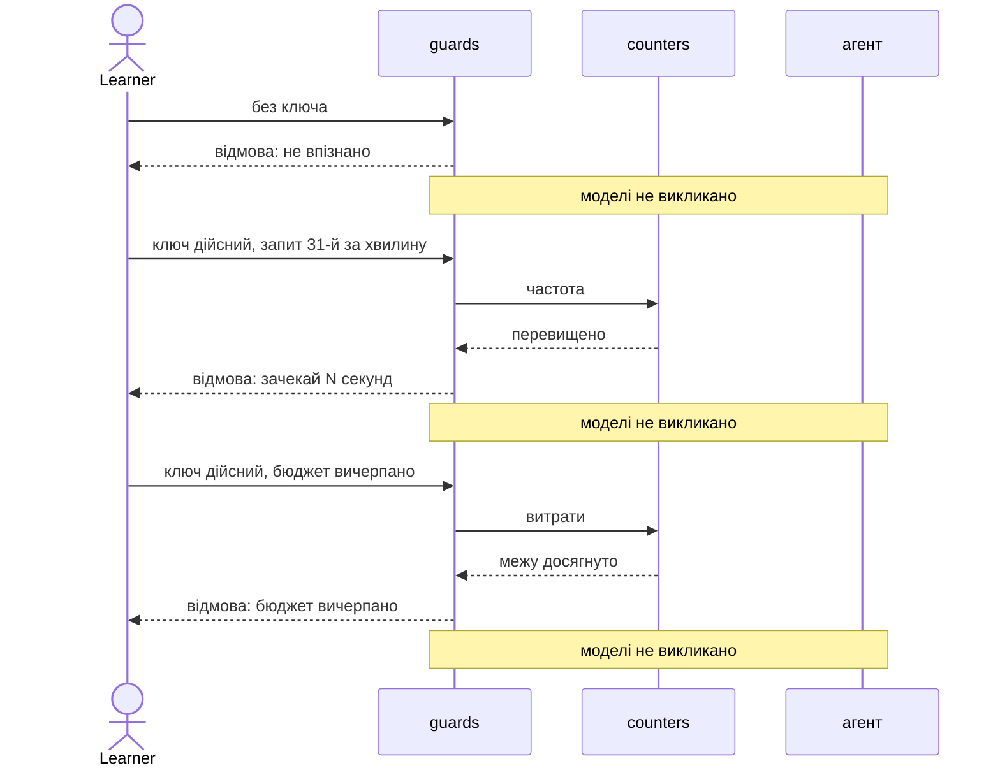
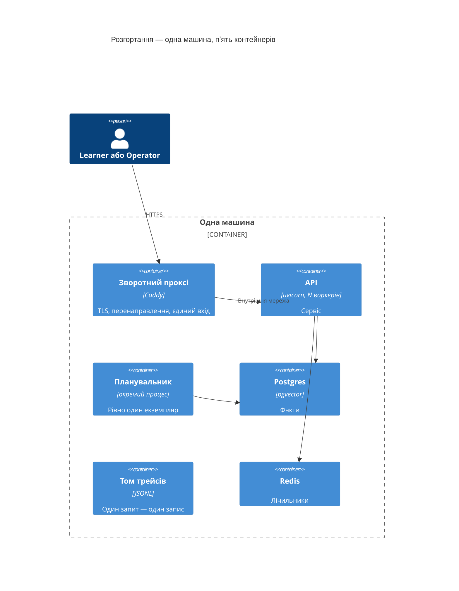

# SAD — s06-platform

## 1. Introduction and goals

Етап 6 перетворює п'ять окремих здатностей на **один сервіс**. Теза етапу коротка:

> **Продакшн — це не «прототип на сервері». Це інший набір задач, і майже жодна з них не про
> якість відповідей.**

Три цілі, кожна перевіряється:

1. Читач бачить, що межі (хто, скільки, за чий рахунок) — це **три різні** механізми з трьома
   різними відмовами.
2. Читач бачить, що метрики й трейс відповідають на **різні** питання, і не плутає їх.
3. Читач наступає на пастку другого воркера **навмисно**, бачить її числом і виправляє.

**Стейкхолдери:** Learner (проходить етап), Operator (розгортає й супроводжує), Contributor
(автор етапу). Shopper лишається вигаданим персонажем усередині домену NovaShop.

## 2. Constraints

| # | Обмеження | Звідки |
|---|---|---|
| C-1 | Етапи 1–5 **не змінюються**; будь-яка правка — привід для ADR | spec §3 |
| C-2 | Усе працює офлайн і без ключа; Docker потрібен лише частині перевірок | правило курсу, NFR-5 |
| C-3 | Реальної VM немає — усе верифікується локально, `smoke.sh` працює проти обох цілей | spec §8 |
| C-4 | `if profile == ...` живе лише у фабриках `shared/` | CONVENTIONS.md, ADR-0002 курсу |
| C-5 | `app.py` ≤ 120 рядків, `guards.py` ≤ 100 | NFR-1, NFR-1b |
| C-6 | Проза українською, код англійською | CONVENTIONS.md |
| C-7 | У профілі `prod` стан лімітів і бюджету — у спільному сховищі | інакше сервіс містить ваду, якої навчає |
| C-7b | У профілі `local` він **навмисно** в пам'яті процесу | це і є вправа: два воркери показують подвоєння обох лічильників |

## 3. Context and scope



**У межах:** зшивання етапів 1–5, три воротарі, стан і метрики, трейс запиту, пастка двох
воркерів і її виправлення, сховище для фактів, том для трейсів, TLS через зворотний проксі, скрипт
перевірки для обох цілей.

**Поза межами:** мультитенантність, черги й довгі задачі, оптимізація латентності (етап 7),
оцінювання (етап 8), дашборд і навантажувальний тест (етап 10), провізіювання VM.

## 4. Solution strategy

| Рішення | Вибір | Чому |
|---|---|---|
| Цільова поверхня | `backend-service` + `cli` | Сервіс і скрипт перевірки; UI немає |
| Маршрутизація | Класифікатор наміру, не supervisor | Дешевше на порядок, достатньо для обсягу. ADR-0001 |
| Стан лічильників | Redis у `prod`, пам'ять процесу в `local` | Локальна половина — не поступка, а вправа. ADR-0002 |
| Планувальник | Окремий процес | Пастка показується наживо, потім виправляється. ADR-0003 |
| Пам'ять | Postgres замість файлу; інтерфейс етапу 5 незмінний | Обіцянка етапу 5. ADR-0004 |
| Трейсер в етапи 2 і 5 | **Не** протягувати | Межа лишається; етап 8 скаже, чого бракує. ADR-0005 |
| Сховище трейсів | JSONL на томі, не база й не зовнішній стік | Читач має читати трейси очима. ADR-0008 |
| Автентифікація | Ключ у заголовку, звірка сталим порівнянням | Обсяг курсу; ціна названа. ADR-0006 |
| TLS | Зворотний проксі з автоматичним сертифікатом | Два рядки конфігурації проти десяти кроків. ADR-0007 |
| Формат метрик | Стандартний текстовий формат витягування | Дашборд етапу 10 читатиме те саме |

**Три воротарі — три механізми, а не «безпека».** Вони стоять у різному порядку й дають різні
відмови, і саме це читач має винести з етапу:

    автентифікація   хто ти          відмова не каже, чи існує такий ключ
    ліміт частоти    скільки разів   відмова каже, коли можна повторити
    бюджет           за чий рахунок  відмова каже, що вичерпано межу витрат

Порядок не довільний: спершу **хто**, потім **скільки**, потім **за чий рахунок**. Ліміт до
автентифікації рахував би анонімів разом; бюджет до ліміту витрачав би облік на тих, кого
однаково відхилять.

## 5. Building block view

```
stages/s06_platform/
├── app.py          зшивання: воротарі -> класифікатор -> агент -> памʼять -> трейс; ≤120
├── guards.py       три воротарі, три відмови; ≤100
├── intent.py       класифікатор наміру — дешева заміна supervisor
├── observe.py      стан залежностей і метрики
├── jobs.py         періодична задача + пастка двох воркерів
├── run.py          демо: сцени проти `Service`, без мережі й без фреймворка
├── check.py        перевірки
└── DECISION.md     чекліст «що має бути перед першим деплоєм»

shared/
├── counters.py     лічильники: у памʼяті (local) або Redis (prod) — фабрика
└── factstore.py    сховище фактів: файл етапу 5 або Postgres — фабрика (ADR-0004)

deploy/
├── docker-compose.prod.yml  сервіс + проксі + сховища
├── Caddyfile                TLS і перенаправлення
├── smoke.sh                 той самий перелік проти localhost і проти домену
└── RUNBOOK.md               що робити, коли впало
```

**C4 Container (L2):**



**Чому `guards.py` окремо від `app.py`.** Три воротарі — це три різні відмови, і саме їхня
різниця є уроком. Усередині `app.py` вони перетворилися б на три `if` серед зшивання, і теза
«це не одна річ під назвою безпека» зникла б у деталях реалізації.

**Чому `factstore.py` у `shared/`, а не в етапі 5.** Підмінити сховище **всередині** етапу 5
неможливо без правки: `Memory` приймає шлях, а не сховище, і його перевірки будують клас
напряму. Тому фабрика стоїть **зовні**, файлову реалізацію бере як є, а контракт, спільний
для обох, стверджує етап 6 (ADR-0004). Обіцянка етапу 5 виконана наполовину — і це
записано, а не замовчано.

**Чому `counters.py` у `shared/`, а не в етапі.** Вибір «пам'ять чи Redis» — це розгалуження за
профілем, а воно за конвенцією курсу живе лише у фабриках `shared/`. Плюс етап 10 візьме той
самий лічильник.

## 6. Runtime view

**Потік 1 — запит проходить трьох воротарів і доходить до агента (AC-01, AC-02).**



**Потік 2 — три різні відмови (AC-03, AC-04, AC-05).**



**Потік 3 — пастка двох воркерів і її виправлення (AC-07).**

```mermaid
sequenceDiagram
    participant W1 as воркер 1
    participant W2 as воркер 2
    participant J as задача
    participant S as планувальник

    Note over W1,W2: ДО: планувальник усередині застосунку
    W1->>J: настав час — виконую
    W2->>J: настав час — виконую
    Note over J: виконано ДВІЧІ за один інтервал,<br/>жодної помилки в логах

    Note over W1,S: ПІСЛЯ: планувальник окремим процесом
    S->>J: настав час — виконую
    Note over J: виконано один раз;<br/>воркери про час не знають
```

## 7. Deployment view



**Локально те саме без TLS і без домену**: `docker compose` піднімає ті самі контейнери,
`smoke.sh` виконує **той самий** перелік. Різниця лише в адресі й у тому, що перевірка
сертифіката локально позначається як невиконана, а не як пройдена.

**Дані живуть у томах**, а не в контейнерах: перезапуск сервісу не стирає ні фактів, ні
трейсів (AC-10). Факти — у базі, трейси — файлом JSONL на змонтованому томі (ADR-0008):
читач має читати трейси очима, і будь-яке інше сховище цю властивість забирає.

## 8. Crosscutting concepts

| Аспект | Як вирішено |
|---|---|
| Трейс | Один запит — один трейс; кожен крок несе причину. Кроки етапів 2 і 5 відсутні свідомо (ADR-0005). Пишеться у JSONL на змонтованому томі (ADR-0008) |
| Метрики | **Теж стан у процесі** — третє обличчя тієї самої причини. Збирач за замовчуванням процесо-локальний, тож за N воркерів видача показує зріз одного з них. Звірка з кількістю трейсів (AC-06b) стверджується для одного воркера; багатопроцесний збирач названо в уроці як те, що робить продакшн |
| Помилки | Недоступна залежність → названа відмова + стан каже про неї; сервіс не падає цілком (AC-11) |
| Секрети | Ключі з оточення; у логах, трейсах і відповідях — лише похідний ідентифікатор власника (AC-12) |
| Конфігурація | Усе через `shared/config.py`; жодного `if profile ==` в етапі |
| Ізоляція | Ключ визначає власника пам'яті; перевіряється в обидва боки (AC-03b, AC-03c) |
| Детермінізм | Перевірки проти клієнта в пам'яті, без мережі; підробка провайдера за замовчуванням |
| Час | Лічильники беруть час параметром там, де це впливає на вердикт — урок етапу 5 |

## 9. Architecture decisions

| # | Рішення | Статус | Де відбилось |
|---|---|---|---|
| 0001 | Класифікатор наміру замість повного supervisor | Accepted | §4, §6 |
| 0002 | Лічильники у спільному сховищі, не в пам'яті процесу | Accepted | §4, §5, §8 |
| 0003 | Планувальник окремим процесом | Accepted | §4, §6, §7 |
| 0004 | Пам'ять переїжджає в Postgres за тим самим інтерфейсом | Accepted | §4, §7 |
| 0005 | Трейсер не протягується в етапи 2 і 5 | Accepted | §4, §8 |
| 0006 | Ключ у заголовку зі сталим порівнянням | Accepted | §4, §8 |
| 0007 | TLS через зворотний проксі з автоматичним сертифікатом | Accepted | §4, §7 |
| 0008 | Трейси лишаються файлом JSONL на томі | Accepted | §3, §7, §8 |

## 10. Quality requirements

| Сценарій | When | Then | How verify |
|---|---|---|---|
| Три гілки | Три різні запити | Три різні гілки видно у трейсі | integration-перевірка |
| Три відмови | Запит без ключа / понад ліміт / понад бюджет | Три різні відмови, моделі не викликано | три перевірки |
| Дзеркальні половини | Дійсний ключ, у межах, у бюджеті | Запит **доходить**; стан каже «живий»; скрипт дає нуль | три перевірки |
| Пастка воркерів | Планувальник усередині, два воркери | Задача виконана двічі; після винесення — один раз | e2e |
| Розмір модулів | Підрахунок виконуваних рядків | `app.py` ≤ 120, `guards.py` ≤ 100 | перевірка бюджету |
| Без Docker | Прогін на машині без контейнерів | Зелено або `НЕ ПЕРЕВІРЕНО`; жодної червоної | `scripts/clean_install.py` |
| Час набору | `python -m stages.s06_platform.check` | ≤ 60 с (оцінка, не заміряно) | `BUDGET_SECONDS` |
| Частка відмов | Підрахунок перевірок етапу | ≥ 1/3 мають префікс `FAILURE ·` | лічильник у перевірці |
| Час смоуку | `deploy/smoke.sh` проти локальної збірки | ≤ 30 с (оцінка, не заміряно) | замір у самому скрипті, число друкується |

## 11. Risks and technical debt

| Ризик | Тяжкість | Мітигація | Власник |
|---|---|---|---|
| **Етап відтворює пастку, якої навчає** | High | Лічильники в спільному сховищі від початку (ADR-0002). Найімовірніша форма провалу: локальний профіль тримає їх у пам'яті процесу, і перевірка, написана лише під локальний профіль, лишається зеленою на проді. Тому потрібна перевірка, що **той самий** лічильник переживає два незалежні екземпляри | Contributor |
| **`app.py` не влізе у 120 рядків** | High | Досвід усіх п'яти етапів: бюджет спрацьовує, і мітигація вгадує факт, не місце. Тут місце назване наперед: виносити треба **зшивання гілок** (`intent.py` уже окремо), а не воротарів — вони і є урок | Contributor |
| **Реальної VM немає** | High | AC-08 розділено: механіка перевіряється локально, дійсність сертифіката від публічного центру лишається `НЕ ПЕРЕВІРЕНО`. Не приховується й не оголошується пройденим | Operator |
| **Перевірки вимагатимуть Docker** | Medium | `NotVerified` як третій стан, як на етапі 4 з MCP. Перевірка, що потребує контейнера, каже про це словами | Contributor |
| **Бюджетний облік не збігається з рахунком провайдера** | Medium | Названо в §«Чого план не доводить»: рахується **оцінка** за токенами. Запобіжник має спрацювати раніше за катастрофу, а не звести баланс | Operator |
| **Open question** — чи протягувати трейсер в етапи 2 і 5 | Open question | ADR-0005 фіксує «ні» з причиною; етап 8 читатиме трейси й скаже, чого бракує | Contributor, етап 8 |
| **Open question** — чи буде реальний деплой | Open question | Усе будується так, щоб працювати в обох режимах | Operator, перед тегом `stage-06` |
| **Open question** — окремий ендпоінт для читання трейсу | Open question | ADR-0008 фіксує «файл»; етап 8 читатиме трейси й скаже, чи потрібен ендпоінт | Contributor, етап 8 |
| **Метрики процесо-локальні** | Medium | Збирач за замовчуванням тримає лічильники в памʼяті процесу — третє обличчя причини з ADR-0002. За N воркерів видача показує зріз одного. Звірка AC-06b стверджується для одного воркера; багатопроцесний збирач названо в уроці | Contributor |
| **Обіцянка етапу 5 виконана наполовину** | Medium | «Тим самим інтерфейсом» виявилось точнішим за код: `Memory` приймає шлях, а не сховище. Фабрика стоїть зовні, контракт стверджує етап 6 (ADR-0004). Урок етапу 5 доведеться уточнити | Contributor, перед тегом `stage-06` |

## 12. Glossary

| Термін | Значення в цьому етапі |
|---|---|
| Воротар (guard) | Механізм, що вирішує, чи пускати запит далі. Їх три, і вони різні |
| Класифікатор наміру | Дешева заміна supervisor: одна класифікація замість циклу передач |
| Бюджетний запобіжник | Зупинка викликів моделі при досягненні межі витрат за період |
| Стан (health) | Відповідь про справність сервісу й **кожної** залежності окремо |
| Метрики | Агрегати: скільки запитів, скільки відмов, яких саме. Не відповідають «чому» |
| Трейс | Кроки одного запиту з причинами. Відповідає «чому», не «скільки» |
| Пастка двох воркерів | Стан у пам'яті процесу, який другий процес робить неправдою — мовчки |
| Смоук (smoke) | Короткий перелік перевірок проти живого сервісу з вердиктом |
