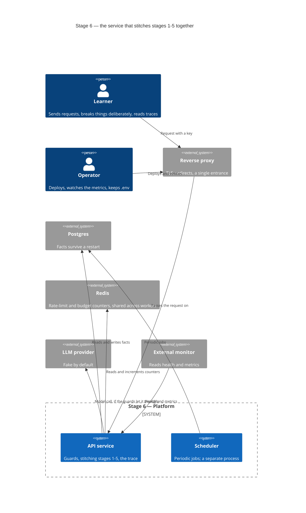
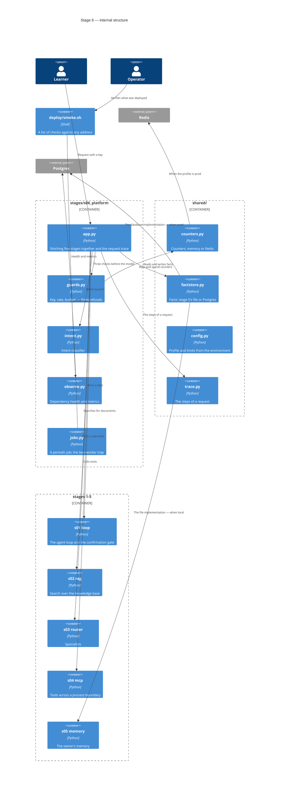
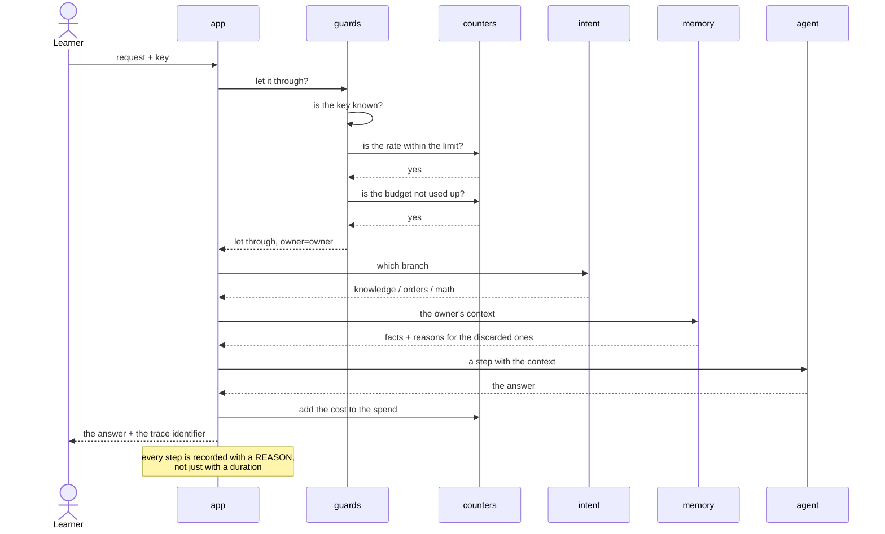
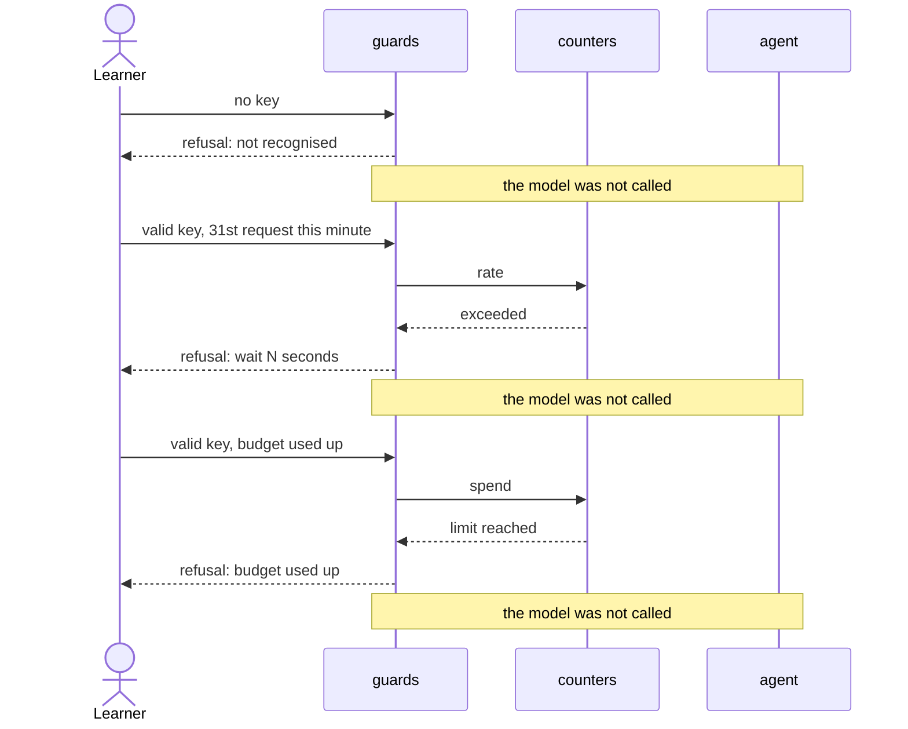
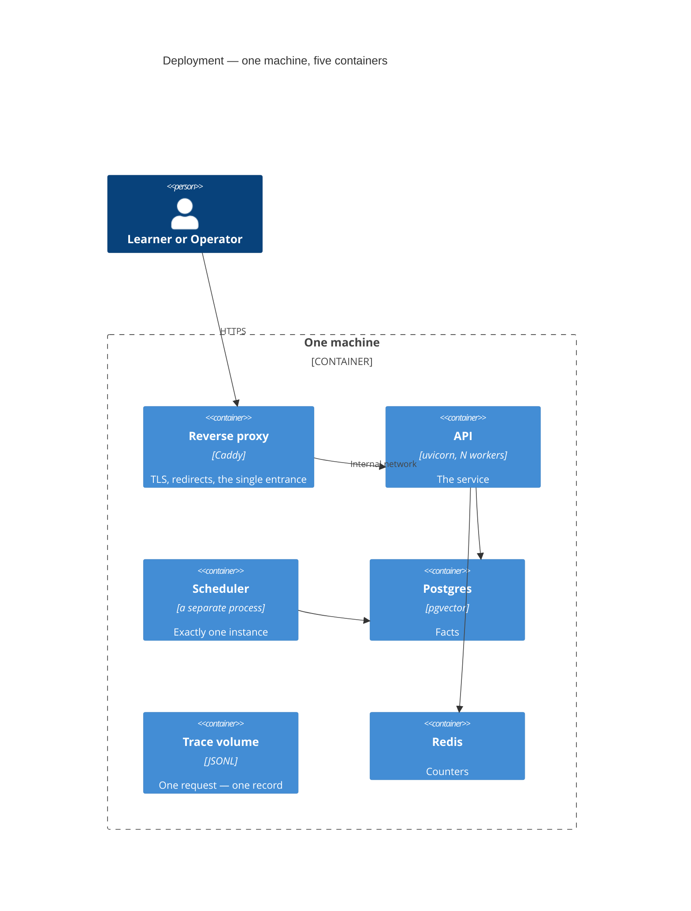

# SAD — s06-platform

## 1. Introduction and goals

Stage 6 turns five separate capabilities into **one service**. The stage's thesis is short:

> **Production is not "a prototype on a server". It is a different set of problems, and almost
> none of them are about the quality of the answers.**

Three goals, each of them checkable:

1. The learner sees that the boundaries (who, how many times, at whose expense) are **three
   different** mechanisms with three different refusals.
2. The learner sees that metrics and the trace answer **different** questions, and does not
   confuse them.
3. The learner steps into the second-worker trap **deliberately**, sees it as a number and
   fixes it.

**Stakeholders:** Learner (takes the stage), Operator (deploys and maintains it), Contributor
(writes the stage). Shopper stays a fictional character inside the NovaShop domain.

## 2. Constraints

| # | Constraint | Where from |
|---|---|---|
| C-1 | Stages 1–5 **do not change**; any edit is grounds for an ADR | spec §3 |
| C-2 | Everything works offline and without a key; Docker is needed by only some of the checks | course rule, NFR-5 |
| C-3 | There is no real VM — everything is verified locally, `smoke.sh` works against both targets | spec §8 |
| C-4 | `if profile == ...` lives only in the `shared/` factories | CONVENTIONS.md, the course's ADR-0002 |
| C-5 | `app.py` ≤ 120 lines, `guards.py` ≤ 100 | NFR-1, NFR-1b |
| C-6 | Everything published is written in English | CONVENTIONS.md |
| C-7 | In the `prod` profile the rate-limit and budget state lives in shared storage | otherwise the service contains the very defect it teaches |
| C-7b | In the `local` profile it is **deliberately** in process memory | that is the exercise: two workers show both counters doubling |

## 3. Context and scope



**In scope:** stitching stages 1–5 together, three guards, health and metrics, the request trace,
the two-worker trap and its fix, storage for facts, a volume for traces, TLS through a reverse
proxy, a check script for both targets.

**Out of scope:** multi-tenancy, queues and long jobs, latency optimisation (stage 7), evaluation
(stage 8), the dashboard and the load test (stage 10), VM provisioning.

## 4. Solution strategy

| Decision | Choice | Why |
|---|---|---|
| Target surface | `backend-service` + `cli` | A service and a check script; there is no UI |
| Routing | An intent classifier, not a supervisor | An order of magnitude cheaper, enough for the scope. ADR-0001 |
| Counter state | Redis in `prod`, process memory in `local` | The local half is not a concession but an exercise. ADR-0002 |
| Scheduler | A separate process | The trap is shown live, then fixed. ADR-0003 |
| Memory | Postgres instead of a file; stage 5's interface unchanged | Stage 5's promise. ADR-0004 |
| The tracer into stages 2 and 5 | **Not** threaded through | The boundary stays; stage 8 will say what is missing. ADR-0005 |
| Trace storage | JSONL on a volume, not a database and not an external sink | The learner has to read the traces with their own eyes. ADR-0008 |
| Authentication | A key in a header, checked with a constant-time comparison | The scope of the course; the price is named. ADR-0006 |
| TLS | A reverse proxy with an automatic certificate | Two lines of configuration against ten steps. ADR-0007 |
| Metrics format | The standard scrape text format | Stage 10's dashboard will read the same thing |

**Three guards — three mechanisms, not "security".** They stand at different points in the order
and give different refusals, and that is exactly what the learner has to take away from the stage:

    authentication   who you are        the refusal does not say whether such a key exists
    rate limit       how many times     the refusal says when you may retry
    budget           at whose expense   the refusal says the spending limit is used up

The order is not arbitrary: first **who**, then **how many times**, then **at whose expense**. A
rate limit before authentication would count all anonymous callers together; a budget before the
rate limit would spend its bookkeeping on those who are going to be rejected anyway.

## 5. Building block view

```
stages/s06_platform/
├── app.py          stitching: guards -> classifier -> agent -> memory -> trace; ≤120
├── guards.py       three guards, three refusals; ≤100
├── intent.py       intent classifier — a cheap replacement for a supervisor
├── observe.py      dependency health and metrics
├── jobs.py         a periodic job + the two-worker trap
├── run.py          demo: scenes against `Service`, no network and no framework
├── check.py        checks
└── DECISION.md     the "what must exist before the first deploy" checklist

shared/
├── counters.py     counters: in memory (local) or Redis (prod) — a factory
└── factstore.py    fact store: stage 5's file or Postgres — a factory (ADR-0004)

deploy/
├── docker-compose.prod.yml  service + proxy + stores
├── Caddyfile                TLS and redirects
├── smoke.sh                 the same list against localhost and against the domain
└── RUNBOOK.md               what to do when it breaks
```

**C4 Container (L2):**



**Why `guards.py` is separate from `app.py`.** Three guards are three different refusals, and
their difference is the lesson. Inside `app.py` they would have turned into three `if`s among the
stitching, and the thesis "this is not one thing called security" would have vanished into
implementation detail.

**Why `factstore.py` lives in `shared/` and not in stage 5.** The store cannot be swapped
**inside** stage 5 without an edit: `Memory` takes a path, not a store, and its own checks build
the class directly. So the factory stands **outside**, takes the file implementation as it is, and
the contract common to both is asserted by stage 6 (ADR-0004). Stage 5's promise is half kept —
and that is written down, not passed over in silence.

**Why `counters.py` lives in `shared/` and not in the stage.** The choice between memory and Redis
is a branch on the profile, and by the course's convention that lives only in the `shared/`
factories. Plus stage 10 will take the same counter.

## 6. Runtime view

**Flow 1 — a request passes three guards and reaches the agent (AC-01, AC-02).**



**Flow 2 — three different refusals (AC-03, AC-04, AC-05).**



**Flow 3 — the two-worker trap and its fix (AC-07).**

```mermaid
sequenceDiagram
    participant W1 as worker 1
    participant W2 as worker 2
    participant J as job
    participant S as scheduler

    Note over W1,W2: BEFORE: the scheduler inside the application
    W1->>J: time is up — running it
    W2->>J: time is up — running it
    Note over J: run TWICE in one interval,<br/>not one error in the logs

    Note over W1,S: AFTER: the scheduler as a separate process
    S->>J: time is up — running it
    Note over J: run once;<br/>the workers know nothing about the schedule
```

## 7. Deployment view



**Locally the same thing without TLS and without a domain**: `docker compose` brings up the same
containers, `smoke.sh` runs **the same** list. The only difference is the address, and that
locally the certificate check is marked as not performed rather than as passed.

**The data lives on volumes**, not in the containers: restarting the service erases neither the
facts nor the traces (AC-10). Facts go into the database, traces into a JSONL file on a mounted
volume (ADR-0008): the learner has to read the traces with their own eyes, and any other store
takes that property away.

## 8. Crosscutting concepts

| Concern | How it is solved |
|---|---|
| Trace | One request — one trace; every step carries a reason. The steps of stages 2 and 5 are missing deliberately (ADR-0005). Written as JSONL on a mounted volume (ADR-0008) |
| Metrics | **Process-local state too** — the third face of the same cause. The default collector is process-local, so with N workers the endpoint serves a slice of one of them. The reconciliation against the number of traces (AC-06b) is asserted for one worker; a multi-process collector is named in the lesson as the thing that makes it production |
| Errors | An unavailable dependency → a named failure + health reports it; the service does not go down as a whole (AC-11) |
| Secrets | Keys come from the environment; the logs, the traces and the responses carry only a derived owner identifier (AC-12) |
| Configuration | Everything through `shared/config.py`; not one `if profile ==` in the stage |
| Isolation | The key determines the owner of the memory; checked in both directions (AC-03b, AC-03c) |
| Determinism | Checks run against an in-memory client, with no network; the provider is fake by default |
| Time | Counters take time as a parameter wherever it affects the verdict — stage 5's lesson |

## 9. Architecture decisions

| # | Decision | Status | Where it shows |
|---|---|---|---|
| 0001 | An intent classifier instead of a full supervisor | Accepted | §4, §6 |
| 0002 | Counters in shared storage, not in process memory | Accepted | §4, §5, §8 |
| 0003 | The scheduler as a separate process | Accepted | §4, §6, §7 |
| 0004 | Memory moves to Postgres behind the same interface | Accepted | §4, §7 |
| 0005 | The tracer is not threaded through stages 2 and 5 | Accepted | §4, §8 |
| 0006 | A key in a header with a constant-time comparison | Accepted | §4, §8 |
| 0007 | TLS through a reverse proxy with an automatic certificate | Accepted | §4, §7 |
| 0008 | Traces stay a JSONL file on a volume | Accepted | §3, §7, §8 |

## 10. Quality requirements

| Scenario | When | Then | How verify |
|---|---|---|---|
| Three branches | Three different requests | Three different branches visible in the trace | integration check |
| Three refusals | A request with no key / over the limit / over the budget | Three different refusals, the model is not called | three checks |
| Mirror halves | A valid key, within the limit, within the budget | The request **gets through**; health says "up"; the script returns zero | three checks |
| The worker trap | The scheduler inside, two workers | The job runs twice; once it is moved out — once | e2e |
| Module size | A count of executed lines | `app.py` ≤ 120, `guards.py` ≤ 100 | budget check |
| Without Docker | A run on a machine with no containers | Green or `NOT EVALUATED`; not one red | `scripts/clean_install.py` |
| Suite time | `python -m stages.s06_platform.check` | ≤ 60 s (an estimate, not measured) | `BUDGET_SECONDS` |
| Share of refusals | A count of the stage's checks | ≥ 1/3 carry the `FAILURE ·` prefix | a counter inside the check |
| Smoke time | `deploy/smoke.sh` against a local build | ≤ 30 s (an estimate, not measured) | measured by the script itself, the number is printed |

## 11. Risks and technical debt

| Risk | Severity | Mitigation | Owner |
|---|---|---|---|
| **The stage reproduces the trap it teaches** | High | Counters in shared storage from the start (ADR-0002). The most likely shape of failure: the local profile keeps them in process memory, and a check written for the local profile alone stays green in production. So there has to be a check that **the same** counter survives two independent instances | Contributor |
| **`app.py` will not fit into 120 lines** | High | The experience of all five stages: the budget fires, and the mitigation guesses the fact, not the place. Here the place is named in advance: what has to move out is **the branch stitching** (`intent.py` is already separate), not the guards — they are the lesson | Contributor |
| **There is no real VM** | High | AC-08 is split: the mechanics are verified locally, the validity of a certificate from a public authority stays `NOT EVALUATED`. It is neither hidden nor declared passed | Operator |
| **The checks will require Docker** | Medium | `NotVerified` as a third state, as at stage 4 with MCP. A check that needs a container says so in words | Contributor |
| **The budget bookkeeping does not match the provider's invoice** | Medium | Named in §"What the plan does not prove": what is counted is an **estimate** from tokens. The guard has to fire before the catastrophe, not balance the books | Operator |
| **Open question** — whether to thread the tracer through stages 2 and 5 | Open question | ADR-0005 records "no" with a reason; stage 8 will read the traces and say what is missing | Contributor, stage 8 |
| **Open question** — whether there will be a real deployment | Open question | Everything is built to work in both modes | Operator, before the `stage-06` tag |
| **Open question** — a separate endpoint for reading a trace | Open question | ADR-0008 records "a file"; stage 8 will read the traces and say whether an endpoint is needed | Contributor, stage 8 |
| **The metrics are process-local** | Medium | The default collector keeps its counters in process memory — the third face of the cause from ADR-0002. With N workers the endpoint serves a slice of one. The AC-06b reconciliation is asserted for one worker; a multi-process collector is named in the lesson | Contributor |
| **Stage 5's promise is half kept** | Medium | "Behind the same interface" turned out to be more precise than the code: `Memory` takes a path, not a store. The factory stands outside, the contract is asserted by stage 6 (ADR-0004). Stage 5's lesson will have to be made more precise | Contributor, before the `stage-06` tag |

## 12. Glossary

| Term | What it means at this stage |
|---|---|
| Guard | The mechanism deciding whether a request goes further. There are three, and they are different |
| Intent classifier | A cheap replacement for a supervisor: one classification instead of a loop of handovers |
| Budget guard | Stopping model calls when the spending limit for the period is reached |
| Health | The answer about whether the service and **each** dependency separately are working |
| Metrics | Aggregates: how many requests, how many refusals, of which kinds. They do not answer "why" |
| Trace | The steps of one request with their reasons. Answers "why", not "how many" |
| The two-worker trap | State in process memory that a second process makes untrue — silently |
| Smoke | A short list of checks against a live service, with a verdict |
