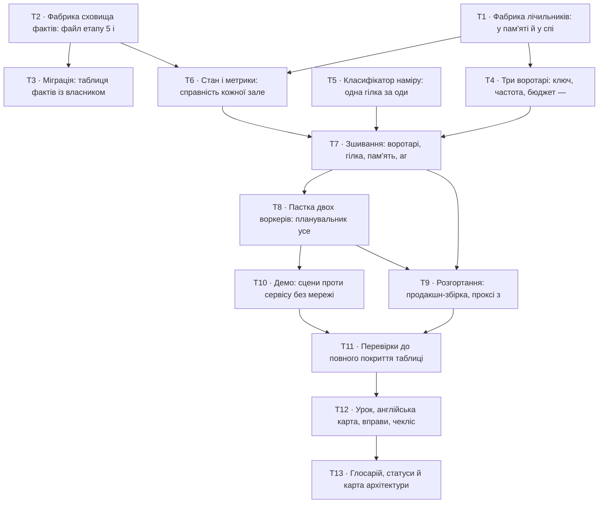

# Епік — s06-platform

Тринадцять задач. Кожна ≤ 1 день, кожна окремо переглядається.

**Джерела:** [spec.md](../spec.md) · [sad.md](../sad.md) · [adr/](../adr/)

## Граф залежностей

**Паралельні старти:** `T1` (лічильники), `T2` (сховище) і `T5` (класифікатор) не залежать
ні від чого й ні від кого — це три незалежні гілки.

## Порядок і чому саме такий

Спершу два адаптери у `shared/` (T1, T2): вони визначають, чи етап містить ваду, якої навчає.
Далі три модулі, що вирішують (T4, T5, T6), потім зшивання (T7). Пастка (T8) йде **після**
зшивання навмисно: щоб показати її наживо, потрібен працюючий сервіс.

Розгортання (T9) і демо (T10) незалежні одне від одного. Перевірки (T11) закривають таблицю
цілком, і лише після них пишеться урок (T12) — інакше числа в ньому будуть вигаданими.

## Задачі

| # | Задача | Шар | Залежить | Критерії |
|---|---|---|---|---|
| [T1](t1.md) | Фабрика лічильників: у пам'яті й у спільному сховищі за одним контрактом | `infra` | — | AC-04, AC-04b, AC-05, AC-05b, AC-07b |
| [T2](t2.md) | Фабрика сховища фактів: файл етапу 5 і база за одним набором методів | `infra` | — | AC-03c, AC-10 |
| [T3](t3.md) | Міграція: таблиця фактів із власником у ключі | `migration` | T2 | AC-10 |
| [T4](t4.md) | Три воротарі: ключ, частота, бюджет — три різні відмови | `app` | T1 | AC-03, AC-03b, AC-12, AC-13 |
| [T5](t5.md) | Класифікатор наміру: одна гілка за один виклик | `app` | — | AC-01 |
| [T6](t6.md) | Стан і метрики: справність кожної залежності окремо | `ports` | T1, T2 | AC-06, AC-06b, AC-06c, AC-11 |
| [T7](t7.md) | Зшивання: воротарі, гілка, пам'ять, агент, трейс запиту | `wiring` | T4, T5, T6 | AC-02 |
| [T8](t8.md) | Пастка двох воркерів: планувальник усередині й окремо | `app` | T7 | AC-07, AC-07b |
| [T9](t9.md) | Розгортання: продакшн-збірка, проксі з TLS, скрипт перевірки | `infra` | T7, T8 | AC-08, AC-09, AC-09b |
| [T10](t10.md) | Демо: сцени проти сервісу без мережі | `docs` | T8 | AC-01, AC-03, AC-04, AC-05, AC-06, AC-07 |
| [T11](t11.md) | Перевірки до повного покриття таблиці й мутації | `tests` | T9, T10 | AC-14 |
| [T12](t12.md) | Урок, англійська карта, вправи, чекліст, розв'язки | `docs` | T11 | AC-07, AC-07b |
| [T13](t13.md) | Глосарій, статуси й карта архітектури | `docs` | T12 | AC-14 |
