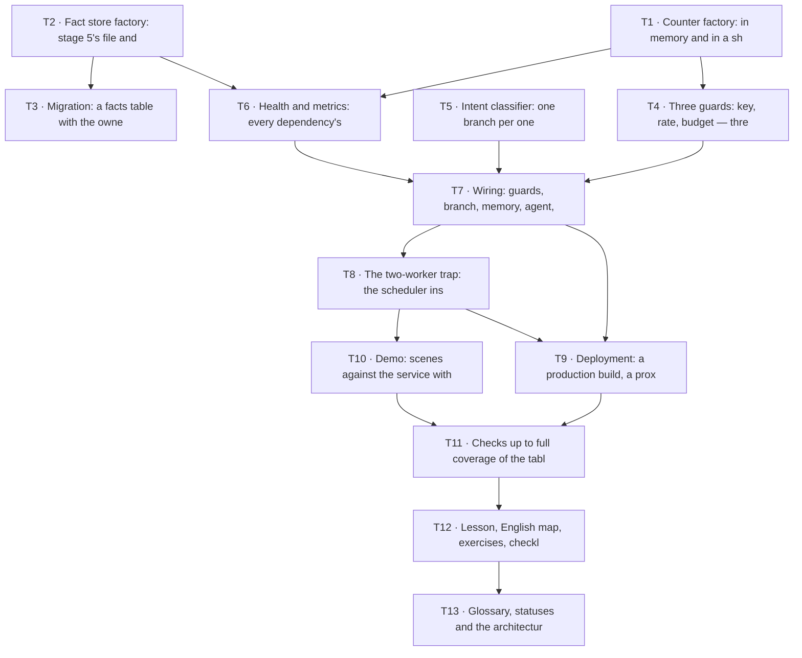

# Epic — s06-platform

Thirteen tasks. Each one ≤ 1 day, each one reviewed on its own.

**Sources:** [spec.md](../spec.md) · [sad.md](../sad.md) · [adr/](../adr/)

## Dependency graph

**Parallel starts:** `T1` (the counters), `T2` (the store) and `T5` (the classifier) depend on
nothing and on nobody — three independent branches.

## The order, and why exactly this one

First the two adapters in `shared/` (T1, T2): they decide whether the stage holds the defect it
teaches. Then the three modules that decide (T4, T5, T6), then the wiring (T7). The trap (T8)
comes **after** the wiring deliberately: showing it live takes a working service.

Deployment (T9) and the demo (T10) do not depend on each other. The checks (T11) close the table
completely, and only after them is the lesson written (T12) — otherwise the numbers in it would
be invented.

## Tasks

| # | Task | Layer | Deps | Criteria |
|---|---|---|---|---|
| [T1](t1.md) | Counter factory: in memory and in a shared store behind one contract | `infra` | — | AC-04, AC-04b, AC-05, AC-05b, AC-07b |
| [T2](t2.md) | Fact store factory: stage 5's file and a database behind one set of methods | `infra` | — | AC-03c, AC-10 |
| [T3](t3.md) | Migration: a facts table with the owner in the key | `migration` | T2 | AC-10 |
| [T4](t4.md) | Three guards: key, rate, budget — three different refusals | `app` | T1 | AC-03, AC-03b, AC-12, AC-13 |
| [T5](t5.md) | Intent classifier: one branch per one call | `app` | — | AC-01 |
| [T6](t6.md) | Health and metrics: every dependency's health on its own | `ports` | T1, T2 | AC-06, AC-06b, AC-06c, AC-11 |
| [T7](t7.md) | Wiring: guards, branch, memory, agent, the request's trace | `wiring` | T4, T5, T6 | AC-02 |
| [T8](t8.md) | The two-worker trap: the scheduler inside and on its own | `app` | T7 | AC-07, AC-07b |
| [T9](t9.md) | Deployment: a production build, a proxy with TLS, a check script | `infra` | T7, T8 | AC-08, AC-09, AC-09b |
| [T10](t10.md) | Demo: scenes against the service with no network | `docs` | T8 | AC-01, AC-03, AC-04, AC-05, AC-06, AC-07 |
| [T11](t11.md) | Checks up to full coverage of the table, and mutations | `tests` | T9, T10 | AC-14 |
| [T12](t12.md) | Lesson, English map, exercises, checklist, solutions | `docs` | T11 | AC-07, AC-07b |
| [T13](t13.md) | Glossary, statuses and the architecture map | `docs` | T12 | AC-14 |
