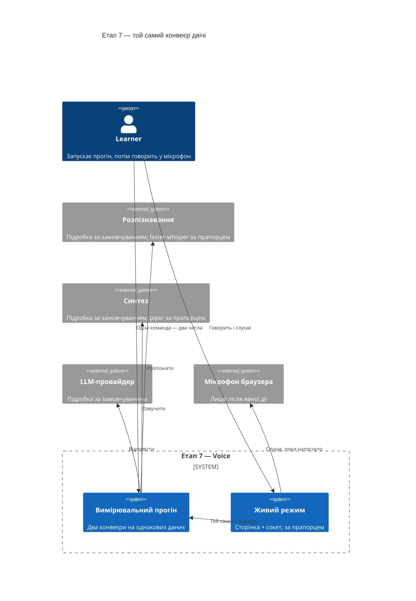
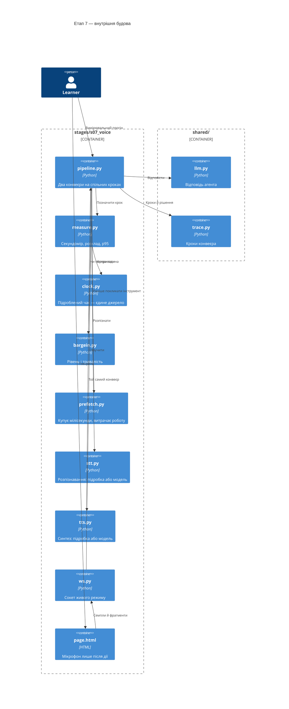
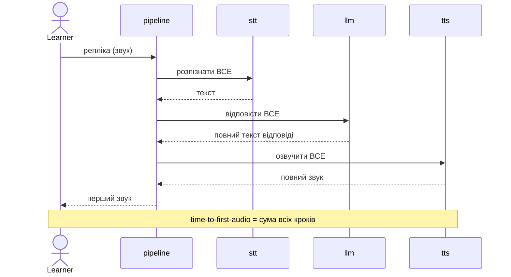
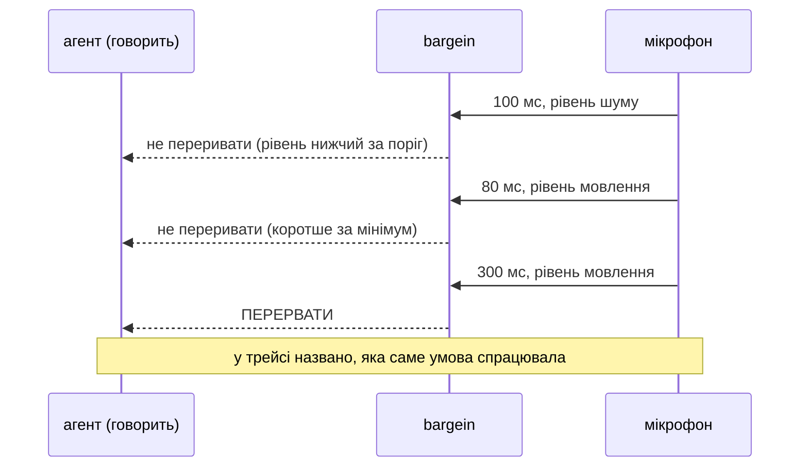

# SAD — s07-voice

## 1. Introduction and goals

Етап 7 будує **один конвеєр двічі** й міряє обидва рази. Теза:

> **Оптимізувати можна лише те, що виміряно. Число «до» без числа «після» — це звіт;
> число «після» без числа «до» — це віра.**

Три цілі, кожна перевіряється:

1. Читач отримує два числа однією командою на однакових даних.
2. Читач бачить, що стрімінг **не прискорює роботу** — він раніше починає віддавати, і саме
   тому міряють час до першого звуку.
3. Читач відтворює barge-in і бачить, що рішення ухвалюють **дві** умови, а не одна.

**Стейкхолдери:** Learner (проходить етап, слухає власним вухом), Operator (нічого не
розгортає на цьому етапі), Contributor (автор).

## 2. Constraints

| # | Обмеження | Звідки |
|---|---|---|
| C-1 | Увесь етап проходиться без мікрофона, без моделей і без мережі | правило курсу, NFR-5 |
| C-2 | Числа беруться з **підроблених** затримок, не з годинника | NFR-6, проти мигтіння |
| C-3 | Розпізнавання й синтез — чужі продукти; етап їх лише кличе | spec §3 |
| C-4 | `if profile == ...` живе лише у фабриках `shared/` | CONVENTIONS.md |
| C-5 | `pipeline.py` ≤ 110 виконуваних рядків | NFR-1 |
| C-6 | Сторінка без збірки: один файл, жодного фронтенд-стека | spec §5, припущення 4 |
| C-7 | Звук і розпізнаний текст не зберігаються | spec §6.1 |

## 3. Context and scope



**У межах:** два конвеєри з вимірюванням, розклад затримки по кроках, розподіл і p95,
barge-in із двома умовами, prefetch із обома числами, сторінка й сокет для живого режиму.

**Поза межами:** якість звуку, телефонія, багатомовність, вибір голосу, зшивання з сервісом
етапу 6 (див. §11), оптимізація самих моделей.

## 4. Solution strategy

| Рішення | Вибір | Чому |
|---|---|---|
| Цільові поверхні | `backend-service` + `web-frontend` + `cli` | Сокет, сторінка, вимірювальний прогін |
| Джерело затримок | Підробка за замовчуванням, моделі за прапорцем | Інакше перевірки мигтять і важать гігабайти. ADR-0001 |
| Час у конвеєрі | Подається годинником-параметром | Урок етапу 5; тут він вирішує ще й мигтіння. ADR-0002 |
| Стрімінг | Конвеєр віддає **фрагменти**, а не результат | Різниця саме в цьому, і вона має бути видима в типі. ADR-0003 |
| Barge-in | Дві умови: рівень і тривалість | Одна дає або глухий детектор, або істеричний. ADR-0004 |
| Prefetch | Запускається одразу, результат може бути відкинутий | Ціна названа обома числами. ADR-0005 |
| Сторінка | Один HTML-файл без збірки | Етап про затримку, а не про складання. ADR-0006 |

**Чому вимірювання — окремий модуль, а не `time.perf_counter()` по місцях.** Розкидані заміри
дають числа, які неможливо скласти: сума кроків не сходиться із загальним, бо щось не
поміряли. Один секундомір, який знає про кроки, робить AC-01 («сума дорівнює загальному»)
перевірюваним твердженням, а не побажанням.

## 5. Building block view

```
stages/s07_voice/
├── clock.py        підроблений годинник і затримки; єдине джерело часу
├── stt.py          розпізнавання: підробка або faster-whisper
├── tts.py          синтез: підробка або piper
├── pipeline.py     батчевий і стрімінговий конвеєри; ≤110 рядків
├── measure.py      секундомір, розклад, розподіл, p95
├── bargein.py      дві умови переривання
├── prefetch.py     ціна раннього виклику — обидва числа
├── page.html       сторінка живого режиму, без збірки
├── ws.py           сокет: той самий конвеєр, інший транспорт
├── run.py          демо: сцени з числами
├── check.py        перевірки
└── DECISION.md     чекліст «що міряти в голосі»
```

**C4 Container (L2):**



**Чому `clock.py` окремо.** Це єдине місце, звідки конвеєр дізнається час. Розкидані
`time.perf_counter()` роблять перевірки часу залежними від навантаження машини — тобто
мигтливими, — і NFR-6 стає недосяжним. Підроблений годинник рухається **кроками**, які задає
тест, тож ті самі дані дають те саме число завжди.

**Чому `measure.py` окремо від `pipeline.py`.** Конвеєр має бути читабельним: у ньому видно
кроки, а не заміри. Плюс той самий секундомір використає етап 8, коли міритиме оцінювання.

## 6. Runtime view

**Потік 1 — батчевий конвеєр: кожен крок чекає попереднього (AC-01).**



**Потік 2 — стрімінговий: перший фрагмент іде далі, не чекаючи решти (AC-02).**

```mermaid
sequenceDiagram
    actor L as Learner
    participant P as pipeline
    participant M as llm
    participant T as tts

    P->>M: відповідай фрагментами
    M-->>P: фрагмент 1
    P->>T: озвучити фрагмент 1
    T-->>P: звук 1
    P-->>L: ПЕРШИЙ ЗВУК
    Note over L,T: далі решта фрагментів іде паралельно
    M-->>P: фрагмент 2
    P->>T: озвучити фрагмент 2
    M-->>P: фрагмент 3
    Note over L,T: загальна тривалість ТА САМА;<br/>раніший лише перший звук
```

**Потік 3 — barge-in: дві умови, і жодної окремо не досить (AC-05, AC-05b, AC-05c).**



## 7. Deployment view

`<!-- N/A: етап не розгортається. Живий режим — локальна сторінка й сокет; сервіс етапу 6 не змінюється (див. §11). -->`

## 8. Crosscutting concepts

| Аспект | Як вирішено |
|---|---|
| Час | Єдине джерело — `clock.py`; конвеєр годинника не читає (C-2) |
| Трейс | Кроки конвеєра з тривалостями; **звуку й тексту там немає** (C-7) |
| Помилки | Відсутня модель → названий стан, не падіння (AC-07b); порожнє розпізнавання → окремий стан (AC-09) |
| Довіра | Розпізнаний текст недовірений: усе, що знають етапи 2 і 5, чинне |
| Детермінізм | Підроблені затримки; перевірка часу прогоняється двадцять разів (NFR-6) |
| Приватність | Мікрофон лише після дії; ані семпли, ані текст не пишуться на диск |

## 9. Architecture decisions

| # | Рішення | Статус | Де відбилось |
|---|---|---|---|
| 0001 | Затримки підроблені за замовчуванням, моделі за прапорцем | Accepted | §4, §5 |
| 0002 | Час подається годинником-параметром | Accepted | §4, §5, §8 |
| 0003 | Стрімінг віддає фрагменти — це видно в типі | Accepted | §4, §6 |
| 0004 | Barge-in вирішують дві умови | Accepted | §4, §6 |
| 0005 | Prefetch показується з обома числами | Accepted | §4 |
| 0006 | Сторінка без збірки | Accepted | §4, §5 |

## 10. Quality requirements

| Сценарій | When | Then | How verify |
|---|---|---|---|
| Два числа | Один прогін | Батч і стрімінг поруч, відношення ≥ 2 | unit-перевірка |
| Чесна половина | Порівняння загальної тривалості | Приблизно однакова | unit-перевірка |
| Розклад | Прогін будь-якого конвеєра | Сума кроків = загальне число | unit-перевірка |
| Розподіл | Сто прогонів | p95 помітно більший за середнє | unit-перевірка |
| Barge-in | Три входи: шум, коротке, довге | Не / не / перервати | три перевірки |
| Розмір модуля | Підрахунок виконуваних рядків | `pipeline.py` ≤ 110 | перевірка бюджету |
| Без моделей | Прогін на базовій установці | Зелено або `НЕ ПЕРЕВІРЕНО` | `scripts/clean_install.py` |
| Мигтіння | Двадцять прогонів поспіль | Двадцять зелених | повторний прогін у перевірці |

## 11. Risks and technical debt

| Ризик | Тяжкість | Мітигація | Власник |
|---|---|---|---|
| **Числа виглядатимуть як обіцянка швидкодії** | High | Урок першим рядком каже, що затримки підроблені, а число — про архітектуру конвеєра. AC-02b тримає чесну половину: загальна тривалість не змінюється | Contributor |
| **Перевірка часу мигтітиме** | High | Найімовірніша форма провалу етапу: одне мигтіння — і перевірку вимикають, а з нею зникає доказ головної тези. Тому годинник підроблений, а NFR-6 перевіряється двадцятьма прогонами | Contributor |
| **`pipeline.py` не влізе у 110 рядків** | Medium | Досвід шести етапів: бюджет спрацьовує. Місце названо наперед: виносити треба **вимірювання** (`measure.py` уже окремо) і **prefetch**, а не самі кроки конвеєра — вони і є урок | Contributor |
| **Реального мікрофона немає** | High | AC-07 лишається `НЕ ПЕРЕВІРЕНО`; сторінка й сокет перевіряються без звуку. Не приховується | Learner, перед тегом |
| **Поріг VAD неправильний для чужої кімнати** | Medium | Названо в §«Чого план не доводить»: 100/300 мс — межі вправи, не налаштування продакшну | Contributor |
| **Open question** — зшивання з сервісом етапу 6 | Open question | Окремий модуль; зшивання має сенс на етапі 10 | Contributor, етап 10 |
| **Open question** — спектральний VAD | Open question | Поріг за рівнем, межа названа | Contributor, після живого прогону |

## 12. Glossary

| Термін | Значення в цьому етапі |
|---|---|
| Time-to-first-audio | Час від кінця репліки до першого звуку відповіді. Головне число етапу |
| Батчевий конвеєр | Кожен крок чекає на повне завершення попереднього |
| Стрімінговий конвеєр | Перший фрагмент іде далі, не чекаючи решти |
| Barge-in | Переривання відповіді голосом співрозмовника |
| VAD | Виявлення мовлення. Тут — поріг за рівнем плюс мінімальна тривалість |
| Prefetch | Ранній виклик інструмента до того, як стало відомо, чи він потрібен |
| p95 | Значення, гірше за яке лише 5 % прогонів. Те, що відчуває користувач |
| Підроблена затримка | Пауза заданої тривалості замість справжньої роботи моделі |
