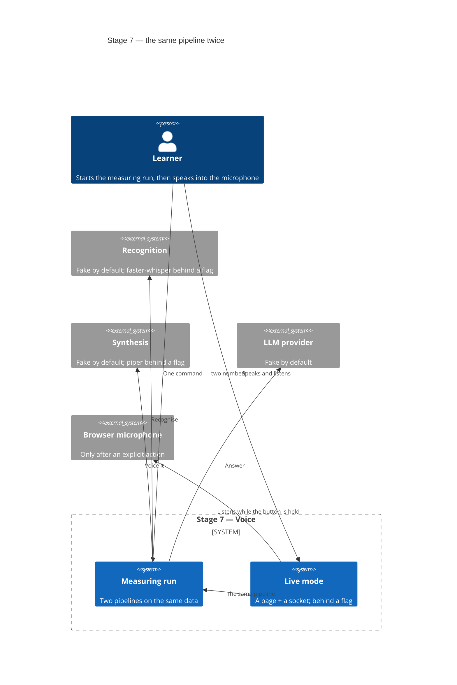
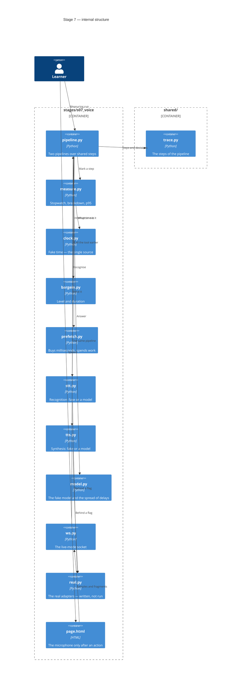
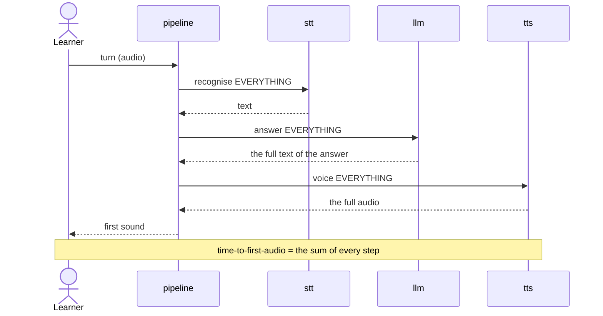
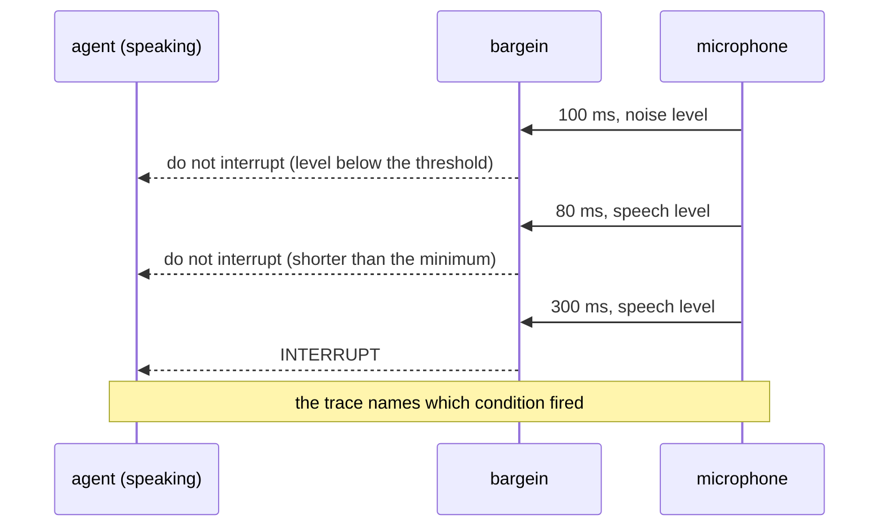

# SAD — s07-voice

## 1. Introduction and goals

Stage 7 builds **one pipeline twice** and measures both times. The thesis:

> **You can only optimise what has been measured. A "before" number with no "after" is a report;
> an "after" number with no "before" is faith.**

Three goals, each of them checkable:

1. The learner gets two numbers from one command on the same data.
2. The learner sees that streaming **does not make the work faster** — it starts delivering
   earlier, and that is exactly why what gets measured is the time to the first sound.
3. The learner reproduces barge-in and sees that **two** conditions decide it, not one.

**Stakeholders:** Learner (takes the stage, listens with their own ears), Operator (deploys
nothing at this stage), Contributor (the author).

## 2. Constraints

| # | Constraint | Where from |
|---|---|---|
| C-1 | The whole stage can be taken without a microphone, without models and without a network | course rule, NFR-5 |
| C-2 | The numbers come from **fake** delays, not from a clock | NFR-6, against flicker |
| C-3 | Recognition and synthesis are somebody else's products; the stage only calls them | spec §3 |
| C-4 | `if profile == ...` lives only in the `shared/` factories | CONVENTIONS.md |
| C-5 | `pipeline.py` ≤ 110 executed lines | NFR-1 |
| C-6 | A page with no build step: one file, no frontend stack | spec §5, assumption 4 |
| C-7 | Audio and recognised text are not stored | spec §6.1 |

## 3. Context and scope



**In scope:** two pipelines with measurement, the latency breakdown by step, the distribution and
p95, barge-in with its two conditions, prefetch with both of its numbers, the page and the socket
for live mode.

**Out of scope:** audio quality, telephony, multiple languages, choosing a voice, stitching into
the stage 6 service (see §11), optimising the models themselves.

## 4. Solution strategy

| Decision | Choice | Why |
|---|---|---|
| Target surfaces | `backend-service` + `web-frontend` + `cli` | The socket, the page, the measuring run |
| Source of the delays | Fake by default, models behind a flag | Otherwise the checks flicker and weigh gigabytes. ADR-0001 |
| Time inside the pipeline | Supplied by a clock passed as a parameter | Stage 5's lesson; here it settles the flicker as well. ADR-0002 |
| Streaming | The pipeline yields **fragments**, not a result | That is exactly where the difference is, and it has to be visible in the type. ADR-0003 |
| Barge-in | Two conditions: level and duration | One gives either a deaf detector or a hysterical one. ADR-0004 |
| Prefetch | Started at once, the result may be discarded | The price is named by both numbers. ADR-0005 |
| The page | One HTML file with no build step | The stage is about latency, not about assembling a build. ADR-0006 |
| The breakdown | The steps **plus the handover to the consumer**, remainder = zero | Two thirds of the invariant left the consumer's time on the model's account. ADR-0007 |
| Trace | The tracer is an optional parameter | The checks stay offline, and reconciling the two mechanisms becomes possible. ADR-0008 |

**Why measurement is a module of its own and not `time.perf_counter()` scattered around.**
Scattered measurements give numbers that cannot be added up: the sum of the steps does not match
the total, because something went unmeasured. One stopwatch that knows about steps turns AC-01
("the sum equals the total") into a checkable statement rather than a wish.

## 5. Building block view

```
stages/s07_voice/
├── clock.py        fake clock and delays; the single source of time
├── stt.py          recognition: fake or faster-whisper
├── tts.py          synthesis: fake or piper
├── pipeline.py     the batch and streaming pipelines; ≤110 lines
├── measure.py      stopwatch, breakdown, distribution, p95
├── bargein.py      two conditions for interrupting
├── prefetch.py     the price of calling early — both numbers
├── page.html       the live-mode page, no build step
├── ws.py           socket: the same pipeline, a different transport
├── run.py          demo: scenes with numbers
├── check.py        checks
└── DECISION.md     the "what to measure in voice" checklist
```

**C4 Container (L2):**



**Why `clock.py` is separate.** It is the only place the pipeline learns the time from. Scattered
`time.perf_counter()` calls make timing checks depend on the machine's load — that is, make them
flicker — and NFR-6 becomes unreachable. The fake clock moves in **steps** set by the test, so the
same data always gives the same number.

**Why `shared/llm.py` is not here.** The stage measures the **pipeline**, not the model. A real
call would add a network, a key and a spread that cannot be reproduced — that is, it would make
the main number unmeasurable. The "model" here is `model.py`: a fake delay whose size is a
function of the run index. The first edition of the diagram drew `Rel(pipe, llm)`, and that was
untrue: the pipeline never called `shared/llm.py` once.

**Why `measure.py` is separate from `pipeline.py`.** The pipeline has to stay readable: what you
see in it is steps, not measurements. Plus stage 8 will use the same stopwatch when it measures
evaluation.

## 6. Runtime view

**Flow 1 — the batch pipeline: every step waits for the previous one (AC-01).**



**Flow 2 — streaming: the first fragment moves on without waiting for the rest (AC-02).**

```mermaid
sequenceDiagram
    actor L as Learner
    participant P as pipeline
    participant M as llm
    participant T as tts

    P->>M: answer in fragments
    M-->>P: fragment 1
    P->>T: voice fragment 1
    T-->>P: audio 1
    P-->>L: FIRST SOUND
    Note over L,T: the rest of the fragments go on in parallel
    M-->>P: fragment 2
    P->>T: voice fragment 2
    M-->>P: fragment 3
    Note over L,T: total duration is THE SAME;<br/>only the first sound comes earlier
```

**Flow 3 — barge-in: two conditions, and neither on its own is enough (AC-05, AC-05b, AC-05c).**



## 7. Deployment view

`<!-- N/A: the stage is not deployed. Live mode is a local page and socket; the stage 6 service does not change (see §11). -->`

## 8. Crosscutting concepts

| Concern | How it is solved |
|---|---|
| Time | A single source — `clock.py`; the pipeline never reads a clock (C-2) |
| Trace | The steps of the pipeline with their durations; **no audio and no text in it** (C-7) |
| Errors | A missing model → a named state, not a crash (AC-07b); empty recognition → a state of its own (AC-09) |
| Trust | Recognised text is untrusted: everything stages 2 and 5 know still holds |
| Determinism | Fake delays; the timing check is run twenty times (NFR-6) |
| Privacy | The microphone only after an action; neither the samples nor the text are written to disk |

## 9. Architecture decisions

| # | Decision | Status | Where it shows |
|---|---|---|---|
| 0001 | Delays are fake by default, models behind a flag | Accepted | §4, §5 |
| 0002 | Time is supplied by a clock passed as a parameter | Accepted | §4, §5, §8 |
| 0003 | Streaming yields fragments — it is visible in the type | Accepted | §4, §6 |
| 0004 | Two conditions decide barge-in | Accepted | §4, §6 |
| 0005 | Prefetch is shown with both of its numbers | Accepted | §4 |
| 0006 | A page with no build step | Accepted | §4, §5 |
| 0007 | The breakdown has three terms, not two | Accepted | §4, §6, §10 |
| 0008 | The tracer is an optional parameter of the pipeline | Accepted | §4, §5 |

## 10. Quality requirements

| Scenario | When | Then | How verify |
|---|---|---|---|
| Two numbers | One run | Batch and streaming side by side, ratio ≥ 2 | unit check |
| The honest half | Comparing total duration | Roughly the same | unit check |
| The breakdown | A run of either pipeline | Sum of the steps = the total number | unit check |
| The distribution | A hundred runs | p95 noticeably larger than the mean | unit check |
| Barge-in | Three inputs: noise, short, long | No / no / interrupt | three checks |
| Module size | A count of executed lines | `pipeline.py` ≤ 110 | budget check |
| Without models | A run on the base install | Green or `NOT EVALUATED` | `scripts/clean_install.py` |
| Flicker | Twenty runs in a row | Twenty greens | a repeated run inside the check |

## 11. Risks and technical debt

| Risk | Severity | Mitigation | Owner |
|---|---|---|---|
| **The numbers will look like a performance promise** | High | The lesson says in its first line that the delays are fake and that the number is about the architecture of the pipeline. AC-02b holds the honest half: total duration does not change | Contributor |
| **The timing check will flicker** | High | The most likely shape of failure for this stage: one flicker and the check gets disabled, and with it disappears the evidence for the main thesis. So the clock is fake, and NFR-6 is verified by twenty runs | Contributor |
| **`pipeline.py` will not fit into 110 lines** | Medium | The experience of six stages: the budget fires. The place is named in advance: what has to move out is **the measurement** (`measure.py` is already separate) and **prefetch**, not the steps of the pipeline themselves — they are the lesson | Contributor |
| **There is no real microphone** | High | AC-07 stays `NOT EVALUATED`. The socket is now **started** by a check (AC-07c) — with no audio, but with a full conversation; what stays unverified is the audio itself. It is not hidden | Learner, before the tag |
| **`real.py` has not been run** | High | Written, not executed: the author has neither the model weights nor a microphone. The weakest point of the stage, named in both READMEs | Learner, before the tag |
| **The VAD threshold is wrong for somebody else's room** | Medium | Named in §"What the plan does not prove": 100/300 ms are the bounds of an exercise, not a production setting | Contributor |
| **Open question** — stitching into the stage 6 service | Open question | A separate module; the stitching makes sense at stage 10 | Contributor, stage 10 |
| **Open question** — spectral VAD | Open question | A level threshold, with its limit named | Contributor, after a live run |

## 12. Glossary

| Term | What it means at this stage |
|---|---|
| Time-to-first-audio | The time from the end of the turn to the first sound of the reply. The main number of the stage |
| Batch pipeline | Each step waits for the previous one to finish completely |
| Streaming pipeline | The first fragment moves on without waiting for the rest |
| Barge-in | Interrupting the reply with the other person's voice |
| VAD | Voice activity detection. Here — a level threshold plus a minimum duration |
| Prefetch | Calling a tool early, before it is known whether it is needed |
| p95 | The value only 5 % of runs are worse than. What the user feels |
| Fake delay | A pause of a set length instead of real model work |
