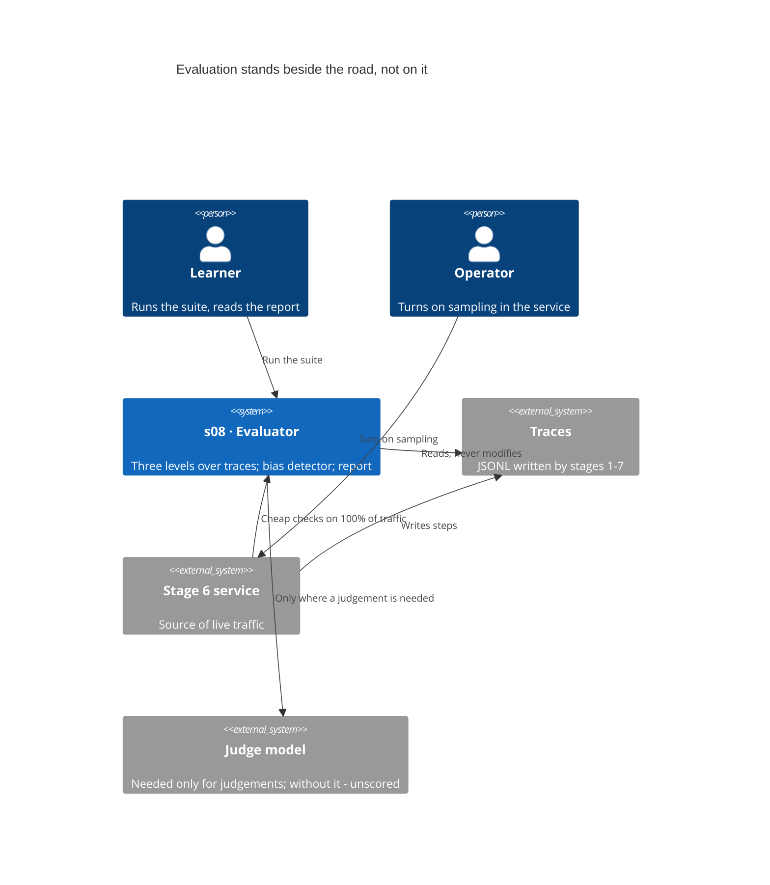
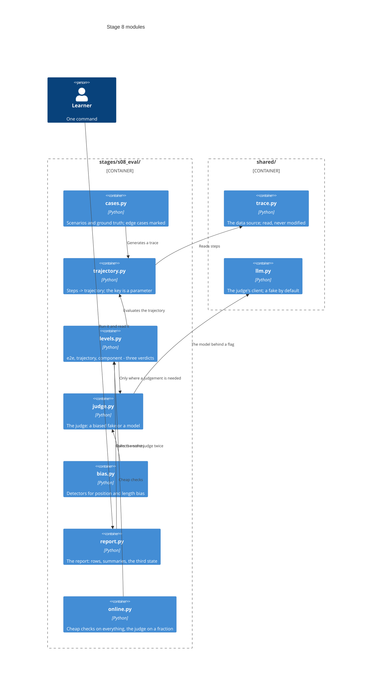
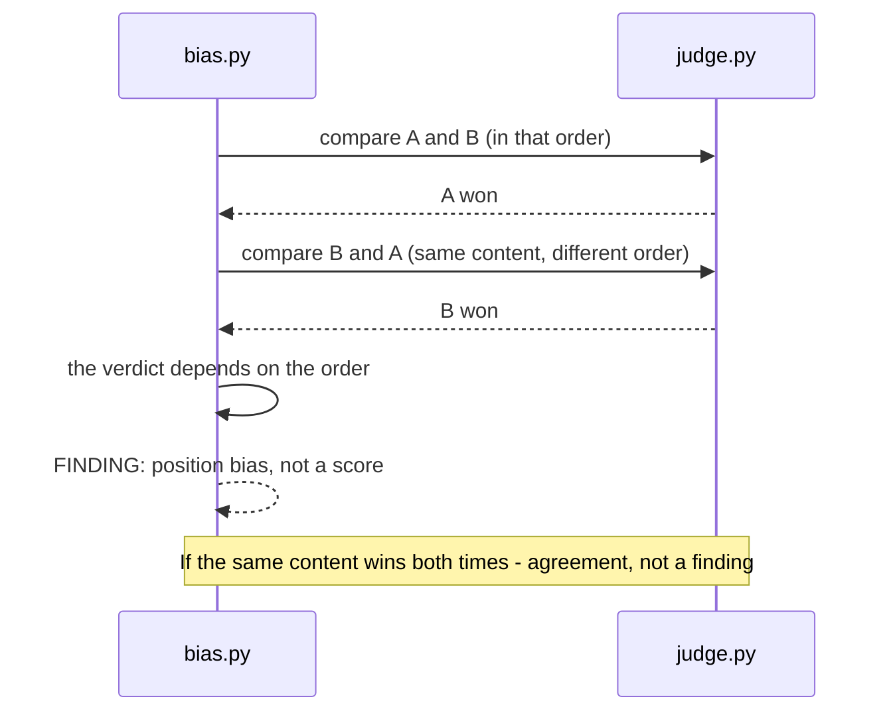
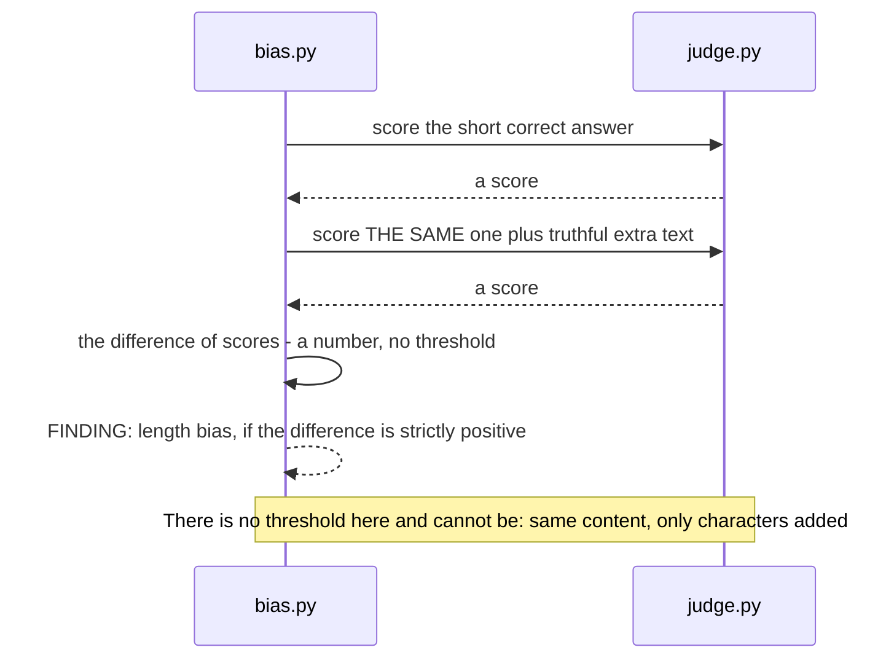

# SAD — s08-eval

## 1. Introduction and goals

Stage 8 builds an **evaluator on top of the traces** stages 1–7 already write. The thesis:

> **What has to be evaluated is the path, not only the destination.** An agent that arrived
> correctly and an agent that arrived by accident produce the same last message.

The second thesis is about the evaluator itself:

> **A judge model is a measuring instrument, and instruments get calibrated.** A number taken
> from an instrument that answers differently on the same data in a different order is not a
> score.

Three goals, each of them checked:

1. One command produces a report with **three independent verdicts** per case.
2. The reader sees that swapping two answers around changes the judge's verdict — on their own
   run, not in a retelling.
3. The reader sees that "unscored" is counted separately from "failed" and "passed".

**Stakeholders:** Learner (runs the suite, reads the report, does the exercises), Operator
(turns on online sampling in the stage 6 service), Contributor (the stage's author).

## 2. Constraints

| # | Constraint | Where from |
|---|---|---|
| C-1 | The whole stage runs offline and with no API key | course rule, NFR-5 |
| C-2 | Stages 1–7 **do not change** for the sake of evaluation | spec §3, AC-02 |
| C-3 | The evaluator **reads** traces and does not write into them | spec §6.1, AC-02b |
| C-4 | `if profile == ...` lives only in the `shared/` factories | CONVENTIONS.md |
| C-5 | Every harness module is ≤ 110 executable lines | NFR-1 |
| C-6 | Evaluation material carries no request text | spec §6.1, AC-07b |
| C-7 | There is no real deployment: the online part is checked locally | spec §8 |
| C-8 | The trace already has its format (`shared/trace.py`, repository ADR-0005) — the evaluator fits itself to it, not the other way round | docs/adr/0005 |
| C-9 | Two promises from stage 6 (`adr/0005`, `adr/0008`) come due here: say what the trace lacks, and state the requirement on the store | s06 adr/0005, adr/0008 |
| C-10 | No part of evaluation stands in the hot path — neither the judge nor the cheap checks | spec §3, §6.1 |

## 3. Context and scope

The evaluator stands **beside** the system: it serves nothing and depends on nothing but the
trace files. That is deliberate — evaluation built into the hot path pays its latency out of
somebody else's budget.



**Inside the scope:** reading traces, three levels of evaluation, a detector for judge bias, the
report, online sampling as a library function.

**Outside it:** a user interface, a results database, significance statistics, evaluating model
quality, changes to stages 1–7.

## 4. Solution strategy

| Question | Decision | Why this way |
|---|---|---|
| What a "trajectory" is | Steps grouped by a **key parameter**, not by a fixed field | Stage 1 groups by `trace_id`, stage 6 by `trace_ref`; a fixed field would declare one of them wrong. ADR-0001 |
| Three levels | Three **independent** verdicts, never a single score | A combined score hides exactly what having three levels is for. ADR-0003 |
| Deterministic check vs judge | Every **evaluator** declares its kind, and that is checked | A judge doing string comparison is an expense and an unreliability at once. ADR-0004 |
| The fake judge | Biased **on purpose**, the way a mutation breaks a property on purpose | A detector needs the thing it detects; without that the proof is impossible offline. ADR-0002 |
| Cases | Generated from **declarative scenarios**, not sitting there as fixtures | Fixtures rot silently; generated traces are real traces in the real format. ADR-0005 |
| The third state | "Unscored" is counted separately in every summary | A silent failure turns a missing key into poor quality. ADR-0006 |
| What a component is | One **step** and its own result; the sequence is the trajectory, the last answer is e2e | Without an unambiguous rule the same defect reddens two levels, and AC-03b about their independence is checked by nothing. ADR-0003 |
| An empty component | No steps of the required kind → **unscored**, not "passed" | Otherwise the poorer the trace, the greener the report. ADR-0006 |
| Online sampling | A library function with **deterministic** selection | Random sampling cannot be checked, and an unchecked fraction is an intention. ADR-0007 |

## 5. Building block view



**Why `trajectory.py` is separate from `levels.py`.** Pulling a trajectory out of a file is one
job, evaluating it is another, and it is the first one the two stages disagree on. Merge them and
every level would have to be taught to read both formats.

**Why `bias.py` is separate from `judge.py`.** The detector is not part of the judge — it stands
**above** it. A judge that checks itself for bias is checking its own idea of what bias is.

**Why `online.py` is not inside the stage 6 service.** C-2: stages do not change. The service
imports the function rather than the other way round — and stage 8 stays removable.

## 6. Runtime view

**Flow 1 — evaluating one case at three levels (AC-01, AC-03, AC-03b).**

```mermaid
sequenceDiagram
    actor L as Learner
    participant R as report.py
    participant C as cases.py
    participant T as trajectory.py
    participant V as levels.py
    participant J as judge.py

    L->>R: run the suite
    R->>C: next case
    C-->>R: task, expected tool, ground truth, trace
    R->>T: extract the trajectory
    T-->>R: ordered steps
    R->>V: evaluate three levels
    V->>V: component - deterministic
    V->>V: trajectory - deterministic
    V->>J: e2e - a judgement is needed
    alt the judge is available
        J-->>V: verdict and reason
    else no judge
        J-->>V: unscored
    end
    V-->>R: three independent verdicts
    R-->>L: the case row; at the end - the summaries
```

**Flow 2 — the position bias detector (AC-05, AC-05b).**



**Flow 2b — the length bias detector, the pointwise protocol (AC-06).**



There are two protocols, and that is a decision of its own for this stage: the pairwise one has
no **score**, the pointwise one has no **order**. One protocol would not have shown both biases.

**Flow 3 — online sampling (AC-07, AC-07b, AC-07c).**

```mermaid
sequenceDiagram
    participant S as Stage 6 service
    participant O as online.py
    participant J as judge.py

    S->>O: the answer to a request
    O->>O: cheap deterministic checks
    Note over O: on EVERY request
    alt the request fell into the fraction
        O->>J: judge it
        J-->>O: verdict
    else it did not
        O-->>O: cheap checks only
    end
    O-->>S: nothing blocks the response
    Note over O: The request text is not kept; only decisions and numbers
```

## 7. Deployment view

Evaluation is **not deployed** separately. The offline part is a command; the online part is a
function the stage 6 service calls inside itself.

**The trace store.** The evaluator's requirement on it is stated here, and it turned out smaller than the guess: read everything in one pass, group by a key on the reader's side, append without rewriting, recover the order from the data, be readable by eye. JSONL satisfies all five; an external sink adds none of them (ADR-0009). A promise that travelled through three stages is closed with an answer rather than a fourth deferral.

<!-- N/A: there is no separate environment; stage 10 decides whether to move evaluation into a scheduled job -->

## 8. Crosscutting concepts

| Concern | How it is done |
|---|---|
| Tracing | An evaluation run writes **its own** trace (AC-02b) and does not modify the traces it reads |
| Errors | An unavailable judge → "unscored" (AC-08); a broken trace file → a named cause, not an empty report |
| Determinism | The fake judge and the sample selection are deterministic; twenty runs give one report (NFR-6) |
| Privacy | Request text never reaches evaluation material (C-6, AC-07b) |
| Configuration | The judge and the sampling fraction are parameters, not constants in the code |

## 9. Architecture decisions

| # | Decision | Status | Where it shows |
|---|---|---|---|
| 0001 | The trajectory is extracted by a key parameter, not a fixed field | Accepted | §4, §5, §6 |
| 0002 | The fake judge is biased on purpose | Accepted | §4, §6 |
| 0003 | Three levels — three independent verdicts, never one score | Accepted | §4, §6 |
| 0004 | Every evaluator declares whether it is deterministic or judges | Accepted | §4, §8 |
| 0005 | Cases are generated from scenarios rather than sitting there as fixtures | Accepted | §4, §5 |
| 0006 | "Unscored" is a full third state of the report | Accepted | §4, §8 |
| 0007 | Selection into the sample is deterministic, and the actual fraction is verified | Accepted | §4, §6 |
| 0008 | What the evaluator lacks in the trace — a measured answer | Accepted | §2, §11 |
| 0009 | The requirement on the trace store is stated; JSONL satisfies it | Accepted | §2, §7 |

## 10. Quality requirements

| Scenario | When | Then | How it is checked |
|---|---|---|---|
| An offline run | No key and no network | The suite is green; judgements are "unscored" | `scripts/clean_install.py`, NFR-5 |
| Suite speed | Running the stage's checks | ≤ 30 s | `BUDGET_SECONDS`, NFR-2 |
| Determinism | Twenty runs in a row | The same report | the flakiness check, NFR-6 |
| Module size | Any harness module | ≤ 110 executable lines | AST count, NFR-1 |
| Suite composition | The list of cases | ≥ 20, of which ≥ 1/3 are edge cases | a count, NFR-7 |
| Failure modes | The list of checks | ≥ 1/3 carry the `FAILURE` prefix | a count, NFR-4 |

## 11. Risks and technical debt

| Risk | Severity | What we do | Owner, deadline |
|---|---|---|---|
| **The fake judge only proves itself** | High | The frame is named in the lesson's first line: the fake plays the part of a broken instrument, the detector works with any judge. The same detector runs against a real model behind a flag | Contributor, before the tag |
| **There is no real deployment** | High | AC-07 is checked against the stage 6 service in the same process; against a live URL it is `NOT EVALUATED`, not green | Contributor, before the tag |
| **Twenty cases give no statistics** | Medium | §3 Non-goals says so outright; the report prints no confidence intervals | Contributor, before the tag |
| **Generated cases may drift away from real traces** | Medium | AC-11: the same code evaluates the traces of stages 1 and 6, not only its own | Contributor, before the tag |
| The evaluator itself becomes non-trivial and unchecked | Medium | Fourteen mutations break properties; the check that goes red is the one asserting that very property. An independent review found eight MAJOR — which is exactly why the mutations exist and not just a green suite | Contributor, before the tag |
| **Four different names for "the run key"** | High | Measured: `scenario`, `phase`, `scene`, `trace_ref`, and two stages with none. The evaluator takes the key as a parameter (ADR-0001), the requirement is written down (ADR-0008), changing `shared/trace.py` is stage 10 | Contributor, stage 10 |
| The component level is blind to the model on service traces | Medium | Measured: there is no `llm_call` in stage 6 requests. The verdict is "unscored", not "passed" (AC-03d); the gap is named in ADR-0008 | Contributor, before the tag |
| Online sampling will touch the hot path | Low | §6 flow 3: nothing blocks the response; a check asserts it | Contributor, before the tag |

## 12. Glossary

The stage's terms are in [GLOSSARY.md](../../../GLOSSARY.md), section "Stage 8". The roles are in
[CONTEXT.md](../../../CONTEXT.md).
