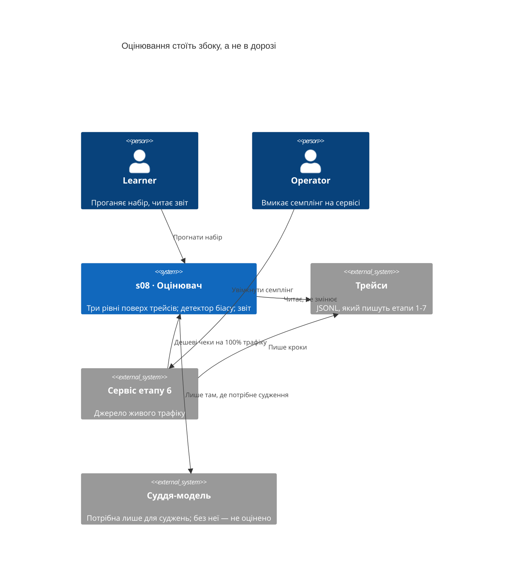
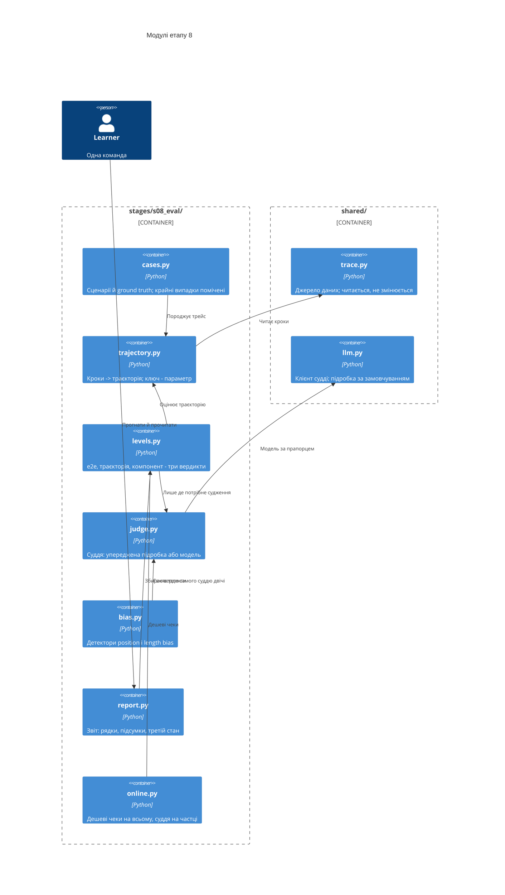
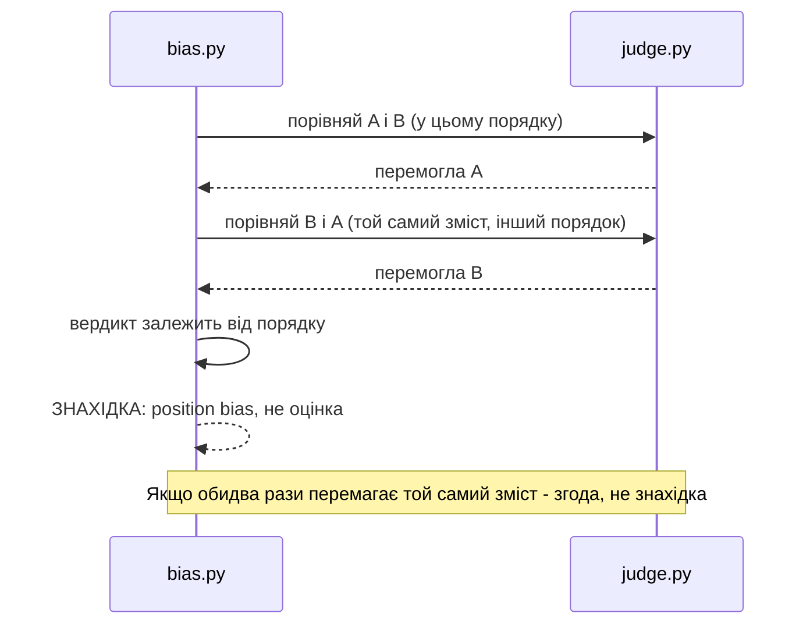

# SAD — s08-eval

## 1. Introduction and goals

Етап 8 будує **оцінювач поверх трейсів**, які етапи 1–7 уже пишуть. Теза:

> **Оцінювати треба шлях, а не лише пункт призначення.** Агент, що дійшов правильно, і агент,
> що дійшов випадково, дають однакове останнє повідомлення.

Друга теза — про сам оцінювач:

> **Суддя-модель — це вимірювальний прилад, а прилади калібрують.** Число, взяте від приладу,
> який дає різні відповіді на ті самі дані в різному порядку, — це не оцінка.

Три цілі, кожна перевіряється:

1. Одна команда дає звіт із **трьома незалежними вердиктами** на кейс.
2. Читач бачить, що перестановка двох відповідей місцями змінює вердикт судді — на власному
   прогоні, а не в переказі.
3. Читач бачить, що «не оцінено» рахується окремо від «провалено» й «пройдено».

**Стейкхолдери:** Learner (проганяє, читає звіт, робить вправи), Operator (вмикає
онлайн-семплінг на сервісі етапу 6), Contributor (автор етапу).

## 2. Constraints

| # | Обмеження | Звідки |
|---|---|---|
| C-1 | Увесь етап проходиться офлайн і без API-ключа | правило курсу, NFR-5 |
| C-2 | Етапи 1–7 **не змінюються** заради оцінювання | spec §3, AC-02 |
| C-3 | Оцінювач **читає** трейси й не пише в них | spec §6.1, AC-02b |
| C-4 | `if profile == ...` живе лише у фабриках `shared/` | CONVENTIONS.md |
| C-5 | Кожен модуль харнеса ≤ 110 виконуваних рядків | NFR-1 |
| C-6 | Матеріали оцінювання не несуть тексту запиту | spec §6.1, AC-07b |
| C-7 | Справжнього розгортання немає: онлайн-частина перевіряється локально | spec §8 |
| C-8 | Трейс уже має свій формат (`shared/trace.py`, ADR-0005 репозиторію) — оцінювач підлаштовується під нього, а не навпаки | docs/adr/0005 |
| C-9 | Дві обіцянки етапу 6 (`adr/0005`, `adr/0008`) настають тут: сказати, чого бракує у трейсі, і сформулювати вимогу до сховища | s06 adr/0005, adr/0008 |
| C-10 | Жодна частина оцінювання не стоїть у гарячому шляху — ані суддя, ані дешеві чеки | spec §3, §6.1 |

## 3. Context and scope

Оцінювач стоїть **збоку** від системи: він нічого не обслуговує й ні від чого не залежить,
крім файлів трейсів. Це навмисно — оцінювання, вбудоване в гарячий шлях, платить своєю
затримкою з чужого бюджету.



**Що всередині обсягу:** читання трейсів, три рівні оцінювання, детектор біасу судді, звіт,
онлайн-семплінг як бібліотечна функція.

**Що зовні:** інтерфейс, база результатів, статистика значущості, оцінювання якості моделей,
зміни в етапах 1–7.

## 4. Solution strategy

| Питання | Рішення | Чому саме так |
|---|---|---|
| Що таке «траєкторія» | Кроки, згруповані **ключем-параметром**, а не фіксованим полем | Етап 1 групує по `trace_id`, етап 6 — по `trace_ref`; фіксоване поле оголосило б один із них неправильним. ADR-0001 |
| Три рівні | Три **незалежні** вердикти, ніколи не один бал | Зведений бал ховає рівно те, заради чого рівнів три. ADR-0003 |
| Детермінований чек проти судді | Кожна перевірка **оголошує** свій вид, і це перевіряється | Суддя за порівняння рядків — це витрата й ненадійність одночасно. ADR-0004 |
| Підроблений суддя | Упереджений **навмисно**, як мутація ламає властивість навмисно | Детектору потрібне те, що він виявляє; без цього доказ неможливий офлайн. ADR-0002 |
| Кейси | Породжуються з **декларативних сценаріїв**, не лежать фікстурами | Фікстури псуються мовчки; породжені трейси — справжні трейси в справжньому форматі. ADR-0005 |
| Третій стан | «Не оцінено» рахується окремо в кожному підсумку | Мовчазний провал перетворює відсутність ключа на погану якість. ADR-0006 |
| Що є компонентом | Один **крок** і його власний результат; послідовність — це траєкторія, остання відповідь — e2e | Без однозначного правила той самий дефект червонить два рівні, і AC-03b про їхню незалежність не перевіряється нічим. ADR-0003 |
| Порожній компонент | Кроків потрібного виду немає → **не оцінено**, не «пройдено» | Інакше що бідніший трейс, то зеленіший звіт. ADR-0006 |
| Онлайн-семплінг | Бібліотечна функція з **детермінованим** відбором | Випадковий семплінг неможливо перевірити, а неперевірена частка — це намір. ADR-0007 |

## 5. Building block view



**Чому `trajectory.py` окремо від `levels.py`.** Витягнути траєкторію з файлу — це одна
задача, оцінити її — інша, і саме на першій два етапи розходяться. Змішавши їх, кожен рівень
довелося б учити читати обидва формати.

**Чому `bias.py` окремо від `judge.py`.** Детектор не є частиною судді — він **над** ним.
Суддя, який сам себе перевіряє на упередженість, перевіряє власне уявлення про упередженість.

**Чому `online.py` не всередині сервісу етапу 6.** C-2: етапи не змінюються. Сервіс імпортує
функцію, а не навпаки, — і етап 8 лишається знімним.

## 6. Runtime view

**Потік 1 — оцінювання одного кейса на трьох рівнях (AC-01, AC-03, AC-03b).**

```mermaid
sequenceDiagram
    actor L as Learner
    participant R as report.py
    participant C as cases.py
    participant T as trajectory.py
    participant V as levels.py
    participant J as judge.py

    L->>R: прогнати набір
    R->>C: наступний кейс
    C-->>R: задача, очікуваний інструмент, ground truth, трейс
    R->>T: витягнути траєкторію
    T-->>R: впорядковані кроки
    R->>V: оцінити три рівні
    V->>V: компонент - детерміновано
    V->>V: траєкторія - детерміновано
    V->>J: e2e - потрібне судження
    alt суддя доступний
        J-->>V: вердикт і причина
    else судді немає
        J-->>V: не оцінено
    end
    V-->>R: три незалежні вердикти
    R-->>L: рядок кейса; наприкінці - підсумки
```

**Потік 2 — детектор position bias (AC-05, AC-05b).**



**Потік 3 — онлайн-семплінг (AC-07, AC-07b, AC-07c).**

```mermaid
sequenceDiagram
    participant S as Сервіс етапу 6
    participant O as online.py
    participant J as judge.py

    S->>O: відповідь на запит
    O->>O: дешеві детерміновані чеки
    Note over O: на КОЖНОМУ запиті
    alt запит потрапив у частку
        O->>J: судити
        J-->>O: вердикт
    else не потрапив
        O-->>O: лише дешеві чеки
    end
    O-->>S: нічого не блокує відповідь
    Note over O: Текст запиту не лишається; лише рішення й числа
```

## 7. Deployment view

Оцінювання **не розгортається** окремо. Офлайн-частина — команда; онлайн-частина — функція,
яку сервіс етапу 6 кличе у себе.

**Сховище трейсів.** Вимогу оцінювача до нього сформульовано тут і вона виявилась меншою за здогад: прочитати все одним проходом, групувати ключем на боці читача, дописувати без переписування, відновлювати порядок із даних, читатись очима. JSONL задовольняє всі пʼять; зовнішній стік не додає жодної (ADR-0009). Обіцянка, що мандрувала трьома етапами, закрита відповіддю, а не четвертим переносом.

<!-- N/A: окремого середовища немає; етап 10 вирішує, чи виносити оцінювання в задачу за розкладом -->

## 8. Crosscutting concepts

| Наскрізне | Як реалізовано |
|---|---|
| Трасування | Прогін оцінювання пише **власний** трейс (AC-02b), читані трейси не змінює |
| Помилки | Недоступний суддя → «не оцінено» (AC-08); зламаний файл трейсу → названа причина, не порожній звіт |
| Детермінізм | Підроблений суддя й відбір семплу детерміновані; двадцять прогонів дають один звіт (NFR-6) |
| Приватність | Текст запиту не потрапляє в матеріали оцінювання (C-6, AC-07b) |
| Конфігурація | Суддя й частка семплінгу — параметри, не константи в коді |

## 9. Architecture decisions

| # | Рішення | Статус | Де відбилось |
|---|---|---|---|
| 0001 | Траєкторія витягується ключем-параметром, не фіксованим полем | Accepted | §4, §5, §6 |
| 0002 | Підроблений суддя упереджений навмисно | Accepted | §4, §6 |
| 0003 | Три рівні — три незалежні вердикти, ніколи не один бал | Accepted | §4, §6 |
| 0004 | Кожна перевірка оголошує, детермінована вона чи судить | Accepted | §4, §8 |
| 0005 | Кейси породжуються зі сценаріїв, а не лежать фікстурами | Accepted | §4, §5 |
| 0006 | «Не оцінено» — повноправний третій стан звіту | Accepted | §4, §8 |
| 0007 | Відбір у семпл детермінований, а фактична частка звіряється | Accepted | §4, §6 |
| 0008 | Чого оцінювачеві бракує у трейсі — виміряна відповідь | Accepted | §2, §11 |
| 0009 | Вимога до сховища трейсів сформульована; JSONL її задовольняє | Accepted | §2, §7 |

## 10. Quality requirements

| Сценарій | Коли | Тоді | Як перевіряється |
|---|---|---|---|
| Прогін офлайн | Немає ключа й мережі | Набір зелений; судження — «не оцінено» | `scripts/clean_install.py`, NFR-5 |
| Швидкість набору | Прогін перевірок етапу | ≤ 30 с | `BUDGET_SECONDS`, NFR-2 |
| Детермінізм | Двадцять прогонів поспіль | Той самий звіт | перевірка мигтіння, NFR-6 |
| Розмір модулів | Будь-який модуль харнеса | ≤ 110 виконуваних рядків | AST-підрахунок, NFR-1 |
| Склад набору | Перелік кейсів | ≥ 20, із них ≥ 1/3 крайніх | підрахунок, NFR-7 |
| Режими відмови | Перелік перевірок | ≥ 1/3 із префіксом `ВІДМОВА` | підрахунок, NFR-4 |

## 11. Risks and technical debt

| Ризик | Важливість | Що робимо | Власник, термін |
|---|---|---|---|
| **Підроблений суддя доводить лише сам себе** | High | Рамка названа першим рядком уроку: підробка грає роль зламаного приладу, детектор працює з будь-яким суддею. Той самий детектор іде проти справжньої моделі за прапорцем | Contributor, перед тегом |
| **Справжнього розгортання немає** | High | AC-07 перевіряється проти сервісу етапу 6 у тому ж процесі; проти живого URL — `НЕ ПЕРЕВІРЕНО`, а не зелене | Contributor, перед тегом |
| **Двадцять кейсів не дають статистики** | Medium | §3 Non-goals називає це прямо; звіт не друкує довірчих інтервалів | Contributor, перед тегом |
| **Породжені кейси можуть розійтися з реальними трейсами** | Medium | AC-11: той самий код оцінює трейси етапів 1 і 6, а не лише власні | Contributor, перед тегом |
| Оцінювач сам стає нетривіальним і неперевіреним | Medium | Мутації етапу ламають рівні оцінювання; червоніє перевірка, що стверджує про рівень | Contributor, перед тегом |
| **Чотири різні імені для «ключа прогону»** | High | Виміряно: `scenario`, `phase`, `scene`, `trace_ref`, і два етапи без нього. Оцінювач приймає ключ параметром (ADR-0001), вимога записана (ADR-0008), зміна `shared/trace.py` — етап 10 | Contributor, етап 10 |
| Компонентний рівень сліпий щодо моделі на трейсах сервісу | Medium | Виміряно: `llm_call` у запитах етапу 6 немає. Вердикт — «не оцінено», а не «пройдено» (AC-03d); брак названо в ADR-0008 | Contributor, перед тегом |
| Онлайн-семплінг зачепить гарячий шлях | Low | §6 потік 3: нічого не блокує відповідь; перевірка стверджує це | Contributor, перед тегом |

## 12. Glossary

Терміни етапу — у [GLOSSARY.md](../../../GLOSSARY.md), розділ «Етап 8». Ролі — у
[CONTEXT.md](../../../CONTEXT.md).
