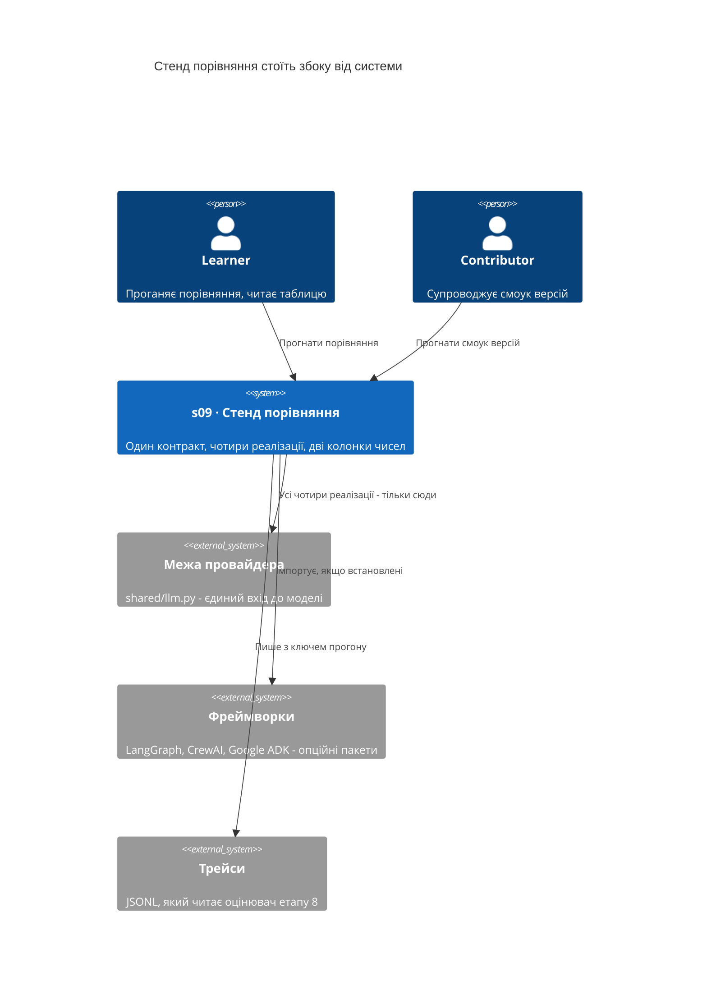
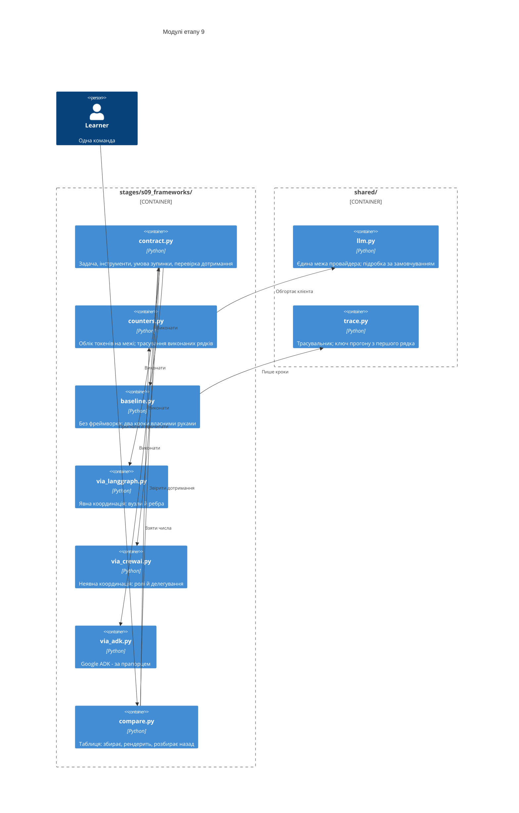
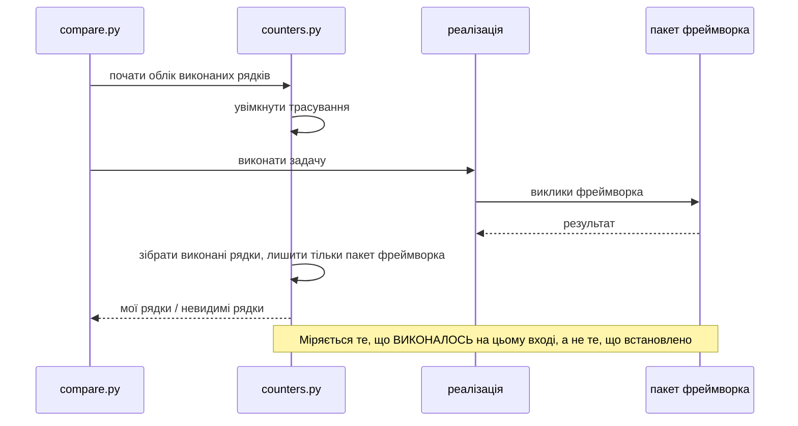
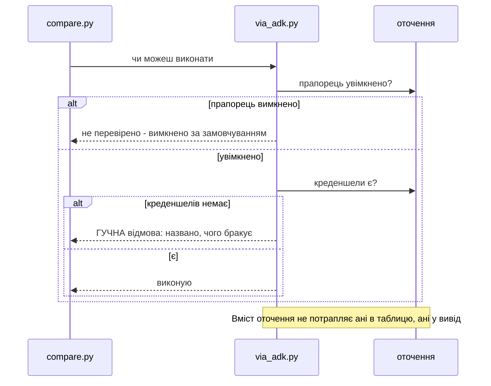

# SAD — s09-frameworks

## 1. Introduction and goals

Етап 9 будує **вимірювальний стенд**, а не ще одну реалізацію агента. Одна задача виконується
чотирма способами, і мірятиметься не якість відповіді, а **ціна риштувань**.

> **Фреймворк — це риштування, а не архітектура.** Обраний до того, як відома форма будівлі,
> він стає формою.

Друга теза — операційна, і саме вона перетворюється на колонки таблиці:

> **Явна координація коштує рядків. Неявна коштує розуміння.**

Три цілі, кожна перевіряється:

1. Одна команда дає **порівняльну таблицю з власними числами** — і числа обчислені, не набрані.
2. Усі реалізації виконують **буквально ту саму задачу**, і це доводиться виконанням спільного
   контракту, а не оглядом коду.
3. У таблиці є рядок **без жодного фреймворка** — інакше вона відповідає не на те питання.

**Стейкхолдери:** Learner (проганяє, читає таблицю, робить вправи), Operator (цікавиться
токенами понад запит), Contributor (автор етапу, супроводжує смоук версій).

## 2. Constraints

| # | Обмеження | Звідки |
|---|---|---|
| C-1 | Увесь етап проходиться офлайн і без API-ключа | правило курсу, NFR-5 |
| C-2 | Етапи 1–8 **не змінюються** заради порівняння | spec §3 |
| C-3 | Жодна реалізація не створює власного клієнта провайдера | spec §6.1, AC-11 |
| C-4 | `if profile == ...` живе лише у фабриках `shared/` | CONVENTIONS.md |
| C-5 | Кожен модуль реалізації ≤ 110 виконуваних рядків | NFR-1 |
| C-6 | Пакети фреймворків **опційні**; їхня відсутність дає «не перевірено» | spec §6.1, NFR-5 |
| C-7 | Креденшели Google не є вимогою етапу; ADK — за прапорцем | spec §8, припущення 3 |
| C-8 | Реалізації **мінімальні**: жодних ретраїв, кешу, запобіжників | spec §3 |
| C-9 | Версії фреймворків запінені **верхньою** межею | NFR-8 |
| C-10 | Трейси пишуться крізь `shared/trace.py` — і з ключем прогону з першого рядка | spec §5, AC-12 |

## 3. Context and scope

Стенд стоїть **збоку** від системи: він нічого не обслуговує, нічого не розгортає й ні від чого
не залежить, крім спільної межі провайдера.



**Що всередині обсягу:** контракт задачі, чотири реалізації, облік токенів на межі провайдера,
підрахунок моїх і невидимих рядків, порівняльна таблиця, смоук версій.

**Що зовні:** швидкодія фреймворків, порівняння екосистем, навчання фреймворкам, продакшн-обвіс,
будь-яка зміна етапів 1–8.

**Brownfield.** Репозиторій зрілий: `shared/llm.py` уже є єдиною межею провайдера (ADR-0003
репозиторію), `shared/trace.py` — єдиним трасувальником, `shared/check_runner.py` — раннером
перевірок із третім станом. Етап 3 уже містить і власний міні-граф, і реалізацію на LangGraph —
він є джерелом **патерну**, але не коду (spec §3).

## 4. Solution strategy

| Питання | Рішення | Чому саме так |
|---|---|---|
| Цільова поверхня | **`cli`** — команда й файл, який читає людина | Етап нічого не обслуговує; сервіс додав би поверхню, якої порівняння не потребує |
| Що таке «та сама задача» | **Виконуваний контракт**, спільний для всіх реалізацій | Описаний контракт не ловить відхилення; виконуваний ловить, і саме він робить числа порівнянними. ADR-0001 |
| Де рахуються токени | На **межі провайдера**, обгорткою навколо клієнта | Лічильник у коді реалізації не бачить того, що фреймворк додав від себе, — тобто саме того, що міряється. ADR-0002 |
| Що таке «менше коду» | **Два** числа: мої рядки й невидимі рядки | Одне число перетворює «менше коду» на аргумент без другої половини. ADR-0003 |
| Як виміряти невидиме | Трасування **виконаних** рядків пакета фреймворка | Установлений код не є виконаним; міряти треба те, що справді працювало на цьому вході. ADR-0003 |
| Базова лінія | Пишеться **тут**, мінімально, не переноситься з етапу 3 | Там supervisor-роутер, тут два послідовні кроки; підгін зробив би задачі різними. ADR-0004 |
| Форма висновку | **«Обмеження → інструмент»**, жодного зведеного бала | Ваги обмежень — це думка, а не вимір. Та сама заборона, що на етапі 8. ADR-0005 |
| Відсутній фреймворк | Стан **«не перевірено»**, окремий рядок таблиці | Червоне на відсутність опційного пакета вимагало б установити все. ADR-0006 |
| ADK | За прапорцем; **увімкнений без креденшелів — гучно** | Прапорець, який просили ввімкнути й який мовчки не спрацював, гірший за його відсутність. ADR-0006 |
| Клієнт провайдера | Тільки крізь `shared.llm`, і це доводиться **виконанням** | Фреймворк із власним клієнтом ламає і офлайн-прогін, і облік токенів — мовчки. ADR-0007 |
| Ключ прогону в трейсі | **Є з першого рядка** | Етап 8 виміряв, що його бракує чотирьом етапам. Перший етап після виміру або користується ним, або вимір не був потрібен. ADR-0008 |

## 5. Building block view



**Чому `contract.py` окремо від реалізацій.** Контракт мусить бути **однією** річчю, яку всі
чотири виконують і жодна не визначає. Розкладений по реалізаціях, він перестає бути спільним
рівно тоді, коли одна з них зручно його трактує.

**Чому `counters.py` не всередині реалізацій.** Лічильник, який реалізація містить у собі,
бачить лише те, що ця реалізація попросила. Надбавка фреймворка — це різниця між попросили й
пішло, і побачити її можна тільки ззовні.

**Чому по модулю на фреймворк.** Відсутній пакет має давати «не перевірено» для **своєї**
реалізації, а не валити імпорт усього етапу. Один файл — одна опційна залежність.

**Чому `compare.py` і рендерить, і розбирає.** Таблиця перевіряється розбором **записаного
файлу** — двома незалежними джерелами, як звіт етапу 8. Рівність, обчислена з одного джерела,
є тотожністю.

## 6. Runtime view

**Потік 1 — один вимір: контракт, лічильники, дотримання (AC-01, AC-02, AC-04).**

```mermaid
sequenceDiagram
    actor L as Learner
    participant CMP as compare.py
    participant CTR as counters.py
    participant IMP as реалізація
    participant LLM as shared/llm.py
    participant CON as contract.py

    L->>CMP: прогнати порівняння
    CMP->>CTR: обгорнути клієнта лічильником
    CTR->>LLM: get_client(...)
    LLM-->>CTR: клієнт
    CMP->>IMP: виконати задачу цим клієнтом
    IMP->>CTR: запит до моделі
    CTR->>CTR: порахувати: просив автор / пішло насправді
    CTR-->>IMP: відповідь
    IMP-->>CMP: результат і трейс
    CMP->>CON: чи дотримано контракт
    alt контракт дотримано
        CON-->>CMP: рядок із числами
    else порушено
        CON-->>CMP: назва порушеного елемента, без чисел
    end
    CMP-->>L: таблиця; рядок-порушник названо, а не пораховано
```

**Потік 2 — невидимі рядки: міряється виконане, не встановлене (AC-03).**



**Потік 3 — ADK: прапорець, креденшели, третій стан (AC-07, AC-07b).**



## 7. Deployment view

Стенд **не розгортається**. Це команда, що читає код і пише файл.

**Опційні залежності.** `pip install -e ".[s09]"` приносить LangGraph і CrewAI; ADK — окремий
extra `[adk]`, бо потребує чужих креденшелів. Базова установка не приносить нічого з цього, і
етап у ній лишається прохідним: три рядки таблиці стають «не перевірено», четвертий — базова
лінія — рахується завжди.

<!-- N/A: окремого середовища немає; етап нічого не обслуговує -->

## 8. Crosscutting concepts

- **Третій стан** — той самий, що на етапі 8: «не перевірено» ≠ «пройдено» ≠ «провалено».
  Тут він означає «пакета немає» або «креденшелів немає», і має власний рядок у таблиці.
- **Два незалежні джерела.** Таблиця перевіряється розбором записаного файлу, а не повторним
  підрахунком тим самим кодом.
- **Межа провайдера одна.** Усе, що йде до моделі, проходить крізь `shared/llm.py`; це
  водночас умова офлайну, умова обліку токенів і умова відтворюваності.
- **Мінімальність як вимога, а не як лінь.** Кожен доданий рядок в одній реалізації робить
  колонку «мої рядки» несумірною з іншими.
- **Ключ прогону** — поле `case` у кожному кроці трейсу: етап 8 виміряв, що чотирьом етапам
  його бракує, і цей етап пишеться вже з ним.

## 9. Architecture decisions

| # | Рішення | Статус | Де відгукується |
|---|---|---|---|
| 0001 | Контракт задачі — виконуваний, а не описаний | Accepted | §4, §6 потік 1 |
| 0002 | Токени рахуються на межі провайдера | Accepted | §4, §5, §6 потік 1 |
| 0003 | Мої рядки й невидимі рядки — два числа; невидиме міряється виконанням | Accepted | §4, §6 потік 2 |
| 0004 | Базова лінія пишеться тут, а не переноситься з етапу 3 | Accepted | §4, §5 |
| 0005 | Жодного зведеного бала; висновок у формі «обмеження → інструмент» | Accepted | §4, §10 |
| 0006 | Відсутній пакет і відсутні креденшели — третій стан, але прапорець мовчати не має | Accepted | §4, §6 потік 3, §7 |
| 0007 | Клієнт провайдера тільки крізь `shared.llm`, і це доводиться виконанням | Accepted | §4, §8 |
| 0008 | Етап пише ключ прогону з першого рядка | Accepted | §4, §8 |

## 10. Quality requirements

| Атрибут | Сценарій (When) | Очікування (Then) | Як перевіряється |
|---|---|---|---|
| Порівнянність | Реалізація відхилилась від контракту | Її рядок не має чисел; названо порушений елемент | перевірка контракту, AC-02b |
| Чесність числа | Читач дивиться на «менше коду» | Поруч стоїть число невидимих рядків | AC-03 |
| Спостережність | Фреймворк додав власний текст до запиту | Надбавка строго додатна; у базової лінії — нуль | AC-04b |
| Детермінізм | Двадцять прогонів офлайн | Усі числа таблиці однакові | NFR-6, перевірка мигтіння |
| Повнота | Читач рахує рядки таблиці | ≥ 4 реалізації, рівно одна без фреймворка | NFR-7 |
| Стійкість до версій | Мажорна версія фреймворка змінилась | Червоніє смоук **цієї** реалізації, називаючи виклик | AC-08, NFR-8 |
| Офлайн | Машина без ключа й без мережі | Прогін зелений; відсутні пакети — «не перевірено» | NFR-5, `clean_install.py` |
| Обсяг | Читач відкриває урок | ≤ 2500 слів | NFR-3 |

## 11. Risks and technical debt

| Ризик | Серйозність | Пом'якшення | Власник, термін |
|---|---|---|---|
| Реалізації написані нерівно, і таблиця міряє автора | High | Виконуваний контракт (ADR-0001) + мінімальність як вимога (C-8); мутації ламають контракт і червонять саме його перевірку | Contributor, перед тегом |
| «Невидимі рядки» тлумачаться як розмір пакета | Medium | Міряється **виконане** на цьому вході; межа названа прямо в уроці й у ADR-0003 | Contributor, перед тегом |
| Фреймворк ходить у мережу власним клієнтом | Medium | Перевірка **виконанням** без ключа (ADR-0007): мережевий виклик падає гучно, а не мовчки працює | Contributor, перед тегом |
| CrewAI / LangGraph ламають API між мінорними версіями | Medium | Пін мінорною межею (C-9); смоук кожної реалізації в наборі (AC-08) | Contributor, постійно |
| ADK недоступний авторові — реалізація написана, але не прогнана | Medium | Стан «не перевірено» з названою причиною; це найслабше місце етапу, і воно назване, а не сховане | Contributor, етап 10 |
| Число токенів підробленої моделі не переноситься на реальну | Low | Урок каже це першим рядком: висновки про **співвідношення**, не про абсолютні значення | Contributor, перед тегом |
| Чи додавати п'яту реалізацію | Open question | Default now: ні — чотирьох досить для обох кінців шкали | Contributor, перед тегом `stage-09` |
| Чи виносити лічильник у `shared/` | Open question | Default now: лишається в етапі 9 | Contributor, етап 10 |
| Чи міряти час поруч із токенами | Open question | Default now: ні — на підробці час міряє підробку | Contributor, етап 10 |
| Невидимі рядки: число чи порядок величини | Open question | Default now: число з прямо названим способом підрахунку й межею | Contributor, перед тегом `stage-09` |

## 12. Glossary

| Термін | Значення в цьому етапі |
|---|---|
| **Реалізація** | Один спосіб виконати контракт задачі. Їх чотири |
| **Контракт задачі** | Вхід, інструменти, модель, умова зупинки, форма результату — спільні для всіх і **виконувані** |
| **Мій рядок** | Виконуваний рядок, який написав і супроводжує автор реалізації |
| **Невидимий рядок** | Виконуваний рядок пакета фреймворка, що **виконався** під час прогону |
| **Токени запиту** | Те, що просив автор |
| **Токени понад запит** | Різниця між тим, що пішло, і тим, що просив автор, — ціна риштувань |
| **Явна координація** | Наступний крок видно в моєму коді |
| **Неявна координація** | Наступний крок вирішує фреймворк за описами ролей |
| **Базова лінія** | Реалізація без жодного фреймворка |
