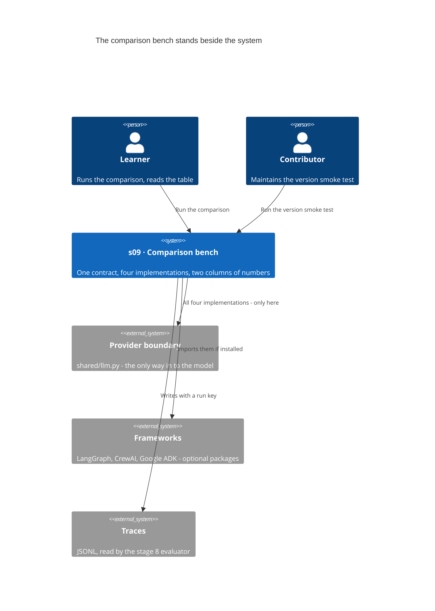
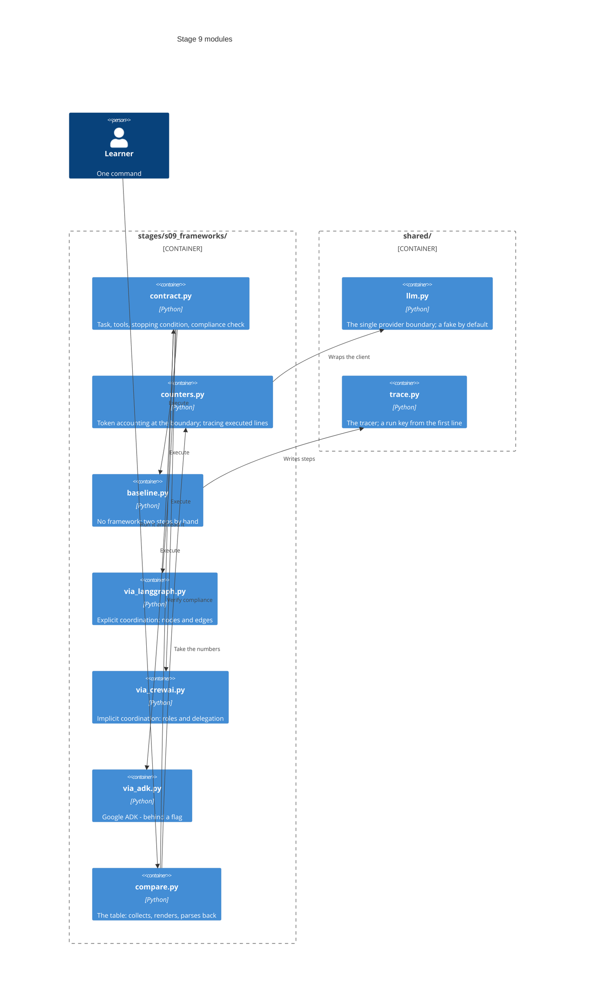
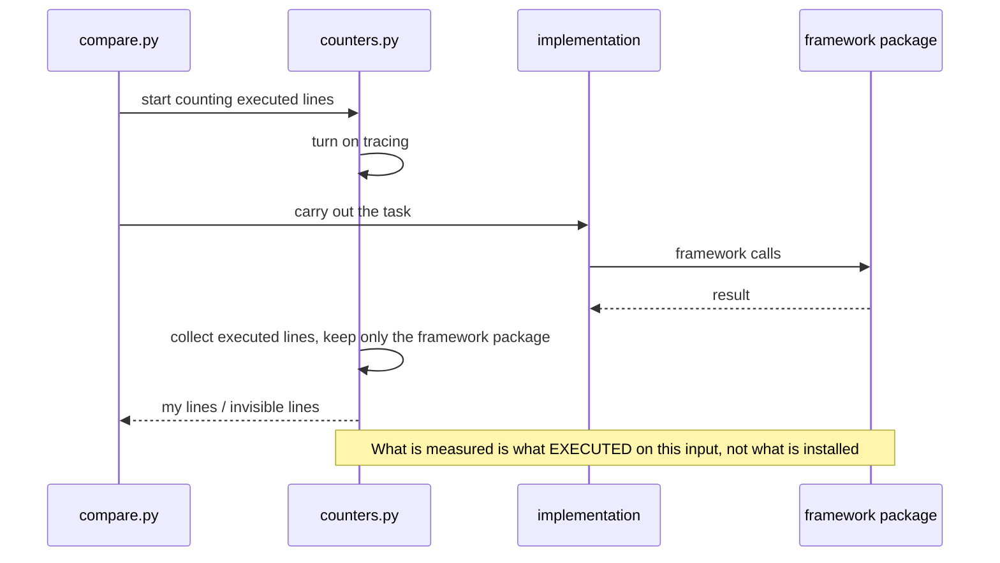
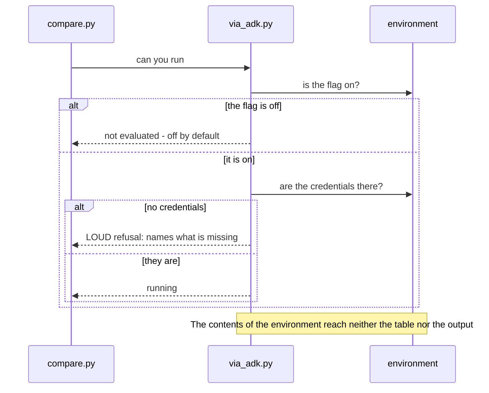

# SAD — s09-frameworks

## 1. Introduction and goals

Stage 9 builds a **measuring bench**, not another agent implementation. One task is carried out
four ways, and what gets measured is not the quality of the answer but the **price of the
scaffolding**.

> **A framework is scaffolding, not architecture.** Chosen before the shape of the building is
> known, it becomes the shape.

The second thesis is operational, and it is the one that turns into the columns of the table:

> **Explicit coordination costs lines. Implicit coordination costs understanding.**

Three goals, each of them checked:

1. One command produces **a comparison table with numbers of its own** — and the numbers are
   computed, not typed in.
2. Every implementation carries out **literally the same task**, and that is proved by executing
   a shared contract rather than by reading the code.
3. The table has a row with **no framework at all** — otherwise it answers the wrong question.

**Stakeholders:** Learner (runs it, reads the table, does the exercises), Operator (cares about
tokens above the request), Contributor (the stage's author, maintains the version smoke test).

## 2. Constraints

| # | Constraint | Where from |
|---|---|---|
| C-1 | The whole stage runs offline and with no API key | course rule, NFR-5 |
| C-2 | Stages 1–8 **do not change** for the sake of the comparison | spec §3 |
| C-3 | No implementation creates a provider client of its own | spec §6.1, AC-11 |
| C-4 | `if profile == ...` lives only in the `shared/` factories | CONVENTIONS.md |
| C-5 | Every implementation module is ≤ 110 executable lines | NFR-1 |
| C-6 | Framework packages are **optional**; their absence gives "not evaluated" | spec §6.1, NFR-5 |
| C-7 | Google credentials are not a requirement of the stage; ADK sits behind a flag | spec §8, assumption 3 |
| C-8 | Implementations are **minimal**: no retries, no cache, no circuit breakers | spec §3 |
| C-9 | Framework versions are pinned by an **upper** bound | NFR-8 |
| C-10 | Traces are written through `shared/trace.py` — and with a run key from the first line | spec §5, AC-12 |

## 3. Context and scope

The bench stands **beside** the system: it serves nothing, deploys nothing and depends on
nothing but the shared provider boundary.



**Inside the scope:** the task contract, four implementations, token accounting at the provider
boundary, counting my lines and invisible lines, the comparison table, the version smoke test.

**Outside it:** framework performance, ecosystem comparison, teaching the frameworks,
production trimmings, any change to stages 1–8.

**Brownfield.** The repository is mature: `shared/llm.py` is already the single provider boundary
(repository ADR-0003), `shared/trace.py` the single tracer, `shared/check_runner.py` the check
runner with a third state. Stage 3 already contains both a mini-graph of its own and a LangGraph
implementation — it is the source of the **pattern**, but not of the code (spec §3).

## 4. Solution strategy

| Question | Decision | Why this way |
|---|---|---|
| Target surface | **`cli`** — a command and a file a human reads | The stage serves nothing; a service would add a surface the comparison does not need |
| What "the same task" means | An **executable contract**, shared by every implementation | A described contract catches no deviation; an executable one does, and that is what makes the numbers comparable. ADR-0001 |
| Where tokens are counted | At the **provider boundary**, by a wrapper around the client | A counter inside an implementation's code cannot see what the framework added of its own — which is precisely what is being measured. ADR-0002 |
| What "less code" means | **Two** numbers: my lines and invisible lines | One number turns "less code" into an argument missing its other half. ADR-0003 |
| How to measure the invisible | Tracing the **executed** lines of the framework package | Installed code is not executed code; what has to be measured is what actually ran on this input. ADR-0003 |
| The baseline | Written **here**, minimally, not carried over from stage 3 | There it is a supervisor router, here two sequential steps; fitting one to the other would make the tasks different. ADR-0004 |
| The shape of the conclusion | **"Constraint → tool"**, no aggregate score | Weights on constraints are an opinion, not a measurement. The same ban as at stage 8. ADR-0005 |
| A missing framework | The **"not evaluated"** state, its own row in the table | Going red over a missing optional package would demand installing everything. ADR-0006 |
| ADK | Behind a flag; **turned on without credentials — loudly** | A flag somebody was asked to turn on, which then silently did nothing, is worse than no flag at all. ADR-0006 |
| The provider client | Only through `shared.llm`, and that is proved by **execution** | A framework with a client of its own breaks both the offline run and the token accounting — silently. ADR-0007 |
| The run key in the trace | **Present from the first line** | Stage 8 measured that four stages lack it. The first stage after the measurement either uses it, or the measurement was not needed. ADR-0008 |

## 5. Building block view



**Why `contract.py` is separate from the implementations.** The contract has to be **one** thing
that all four carry out and none of them defines. Spread across the implementations, it stops
being shared exactly when one of them reads it conveniently.

**Why `counters.py` is not inside the implementations.** A counter an implementation holds inside
itself sees only what that implementation asked for. The framework's markup is the difference
between what was asked for and what went out, and it can only be seen from outside.

**Why one module per framework.** A missing package must give "not evaluated" for **its own**
implementation rather than break the import of the whole stage. One file, one optional
dependency.

**Why `compare.py` both renders and parses.** The table is checked by parsing the **written
file** — two independent sources, like the stage 8 report. An equality computed from a single
source is an identity.

## 6. Runtime view

**Flow 1 — one measurement: contract, counters, compliance (AC-01, AC-02, AC-04).**

```mermaid
sequenceDiagram
    actor L as Learner
    participant CMP as compare.py
    participant CTR as counters.py
    participant IMP as implementation
    participant LLM as shared/llm.py
    participant CON as contract.py

    L->>CMP: run the comparison
    CMP->>CTR: wrap the client in a counter
    CTR->>LLM: get_client(...)
    LLM-->>CTR: client
    CMP->>IMP: carry out the task with this client
    IMP->>CTR: request to the model
    CTR->>CTR: count: what the author asked for / what actually went out
    CTR-->>IMP: response
    IMP-->>CMP: result and trace
    CMP->>CON: was the contract kept
    alt contract kept
        CON-->>CMP: a row with numbers
    else violated
        CON-->>CMP: the name of the violated element, no numbers
    end
    CMP-->>L: the table; the offending row is named, not counted
```

**Flow 2 — invisible lines: what is measured is executed, not installed (AC-03).**



**Flow 3 — ADK: the flag, the credentials, the third state (AC-07, AC-07b).**



## 7. Deployment view

The bench is **not deployed**. It is a command that reads code and writes a file.

**Optional dependencies.** `pip install -e ".[s09]"` brings in LangGraph and CrewAI; ADK is a
separate extra, `[adk]`, because it needs somebody else's credentials. A base install brings none
of this, and the stage stays passable under it: three rows of the table become "not evaluated",
the fourth — the baseline — is computed always.

<!-- N/A: there is no separate environment; the stage serves nothing -->

## 8. Crosscutting concepts

- **The third state** — the same one as at stage 8: "not evaluated" ≠ "passed" ≠ "failed".
  Here it means "the package is missing" or "the credentials are missing", and it has a row of
  its own in the table.
- **Two independent sources.** The table is checked by parsing the written file, not by counting
  again with the same code.
- **There is one provider boundary.** Everything that goes to the model passes through
  `shared/llm.py`; that is at once the condition for offline, for token accounting and for
  reproducibility.
- **Minimality as a requirement, not as laziness.** Every line added in one implementation makes
  the "my lines" column incommensurable with the others.
- **The run key** — the `case` field in every trace step: stage 8 measured that four stages lack
  it, and this stage is written with it from the start.

## 9. Architecture decisions

| # | Decision | Status | Where it echoes |
|---|---|---|---|
| 0001 | The task contract is executable, not described | Accepted | §4, §6 flow 1 |
| 0002 | Tokens are counted at the provider boundary | Accepted | §4, §5, §6 flow 1 |
| 0003 | My lines and invisible lines are two numbers; the invisible is measured by execution | Accepted | §4, §6 flow 2 |
| 0004 | The baseline is written here rather than carried over from stage 3 | Accepted | §4, §5 |
| 0005 | No aggregate score; the conclusion takes the form "constraint → tool" | Accepted | §4, §10 |
| 0006 | A missing package and missing credentials are a third state, but a flag must not stay silent | Accepted | §4, §6 flow 3, §7 |
| 0007 | The provider client only through `shared.llm`, and that is proved by execution | Accepted | §4, §8 |
| 0008 | The stage writes a run key from its first line | Accepted | §4, §8 |

## 10. Quality requirements

| Attribute | Scenario (When) | Expectation (Then) | How it is checked |
|---|---|---|---|
| Comparability | An implementation deviated from the contract | Its row carries no numbers; the violated element is named | the contract check, AC-02b |
| Honesty of the number | The reader looks at "less code" | The invisible-lines number stands next to it | AC-03 |
| Observability | The framework added text of its own to the request | The markup is strictly positive; for the baseline it is zero | AC-04b |
| Determinism | Twenty offline runs | Every number in the table is the same | NFR-6, the flakiness check |
| Completeness | The reader counts the table's rows | ≥ 4 implementations, exactly one with no framework | NFR-7 |
| Version resilience | A framework's major version changed | The smoke test of **that** implementation goes red, naming the call | AC-08, NFR-8 |
| Offline | A machine with no key and no network | The run is green; missing packages are "not evaluated" | NFR-5, `clean_install.py` |
| Length | The reader opens the lesson | ≤ 2500 words | NFR-3 |

## 11. Risks and technical debt

| Risk | Severity | Mitigation | Owner, deadline |
|---|---|---|---|
| The implementations are written unevenly, and the table measures the author | High | An executable contract (ADR-0001) plus minimality as a requirement (C-8); mutations break the contract and redden exactly its check | Contributor, before the tag |
| "Invisible lines" is read as package size | Medium | What is measured is what **executed** on this input; the limit is named outright in the lesson and in ADR-0003 | Contributor, before the tag |
| A framework goes to the network with a client of its own | Medium | A check **by execution** with no key (ADR-0007): a network call fails loudly rather than silently working | Contributor, before the tag |
| CrewAI / LangGraph break their API between minor versions | Medium | Pinned by a minor bound (C-9); a smoke test of every implementation in the suite (AC-08) | Contributor, continuously |
| ADK is unavailable to the author — the implementation is written but never run | Medium | The "not evaluated" state with a named cause; this is the stage's weakest point, and it is named rather than hidden | Contributor, stage 10 |
| The token count of a fake model does not carry over to a real one | Low | The lesson says so in its first line: the conclusions are about **ratios**, not about absolute values | Contributor, before the tag |
| Whether to add a fifth implementation | Open question | Default now: no — four are enough for both ends of the scale | Contributor, before the `stage-09` tag |
| Whether to move the counter into `shared/` | Open question | Default now: it stays in stage 9 | Contributor, stage 10 |
| Whether to measure time alongside tokens | Open question | Default now: no — on a fake, time measures the fake | Contributor, stage 10 |
| Invisible lines: a number or an order of magnitude | Open question | Default now: a number, with the counting method and its limit named outright | Contributor, before the `stage-09` tag |

## 12. Glossary

| Term | What it means in this stage |
|---|---|
| **Implementation** | One way of carrying out the task contract. There are four |
| **Task contract** | Input, tools, model, stopping condition, result shape — shared by all and **executable** |
| **My line** | An executable line the implementation's author wrote and maintains |
| **Invisible line** | An executable line of the framework package that **executed** during the run |
| **Request tokens** | What the author asked for |
| **Tokens above the request** | The difference between what went out and what the author asked for — the price of the scaffolding |
| **Explicit coordination** | The next step is visible in my code |
| **Implicit coordination** | The framework decides the next step from role descriptions |
| **Baseline** | An implementation with no framework at all |
