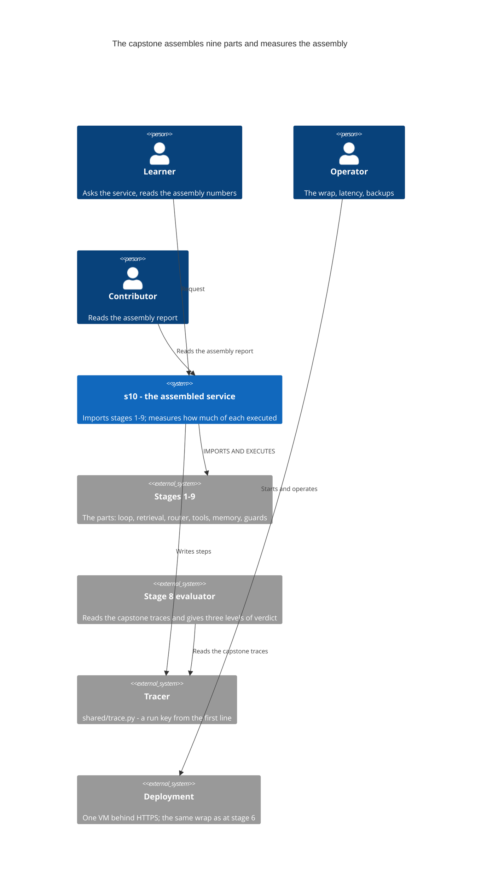
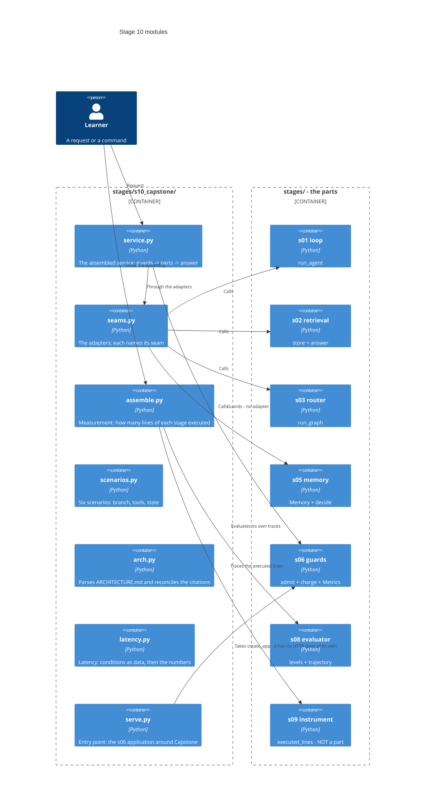
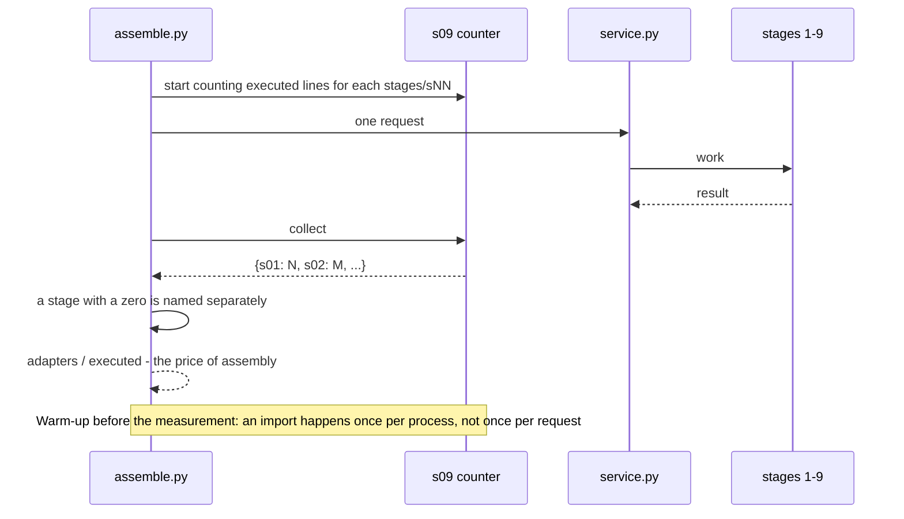
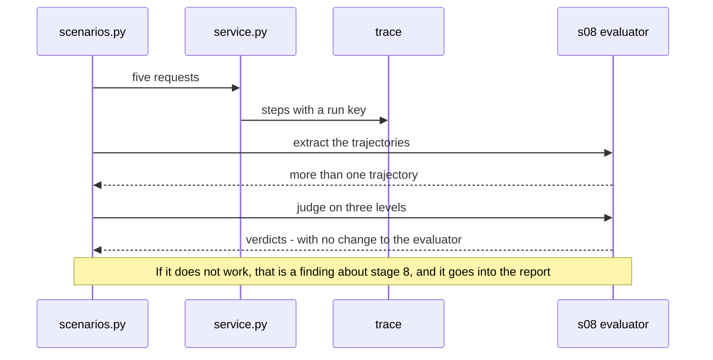

# SAD — s10-capstone

## 1. Introduction and goals

Stage 10 assembles one service out of nine parts — and **measures the assembly itself**.

> **The course taught not ten topics but the habit of making the same trade-offs in a system
> nobody has written a tutorial about yet.**

The claim is proven by a number, not by a list of imports. Measured before the first line of code:
stage 6 imports stage 2 and executes **zero** of its lines — what gets imported there is an
access-level constant, not retrieval.

> **"Imports" is not the same as "uses".**

Four goals, each of them checked:

1. The service starts with one command and shows **which parts took part** in the answer.
2. For every stage 1–9 it names **how many of its lines executed** on one request.
3. The price of assembly is stated as a number: adapter lines against the lines that executed.
4. Every decision in `ARCHITECTURE.md` has a source stage, and the citation is **reconciled with
   the repository**.

**Stakeholders:** Learner (starts it, asks questions, reads the numbers), Operator (the wrap,
latency, backups), Contributor (author of the capstone and of the assembly report), Tech Lead
(checks the justifications).

## 2. Constraints

| # | Constraint | Where from |
|---|---|---|
| C-1 | The whole stage is passable offline and with no API key | course rule, NFR-5, AC-11 |
| C-2 | Stages 1–9 **do not change** for the sake of assembly | spec §3 |
| C-3 | Every capstone module is ≤ 110 executable lines | NFR-1 |
| C-4 | `if profile == ...` lives only in the `shared/` factories | CONVENTIONS.md |
| C-5 | Adapters ≤ 1/5 of what executed | NFR-7, AC-03b |
| C-6 | Assembly goes **top down**: the service calls the parts, the parts know nothing of the service | spec §8, assumption 4 |
| C-7 | One VM, self-hosted, no managed services | stage 6 decision, not revisited |
| C-8 | The guards are imported from stage 6, not written again | AC-07 |
| C-9 | Voice, stage 7, is an adapter deliberately not wired in | spec §8 |
| C-10 | Traces are written through `shared/trace.py` with a run key, as at stage 9 | AC-09 |

## 3. Context and scope

The capstone stands **where stage 6 stands** as a service, but its input is not only the user
request: it also measures itself.



**What is inside the scope:** assembling nine parts, measuring what executed per stage, adapters
with named seams, five end-to-end scenarios, `ARCHITECTURE.md` with reconciled citations, the wrap
with a named origin, latency numbers with their conditions.

**What is outside:** any change to stages 1–9, a new agent technique, Kubernetes, measuring answer
quality — that is stage 8, which the capstone **uses** — and real third-party APIs.

**Brownfield.** The repository is mature and complete: nine stages, `shared/` with six adapters,
`deploy/` with the first deployment, `scripts/` with six validators. The most important fact for
this stage: **the measuring instrument already exists** —
`stages.s09_frameworks.counters.executed_lines` counts the executed lines of a named package, and
it is exactly that instrument which gets pointed at the stages themselves.

## 4. Solution strategy

| Question | Decision | Why this way |
|---|---|---|
| Target surface | **`backend-service` + `cli`** | The service answers requests; the command shows the assembly and the numbers. The second surface adds no code — it is the same object through two entrances |
| What proves the assembly | **Executed lines per stage**, not a list of imports | Stage 6 imports stage 2 and executes zero of its lines; a list of imports hides that. ADR-0001 |
| What to measure with | **`executed_lines` from stage 9**, pointed at `stages/sNN_*` | The instrument already exists, is checked, and has its limits named. Writing a second one would mean having two definitions of the word "executed". ADR-0002 |
| What an adapter is | Code that exists **only** for a seam; it does not decide | An adapter that decides is a part — and a part belongs in a stage, with a lesson and checks. ADR-0003 |
| Where a mismatch goes | Into the **adapter**, never into the part | A changed part makes the claim "the parts were mature" unprovable. ADR-0004 |
| Justification | A row with a **source stage**, reconciled with the repository | A bibliography nobody reconciles ages silently — twice during this course. ADR-0005 |
| Own decisions | A separate section, each with a reason for why there is no stage | Otherwise "there is no source" and "there is a source" would merge into one. ADR-0005 |
| Scenarios | Five, and each checks the **branch AND the final state** | Checking the answer alone misses the case "the text is right, the state is not". ADR-0006 |
| A part failing | The service stays alive, the answer names what exactly failed | A part failing is not the system falling over — the lesson of stage 4. ADR-0006 |
| Load | Locally, on the fake, with the **conditions next to the number** | A number without its conditions is not a measurement — the lesson of stage 7. ADR-0007 |
| Voice | Deliberately **not** wired in, and that is stated | It adds no conclusion and adds gigabytes. Unstated, it would look forgotten. ADR-0008 |

## 5. Building block view



**Why `seams.py` is separate from `service.py`.** The adapters have to be **enumerable**: a check
counts them, and each names its seam. Dissolved into the service, they stop being visible as a
price — and the price is the stage's number.

**Why `assemble.py` is not inside the service.** Measuring the assembly is separate work, and it is
expensive: tracing is switched on around a single request, not for the whole lifetime of the
service.

**Why `arch.py` exists.** A citation of a source stage is checked by code. A document whose
citations nobody reconciles ages silently — during this course that happened twice, and both times
it was review that found it, not the author.

**What is absent here.** An agent loop of its own, retrieval of its own, memory of its own, guards
of its own. Every such module would mean the corresponding part could not be assembled — and that
belongs in the report, not in the code.

## 6. Runtime view

**Flow 1 — one request through the assembled service (AC-01, AC-05, AC-07).**

```mermaid
sequenceDiagram
    actor L as Learner
    participant SV as service.py
    participant G as s06 guards
    participant SE as seams.py
    participant P as parts s01-s05
    participant T as shared/trace.py

    L->>SV: request
    SV->>T: received
    SV->>G: admit(key)
    G-->>SV: verdict
    alt refused
        SV->>T: guard - refusal
        SV-->>L: refusal; not a single model call
    else admitted
        SV->>SE: run the branch
        SE->>P: call the part through an adapter
        P-->>SE: result in the shape of the part
        SE-->>SV: result in the shape of the service
        SV->>T: done - branch, parts, state
        SV-->>L: answer + which parts took part
    end
```

**Flow 2 — measuring the assembly: how much of each stage executed (AC-02, AC-03).**



**Flow 3 — the capstone evaluates itself with the stage 8 instrument (AC-09).**



## 7. Deployment view

The same wrap as at stage 6, and **the same code**: the capstone does not deploy itself any
differently.

```
HTTPS → Caddy → uvicorn (N workers) → s06 guards → s10 service → parts s01-s05
                                          │                            │
                                        Redis                      Postgres (volume)
```

**What the capstone adds:** nothing in the infrastructure. `ARCHITECTURE.md` names where every item
of the wrap came from, and the stage 6 `RUNBOOK` stays in force.

**The load run** goes against a **locally** started service on a fake model. The p50/p95 numbers are
printed together with their conditions; a real deployment stays `NOT EVALUATED` — exactly as trust
in a certificate did at stage 6.

## 8. Crosscutting concepts

- **Measure, do not assert.** The cross-cutting rule of the course; here it is pointed at the
  course itself.
- **The third state.** "Not evaluated" ≠ "passed" ≠ "failed" — and a load run with no instrument
  gives exactly that.
- **The price is named next to the gain.** The adapters are the price of assembly, and they are in
  the same table.
- **The limits of the measurement are named.** Executed lines describe **this request** and **this
  thread**; both limits are inherited from stage 9 along with the instrument.
- **A run key from the first line** — the stage 9 rule; the capstone does not revisit it.

## 9. Architecture decisions

| # | Decision | Status | Where it echoes |
|---|---|---|---|
| 0001 | Assembly is proven by executed lines, not by a list of imports | Accepted | §4, §6 flow 2 |
| 0002 | The measuring instrument is taken from stage 9, not written again | Accepted | §4, §5 |
| 0003 | An adapter does not decide; whatever decides is a part | Accepted | §4, §5 |
| 0004 | A mismatch goes into the adapter, never into the part | Accepted | §4, §8 |
| 0005 | Every justification has a source stage, and code verifies it | Accepted | §4, §5 |
| 0006 | A scenario checks the branch **AND** the final state | Accepted | §4, §6 flow 1 |
| 0007 | Latency numbers are printed together with their conditions | Accepted | §4, §7 |
| 0008 | Voice is deliberately not wired in, and that is stated | Accepted | §4 |

## 10. Quality requirements

| Attribute | Scenario — When | Expectation — Then | How it is checked |
|---|---|---|---|
| Assembly | A stage is named a part | Its executed lines are above zero, otherwise red with the name | AC-02b |
| Completeness | The reader counts the stages at work | ≥ 6 of nine give a non-zero number | NFR-9 |
| Price | The reader looks at the adapters | Their sum is ≤ 1/5 of what executed | NFR-7, AC-03b |
| Truthfulness | A justification cites a stage | The stage exists; a dangling citation reddens | AC-06b |
| End-to-end | Five scenarios | The branch **and** the final state are right | AC-05 |
| Survivability | A part fails | The service stays alive, the failure is named | AC-05b |
| Offline | A machine with no key and no network | All five scenarios pass | AC-11, NFR-5 |
| Determinism | Twenty offline runs | The same branches and the same final states | NFR-6 |
| Length | The reader opens the lesson | ≤ 2500 words | NFR-3 |

## 11. Risks and technical debt

| Risk | Severity | Mitigation | Owner, due |
|---|---|---|---|
| The capstone quietly rewrites a part to make it fit | High | C-2 plus a check: a changed part breaks its own suite, and `check_all` shows that at once | Contributor, before the tag |
| An adapter grows into a layer with behaviour | High | ADR-0003 plus NFR-7: the sum of the adapters is ≤ 1/5 of what executed; above that it is red | Contributor, before the tag |
| A stage is in the list and absent from the work | Medium | That is the stage's main measurement, AC-02b, not a risk to be hidden | Contributor, before the tag |
| The numbers from the fake get carried over to production | Medium | The conditions are printed next to the number, ADR-0007; a real deployment stays `NOT EVALUATED` | Contributor, before the tag |
| The stage 8 evaluator cannot handle a capstone trace | Medium | That is a finding about stage 8, and it goes into §10 of `ARCHITECTURE.md`, not into a silent fix of stage 8 | Contributor, a stage beyond the course |
| `sys.settrace` tracing does not see other threads | Low | The limit is inherited from stage 9 along with the instrument and named in the lesson | Contributor, before the tag |
| Whether to wire voice in | Open question | Default now: no — it adds no conclusion and adds gigabytes | Contributor, before the `stage-10` tag |
| Whether to run the load test in CI | Open question | Default now: no — it needs a running service and yields a machine-dependent number | Contributor, before the `stage-10` tag |
| Whether to move the adapters into `shared/` | Open question | Default now: no — an adapter exists for a particular seam | Contributor, after the course |
| Whether to pin p50/p95 in the prose | Open question | Default now: yes, together with the conditions and a "local fake" marker | Contributor, before the `stage-10` tag |

## 12. Glossary

| Term | What it means in this stage |
|---|---|
| **Part** | A module of stages 1–9 that the capstone imports **and executes** |
| **Seam** | A place where two parts do not meet without an adapter |
| **Adapter** | Capstone code that exists only for a seam; it does not decide |
| **Executed stage lines** | How many lines of `stages/sNN_*` fired on one request |
| **Price of assembly** | Adapter lines against the lines that executed |
| **Justification** | A decision plus a source stage, reconciled with the repository |
| **Own decision** | A capstone decision with no source stage; it stands separately, with a reason |
| **Assembly report** | The section "what assembly revealed" — the list of what joined badly |
