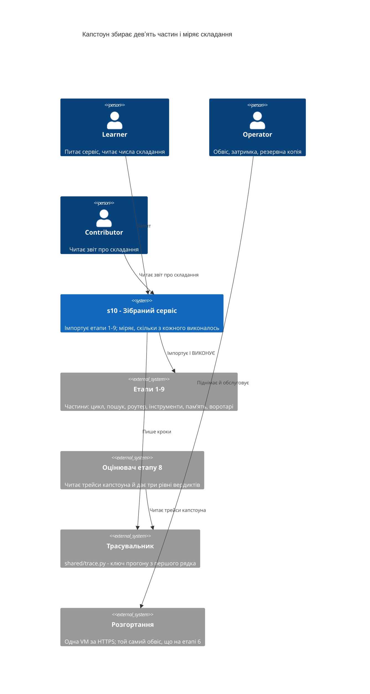
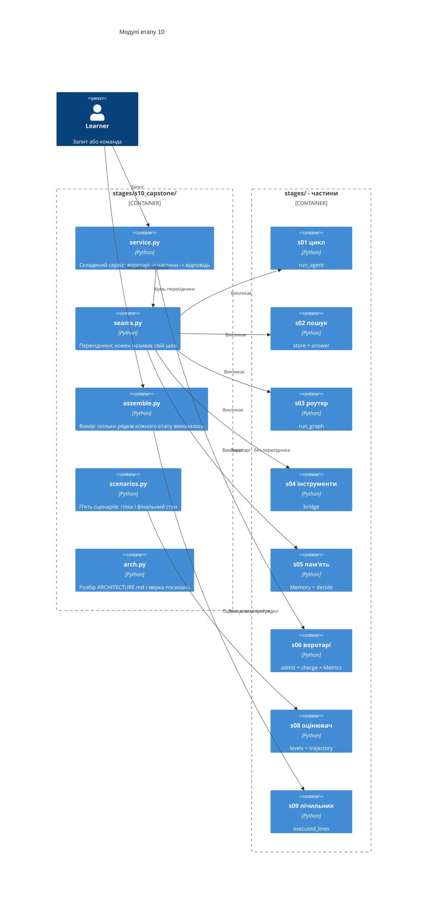
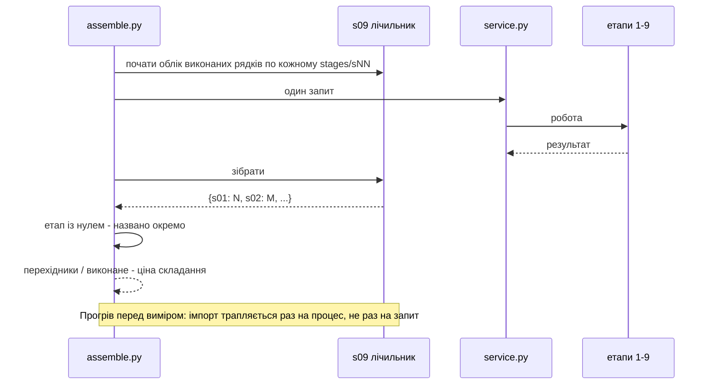
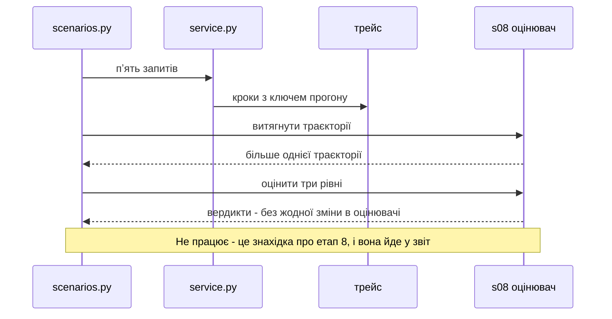

# SAD — s10-capstone

## 1. Introduction and goals

Етап 10 збирає з дев'яти частин один сервіс — і **міряє саме складання**.

> **Курс учив не десяти темам, а вмінню робити ті самі компроміси в системі, про яку
> туторіалу ще ніхто не написав.**

Твердження доводиться числом, а не переліком імпортів. Заміряно до першого рядка коду:
етап 6 імпортує етап 2 і виконує з нього **нуль** рядків — там імпортується константа рівня
доступу, а не пошук.

> **«Імпортує» — не те саме, що «використовує».**

Чотири цілі, кожна перевіряється:

1. Сервіс піднімається однією командою й показує, **які частини брали участь** у відповіді.
2. Для кожного етапу 1–9 названо, **скільки його рядків виконалось** на один запит.
3. Ціна складання названа числом: рядки перехідників проти рядків, що виконались.
4. Кожне рішення в `ARCHITECTURE.md` має етап-джерело, і посилання **звіряється з репозиторієм**.

**Стейкхолдери:** Learner (піднімає, ставить питання, читає числа), Operator (обвіс, затримка,
резервна копія), Contributor (автор капстоуна й звіту про складання), Tech Lead (перевіряє
обґрунтування).

## 2. Constraints

| # | Обмеження | Звідки |
|---|---|---|
| C-1 | Увесь етап проходиться офлайн і без API-ключа | правило курсу, NFR-5, AC-11 |
| C-2 | Етапи 1–9 **не змінюються** заради складання | spec §3 |
| C-3 | Кожен модуль капстоуна ≤ 110 виконуваних рядків | NFR-1 |
| C-4 | `if profile == ...` живе лише у фабриках `shared/` | CONVENTIONS.md |
| C-5 | Перехідники ≤ 1/5 від виконаного | NFR-7, AC-03b |
| C-6 | Складання йде **згори вниз**: сервіс кличе частини, частини про сервіс не знають | spec §8, припущення 4 |
| C-7 | Одна VM, self-hosted, без керованих сервісів | рішення етапу 6, не переглядається |
| C-8 | Воротарі імпортуються з етапу 6, а не пишуться заново | AC-07 |
| C-9 | Голос (етап 7) — свідомо не ввімкнений адаптер | spec §8 |
| C-10 | Трейси пишуться крізь `shared/trace.py` із ключем прогону, як на етапі 9 | AC-09 |

## 3. Context and scope

Капстоун стоїть **на місці етапу 6** як сервіс, але його вхід — не лише запит користувача:
він ще й міряє сам себе.



**Що всередині обсягу:** складання дев'яти частин, вимір виконаного на етап, перехідники з
названими швами, п'ять наскрізних сценаріїв, `ARCHITECTURE.md` зі звіреними посиланнями,
обвіс із названим походженням, числа затримки з умовами.

**Що зовні:** будь-яка зміна етапів 1–9, нова техніка агента, Kubernetes, вимір якості
відповідей (це етап 8, який капстоун **використовує**), реальні сторонні API.

**Brownfield.** Репозиторій зрілий і повний: дев'ять етапів, `shared/` із шістьма адаптерами,
`deploy/` з першим розгортанням, `scripts/` із шістьма валідаторами. Найважливіше для цього
етапу: **інструмент виміру вже є** — `stages.s09_frameworks.counters.executed_lines` рахує
виконані рядки названого пакета, і саме він наводиться на самі етапи.

## 4. Solution strategy

| Питання | Рішення | Чому саме так |
|---|---|---|
| Цільова поверхня | **`backend-service` + `cli`** | Сервіс відповідає на запити; команда показує складання й числа. Друга поверхня не додає коду — це той самий об'єкт двома входами |
| Що доводить складання | **Виконані рядки на етап**, а не перелік імпортів | Етап 6 імпортує етап 2 і виконує нуль його рядків; перелік імпортів це ховає. ADR-0001 |
| Чим міряти | **`executed_lines` етапу 9**, наведений на `stages/sNN_*` | Інструмент уже є, перевірений і має названі межі. Написати другий означало б мати два визначення слова «виконано». ADR-0002 |
| Що таке перехідник | Код **тільки** заради шва; він не вирішує | Перехідник, що вирішує, є частиною — і їй місце в етапі, з уроком і перевірками. ADR-0003 |
| Куди йде невідповідність | У **перехідник**, ніколи в частину | Змінена частина робить тезу «частини були зрілі» недоказовою. ADR-0004 |
| Обґрунтування | Рядок із **етапом-джерелом**, звірений із репозиторієм | Бібліографія, якої ніхто не звіряв, старіє мовчки — двічі за цей курс. ADR-0005 |
| Власні рішення | Окремий розділ, кожне з причиною, чому етапу немає | Інакше «немає джерела» й «джерело є» злилися б в одне. ADR-0005 |
| Сценарії | П'ять, і кожен звіряє **гілку І фінальний стан** | Перевірка самої відповіді пропускає випадок «текст правильний, стан ні». ADR-0006 |
| Відмова частини | Сервіс живий, у відповіді названо, що саме відмовило | Відмова частини не є падінням системи — урок етапу 4. ADR-0006 |
| Навантаження | Локально, на підробці, з **умовами поруч із числом** | Число без умов не є виміром — урок етапу 7. ADR-0007 |
| Голос | Свідомо **не** ввімкнений, і це назване | Він не додає висновку, а додає гігабайти. Не названий — виглядав би забутим. ADR-0008 |

## 5. Building block view



**Чому `seams.py` окремо від `service.py`.** Перехідники мусять бути **перелічуваними**: їх
рахує перевірка, і кожен називає свій шов. Розчинені в сервісі, вони перестають бути видимими
як ціна — а ціна і є числом етапу.

**Чому `assemble.py` не всередині сервісу.** Вимір складання — окрема робота, і вона дорога:
трасування вмикається навколо одного запиту, а не на весь час життя сервісу.

**Чому `arch.py` існує.** Посилання на етап-джерело перевіряється кодом. Документ, чиї
посилання ніхто не звіряє, старіє мовчки — за цей курс так сталося двічі, і обидва рази це
знайшло рев'ю, а не автор.

**Чого тут немає.** Власного циклу агента, власного пошуку, власної пам'яті, власних воротарів.
Кожен такий модуль означав би, що відповідну частину не вдалося зібрати, — і це мало б стояти
у звіті, а не в коді.

## 6. Runtime view

**Потік 1 — один запит крізь складений сервіс (AC-01, AC-05, AC-07).**

```mermaid
sequenceDiagram
    actor L as Learner
    participant SV as service.py
    participant G as s06 воротарі
    participant SE as seams.py
    participant P as частини s01-s05
    participant T as shared/trace.py

    L->>SV: запит
    SV->>T: received
    SV->>G: admit(ключ)
    G-->>SV: вердикт
    alt відмовлено
        SV->>T: guard - відмова
        SV-->>L: відмова; жодного виклику моделі
    else дозволено
        SV->>SE: виконати гілку
        SE->>P: виклик частини крізь перехідник
        P-->>SE: результат у формі частини
        SE-->>SV: результат у формі сервісу
        SV->>T: done - гілка, частини, стан
        SV-->>L: відповідь + які частини брали участь
    end
```

**Потік 2 — вимір складання: скільки кожного етапу виконалось (AC-02, AC-03).**



**Потік 3 — капстоун оцінює себе інструментом етапу 8 (AC-09).**



## 7. Deployment view

Той самий обвіс, що на етапі 6, і **той самий код**: капстоун не розгортає себе інакше.

```
HTTPS → Caddy → uvicorn (N воркерів) → s06 воротарі → s10 сервіс → частини s01-s05
                                          │                            │
                                        Redis                      Postgres (том)
```

**Що додається капстоуном:** нічого в інфраструктурі. `ARCHITECTURE.md` називає, звідки
прийшов кожен пункт обвісу, а `RUNBOOK` етапу 6 лишається чинним.

**Навантажувальний прогін** іде проти **локально** піднятого сервісу на підробленій моделі.
Числа p50/p95 друкуються разом з умовами; справжнє розгортання лишається `НЕ ПЕРЕВІРЕНО` — так
само, як довіра до сертифіката на етапі 6.

## 8. Crosscutting concepts

- **Вимірювати, а не стверджувати.** Наскрізне правило курсу; тут воно наведене на сам курс.
- **Третій стан.** «Не перевірено» ≠ «пройдено» ≠ «провалено» — і навантажувальний прогін без
  інструмента дає саме його.
- **Ціна названа поруч із виграшем.** Перехідники — ціна складання, і вони в тій самій таблиці.
- **Межі виміру названі.** Виконані рядки описують **цей запит** і **цей потік**; обидві межі
  успадковані з етапу 9 разом з інструментом.
- **Ключ прогону з першого рядка** — правило етапу 9; капстоун його не переглядає.

## 9. Architecture decisions

| # | Рішення | Статус | Де відгукується |
|---|---|---|---|
| 0001 | Складання доводиться виконаними рядками, а не переліком імпортів | Accepted | §4, §6 потік 2 |
| 0002 | Інструмент виміру береться з етапу 9, а не пишеться заново | Accepted | §4, §5 |
| 0003 | Перехідник не вирішує; той, що вирішує, є частиною | Accepted | §4, §5 |
| 0004 | Невідповідність іде в перехідник, ніколи в частину | Accepted | §4, §8 |
| 0005 | Кожне обґрунтування має етап-джерело, і воно звіряється кодом | Accepted | §4, §5 |
| 0006 | Сценарій звіряє гілку **І** фінальний стан | Accepted | §4, §6 потік 1 |
| 0007 | Числа затримки друкуються разом з умовами | Accepted | §4, §7 |
| 0008 | Голос свідомо не ввімкнений, і це назване | Accepted | §4 |

## 10. Quality requirements

| Атрибут | Сценарій (When) | Очікування (Then) | Як перевіряється |
|---|---|---|---|
| Складання | Етап названо частиною | Його виконані рядки > 0, інакше червоне з назвою | AC-02b |
| Повнота | Читач рахує етапи в роботі | ≥ 6 із девʼяти дають ненульове число | NFR-9 |
| Ціна | Читач дивиться на перехідники | Їхня сума ≤ 1/5 виконаного | NFR-7, AC-03b |
| Правдивість | Обґрунтування посилається на етап | Етап існує; биле посилання червонить | AC-06b |
| Наскрізність | Пʼять сценаріїв | Гілка **і** фінальний стан правильні | AC-05 |
| Живучість | Частина відмовляє | Сервіс живий, відмову названо | AC-05b |
| Офлайн | Машина без ключа й без мережі | Усі пʼять сценаріїв проходять | AC-11, NFR-5 |
| Детермінізм | Двадцять прогонів офлайн | Ті самі гілки й ті самі фінальні стани | NFR-6 |
| Обсяг | Читач відкриває урок | ≤ 2500 слів | NFR-3 |

## 11. Risks and technical debt

| Ризик | Серйозність | Пом'якшення | Власник, термін |
|---|---|---|---|
| Капстоун тихо перепише частину, щоб вона встала | High | C-2 + перевірка: змінена частина ламає її власний набір, і `check_all` це показує одразу | Contributor, перед тегом |
| Перехідник розростеться в шар із поведінкою | High | ADR-0003 + NFR-7: сума перехідників ≤ 1/5 виконаного; понад — червоне | Contributor, перед тегом |
| Етап у переліку є, у роботі немає | Medium | Це і є головний вимір етапу (AC-02b), а не ризик, який ховають | Contributor, перед тегом |
| Числа підробки перенесуть на продакшн | Medium | Умови друкуються поруч із числом (ADR-0007); справжнє розгортання — `НЕ ПЕРЕВІРЕНО` | Contributor, перед тегом |
| Оцінювач етапу 8 не впорається з трейсом капстоуна | Medium | Це знахідка про етап 8, і вона йде у звіт §10 `ARCHITECTURE.md`, а не в мовчазне виправлення етапу 8 | Contributor, етап поза курсом |
| Трасування `sys.settrace` не бачить інших потоків | Low | Межа успадкована з етапу 9 разом з інструментом і названа в уроці | Contributor, перед тегом |
| Чи вмикати голос | Open question | Default now: ні — не додає висновку, додає гігабайти | Contributor, перед тегом `stage-10` |
| Чи проганяти навантаження в CI | Open question | Default now: ні — потребує піднятого сервісу, дає число, залежне від машини | Contributor, перед тегом `stage-10` |
| Чи виносити перехідники у `shared/` | Open question | Default now: ні — перехідник існує заради конкретного шва | Contributor, після курсу |
| Чи фіксувати p50/p95 у прозі | Open question | Default now: так, разом з умовами й позначкою «локальна підробка» | Contributor, перед тегом `stage-10` |

## 12. Glossary

| Термін | Значення в цьому етапі |
|---|---|
| **Частина** | Модуль етапу 1–9, який капстоун імпортує **і виконує** |
| **Шов** | Місце, де дві частини не стикуються без перехідника |
| **Перехідник** | Код капстоуна, що існує тільки заради шва; він не вирішує |
| **Виконані рядки етапу** | Скільки рядків `stages/sNN_*` спрацювало на один запит |
| **Ціна складання** | Рядки перехідників проти рядків, що виконались |
| **Обґрунтування** | Рішення плюс етап-джерело, звірений із репозиторієм |
| **Власне рішення** | Рішення капстоуна без етапу-джерела; стоїть окремо, з причиною |
| **Звіт про складання** | Розділ «що складання виявило» — перелік того, що зібралось погано |
