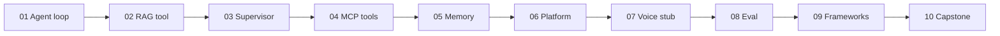

> **АРХІВ.** Це попередній план (Cursor), збережений як є для історії. Частину його
> рішень скасовано — див. §2 [дизайн-спеки](2026-08-22-agentic-ai-course-design.md).
> Посилання на `docs/NN-*.md` усередині ведуть на локальні копії статей, яких у
> публічному репозиторії немає (див. [docs/readme.md](../docs/readme.md)).

---

---
name: 10-stage agent lab
overview: "Навчальний Python-репозиторій із 10 етапами за серією «Agentic AI: From Zero to Production»: українські гайди + англійський код, кожен етап — самостійна лабораторна робота, етапи 1–9 накопичують шари, етап 10 збирає e-commerce support agent."
todos:
  - id: scaffold
    content: "Scaffold: root README, pyproject.toml, .env.example, shared/llm.py, stages/01-10 templates"
    status: pending
  - id: stage-01
    content: "Stage 01: ReAct agent loop + weather tool + UA guide"
    status: pending
  - id: stage-02
    content: "Stage 02: RAG tool + decision checklist (FT theory only)"
    status: pending
  - id: stage-03
    content: "Stage 03: LangGraph supervisor + specialists + StateGraph"
    status: pending
  - id: stage-04
    content: "Stage 04: FastMCP server + client wired to agent"
    status: pending
  - id: stage-05
    content: "Stage 05: extract/store/retrieve memory two-session demo"
    status: pending
  - id: stage-06
    content: "Stage 06: FastAPI classifier + 3 mock MCP domains"
    status: pending
  - id: stage-07
    content: "Stage 07: voice pipeline stub + barge-in metrics"
    status: pending
  - id: stage-08
    content: "Stage 08: EvalCase harness + LLM-as-judge report"
    status: pending
  - id: stage-09
    content: "Stage 09: same agent in LangGraph / CrewAI / ADK"
    status: pending
  - id: stage-10
    content: "Stage 10: capstone e-commerce support agent integrating 01-09"
    status: pending
isProject: false
---

=# План: Agentic AI Lab (10 етапів)

## Рішення (зафіксовано)

- **Мова:** українські `README.md` / глосарій / чеклісти; код і імена модулів — англійською (як у статтях).
- **Формат:** курс (теорія → терміни → кроки → завдання → перевірка) + **інкрементальний продукт**, що завершується capstone з Post #10.
- **Стек:** Python 3.11+, OpenAI API (через `.env`), mock/stubs замість реальних Swiggy/voice-scale інфр.
- **Джерела:** оригінали лишаються в [`docs/`](docs/) з URL у frontmatter; етапи **не копіюють** статті verbatim — адаптують ідеї під labs.

## Структура репозиторію

```text
Agentic-AI/
├── README.md                 # карта курсу, setup, порядок етапів
├── docs/                     # оригінальні статті (вже є)
├── .env.example
├── pyproject.toml            # спільні deps; optional extras per stage
├── shared/                   # спільні утиліти (llm client, logging)
│   └── llm.py
└── stages/
    ├── 01-what-is-an-agent/
    ├── 02-rag-vs-finetuning/
    ├── ...
    └── 10-capstone-support-agent/
```

Кожен `stages/NN-*/` містить:

| Файл | Призначення |
|------|-------------|
| `README.md` | UA: мета, глосарій, кроки, посилання на `docs/NN-*.md` |
| `src/` | runnable код етапу |
| `data/` | фікстури (docs для RAG, eval cases) за потреби |
| `exercises.md` | завдання без спойлерів |
| `solutions/` | еталон (новачок спочатку робить сам) |
| `CHECKLIST.md` | «я зрозумів / я запустив / я пояснив» |



## Етапи (що будуємо)

### 01 — Що таке агент
- **Джерело:** [`docs/01-...md`](docs/01-what-is-an-ai-agent-the-simplest-explanation-youll-find.md)
- **Lab:** мінімальний ReAct-цикл з OpenAI function calling + stub `get_weather`; max steps; валідація args.
- **Терміни:** LLM / tools / memory / Plan→Act→Observe / ReAct / single vs multi-agent.
- **Вихід:** CLI `python -m stages.01...` → виклик tool + фінальна відповідь.

### 02 — RAG vs fine-tuning
- **Джерело:** [`docs/02-...md`](docs/02-rag-vs-fine-tuning-which-one-actually-solves-your-problem.md)
- **Lab:** мінімальний RAG (embeddings + cosine, in-memory store з 5–10 policy docs) як tool `search_knowledge_base` для агента з етапу 01. Fine-tuning — **лише теорія + decision checklist** (без реального FT-тренування).
- **Терміни:** embedding, retrieval, grounded answer, RAG vs FT decision framework.
- **Вихід:** Q&A з цитатою джерела з `data/docs/`.

### 03 — Multi-agent router (LangGraph)
- **Джерело:** [`docs/03-...md`](docs/03-build-a-multi-agent-router-with-langgraph-in-30-minutes.md)
- **Lab:** supervisor + `math_expert` + `research_expert`; спочатку `create_supervisor` (або еквівалент), потім ручний `StateGraph` з лічильником round-trips.
- **Терміни:** supervisor, specialist, handoff tools, state schema, revision loop.
- **Вихід:** два сценарії (math / research) з логами маршрутизації.

### 04 — MCP
- **Джерело:** [`docs/04-...md`](docs/04-mcp-protocol-explained-the-new-standard-every-ai-developer-needs-to-know.md)
- **Lab:** FastMCP `weather-server` (tools); клієнт `list_tools` / `call_tool`; підключення до агента як джерела tools.
- **Терміни:** host / client / server; tools / resources / prompts; decoupling integrations.
- **Вихід:** агент викликає weather через MCP, не через локальний dict tools.

### 05 — Memory
- **Джерело:** [`docs/05-...md`](docs/05-memory-in-ai-agents-why-your-agent-forgets-everything-and-how-to-fix-it.md)
- **Lab:** extract → store → retrieve; dict-store; Session A (факти) → Session B (порожня історія, ті самі факти).
- **Терміни:** short/long-term memory, selective memory, context rot.
- **Вихід:** демо двох сесій з `user_id`.

### 06 — Multi-connector platform (mock)
- **Джерело:** [`docs/06-...md`](docs/06-i-built-a-multi-connector-ai-platform-on-a-single-vm-heres-the-real-architecture.md)
- **Lab:** FastAPI entry + lightweight intent classifier → 3 specialist agents (food / grocery / booking) → 3 mock MCP servers; коректний парсинг tool results (stringified JSON). Без GCP/systemd у коді — лише короткий розділ «як би в проді».
- **Терміни:** intent classifier vs full supervisor, few well-designed tools, observability vs quality.
- **Вихід:** `POST /chat` з трьома доменами на stub-даних.

### 07 — Voice (навчальний stub)
- **Джерело:** [`docs/07-...md`](docs/07-voice-agents-at-scale-what-breaks-when-millions-of-people-talk-to-your-ai.md)
- **Lab:** симульований pipeline VAD→STT→LLM→TTS (файли/таймінги замість мільйонів юзерів); barge-in (interrupt mid-TTS); метрики time-to-first-audio, p50/p95.
- **Терміни:** E2E latency ~600ms, streaming, barge-in, containment.
- **Вихід:** скрипт симуляції + звіт метрик (не production voice stack).

### 08 — Evaluation
- **Джерело:** [`docs/08-...md`](docs/08-agent-evaluation-how-do-you-know-your-agent-actually-works.md)
- **Lab:** `EvalCase` suite над агентом з 01/06; deterministic tool check + LLM-as-judge; offline report.
- **Терміни:** path vs destination, trajectory/component/E2E, LLM-as-judge biases, offline vs online.
- **Вихід:** `eval_report.json` з tool accuracy + task success %.

### 09 — LangGraph vs CrewAI vs ADK
- **Джерело:** [`docs/09-...md`](docs/09-langgraph-vs-crewai-vs-google-adk-i-built-the-same-agent-three-times.md)
- **Lab:** один і той самий research→writer task у трьох фреймворках (мінімальні реалізації); порівняльна таблиця в README. ADK — якщо deps/ключі доступні, інакше skeleton + примітка «потребує Google credentials».
- **Терміни:** explicit vs implicit coordination, checkpointing, A2A (огляд).
- **Вихід:** три runnable entrypoints + decision checklist.

### 10 — Capstone: Customer Support Agent
- **Джерело:** [`docs/10-...md`](docs/10-the-capstone-building-one-real-agent-with-everything-from-this-series.md)
- **Lab (збирає все):**
  1. Intent classifier: `order_status` | `returns` | `general_inquiry`
  2. RAG над product/policy docs
  3. FastMCP tools: `get_order_status`, `initiate_return` (stubs)
  4. Selective customer memory
  5. LangGraph (або чистий router) + FastAPI
  6. Eval suite з етапу 08 на цьому агенті
  7. Voice — опційний stub з етапу 07
- **Вихід:** один сервіс, який новачок може прогнати end-to-end за чеклістом.

## Порядок впровадження (коли перейдемо від плану до коду)

1. **Scaffold:** root README, `pyproject.toml`, `.env.example`, `shared/llm.py`, порожні `stages/01..10` з шаблоном README.
2. **Послідовно 01 → 10:** код lab → exercises → solutions → checklist; після кожного етапу — smoke-run (де можливо без ключа: dry-run / mock mode).
3. **Capstone** тягне імпорти/патерни з попередніх `stages/*/src` (або копіює спрощені модулі в `stages/10/.../lib`, щоб етапи лишались runnable окремо).
4. **Фінальний README:** learning path, estimated time per stage, glossary index, посилання на Medium originals у `docs/`.

## Правила навчання (для всіх етапів)

- Кожен README починається з «що ти зможеш зробити після цього етапу» + посилання на оригінал у `docs/`.
- Спочатку stub/mock tools — реальні API лише як optional stretch.
- Обов’язковий `max_steps` / termination у всіх agent loops.
- Secrets тільки через `.env`; ніколи в git.
- Не дублювати повний текст статей — переказувати ідеї + labs.

## Поза scope (свідомо)

- Fine-tuning GPU pipeline, реальні food/grocery APIs, GCP VM + systemd, Prometheus/ELK, мільйони voice-користувачів, повний A2A.
- Ці теми лишаються в README як «production notes» з посиланням на відповідний `docs/NN`.
