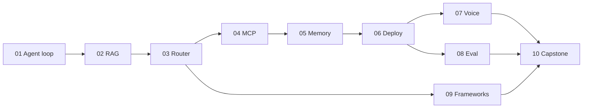

# Design: the teaching-and-production repository "Agentic AI: From Zero to Production"

- **Date:** 2026-08-22
- **Status:** for approval
- **Source:** the ten articles of the series in [`docs/`](../docs/)

---

## 1. What this is and who it is for

A repository in which a person who can write a Python function and run a script travels, over
10 stages, from "I have used ChatGPT" to "I deployed an agent on a server and measured how well
it works".

Two modes of existence for one and the same code:

- **teaching** — everything local, free, deterministic, with no API key;
- **production** — the same code on a VM behind HTTPS, with a real LLM, a database, metrics and
  tracing.

**The promise to the reader.** After every stage they have something working that they started
themselves, and they can explain in words *why* it is built that way. After stages 6 and 10 they
have a public HTTPS endpoint they can hit from a phone.

**Audience.** Python at the level of "a function, `import`, `pip install`". Does not know:
embedding, tool-call, state graph, MCP, barge-in, LLM-as-judge.

---

## 2. Changes against the earlier scope

The earlier scope of this course kept deployment out. The requirement "it has to be deployed and
tested under real conditions" overturns three of its decisions; two more changed for reasons of
their own:

| # | Earlier decision | What it became | Why |
|---|---|---|---|
| 1 | "Out of scope: a GCP VM with systemd, Prometheus/ELK" | In scope: a real deployment on a VM, Caddy + HTTPS, Prometheus + Grafana, Langfuse | A direct request for production |
| 2 | Stage 06: "no GCP or systemd in the code — only a section on *how it would be in production*" | Stage 06 is a real service that the reader deploys and hits from outside | The same |
| 3 | Stage 07: "not a production voice stack" | The mock pipeline stays as a **measuring bench**, and beside it a real local STT/TTS, so the reader really does have a conversation | The same |
| 4 | "The OpenAI API through `.env`" | A pluggable OpenAI-compatible shim: Groq / OpenRouter / Ollama / OpenAI | The reader must not hit a payment card at stage 1 |
| 5 | `python -m stages.01...` | `python -m stages.s01_agent_loop.run` | A Python package name cannot start with a digit — the earlier command would not have run |

Carried over **unchanged**: the `stages/NN/` structure with `exercises.md`, `solutions/` and
`CHECKLIST.md`; the rule "do not copy the text of the articles, retell the ideas"; a mandatory
`max_steps` in every loop; secrets only in `.env`; the glossary; `pyproject.toml` with per-stage
extras.

---

## 3. The main structural idea — three acts

The series has a hidden dramaturgy. The plan reproduces it; otherwise the result is 10 unconnected
tutorials.

```
Act I   · Stages 1–5  · WE BUILD      each stage adds a new capability to the agent
Act II  · Stage  6    · WE JOIN       blocks 1–5 become one deployed service
Act III · Stages 7–9  · WE CHECK      latency, measurement, choice of tool
Finale  · Stage  10   · WE REWRITE    cleanly, justifying every decision, and we deploy
```

Stages 7–9 add no functionality. They exist so that the reader stops lying to themselves.



## 4. How each stage relates to its article

Every stage `README.md` has two parts:

1. **The canon** — code the reader recognises from the article (weather, math/research agents). The
   anchor of trust.
2. **The bridge** — the same pattern carried over to the cross-cutting domain. Here the reader
   learns to *carry over* rather than to copy.

The text of the articles is not copied. We retell the ideas in our own words, with a link to the
original in `docs/` and the URL in its frontmatter.

**The cross-cutting domain is `NovaShop`,** an online shop: orders, returns, policies, catalogue.
Chosen because article 10 chooses it itself — so stage 10 is not a surprise but an assembly of
familiar pieces.

---

## 5. Five architectural decisions

### 5.1 One codebase, two profiles — not two codebases

`APP_PROFILE=local|prod` switches **adapters**, not branches of code. This is the main decision of
the whole repository: a "teaching version" and a "production version" as separate trees would have
diverged within two weeks, and the reader would be learning from code nobody ever deployed.

| Subsystem | `local` | `prod` |
|---|---|---|
| LLM | `FakeLLM` in `check`; Ollama or Groq in `run` | Groq / OpenRouter / OpenAI / Anthropic |
| Embeddings | hash-deterministic / `fastembed` | `fastembed` on the server / OpenAI |
| Vector store | in-memory NumPy | Postgres + `pgvector` |
| Memory store | a dict in the process | Postgres + Redis |
| STT / TTS | a mock with controlled delay | `faster-whisper` + `piper` locally on the VM |
| Trace | JSONL in `traces/` | Langfuse (self-hosted) |
| Metrics | a log | `/metrics` → Prometheus → Grafana |
| Auth / rate limit | off | API key + a Redis token bucket |

### 5.2 `shared/trace.py` exists from stage 1, not from stage 8

Article 6 repents outright: *"I'd instrument tracing before the system got complex, not after"*. We
do that literally. Every stage writes its steps into the trace. The consequence: stage 8
(evaluation) needs nothing rewritten — the data has been accumulating since day one. On their own
repository the reader feels why that piece of advice costs money.

### 5.3 `shared/fake_llm.py` — and every `check.py` runs on it

`python scripts/check_all.py` passes green **with no API key at all**, offline, in seconds. A real
run is separate, through `run.py`.

The fake LLM is not a mock for a test's sake but a teaching instrument: only with it can you write
a check on a **failure mode** rather than only on the happy path. A fake that *always* asks for
another tool-call proves that the step limit works. With a real LLM you cannot write that check —
it is not deterministic.

The same goes for the deterministic hash embedder at stage 2: retrieval becomes testable, and the
reader sees that RAG is sorting by a dot product rather than magic.

### 5.4 The stages are self-contained; the capstone imports rather than copies

Stages 1–9 deliberately duplicate a little code between them — the reader has to be able to start
at stage 5 without doing 1–4. Stage 10 instead **imports** the mature modules: that is the lesson
about how teaching code differs from production code.

### 5.5 Boring infrastructure on purpose

One VM, `docker compose`, Caddy for TLS. No Kubernetes. This is not a compromise — it is the direct
conclusion of article 6 ("boring on purpose"), and the reader has to see that production begins
right here rather than with a cluster.

---

## 6. Repository structure

```text
Agentic-AI/
├── README.md                  entry point, course map, order of the stages
├── CURRICULUM.md              the programme, dependencies, time estimates, status
├── GLOSSARY.md                terms, each linked to the stage that introduces it
├── SETUP.md                   venv, .env, choosing a provider, "how to check"
├── SECURITY.md                the threat model of a public endpoint
├── pyproject.toml             one package, per-stage extras
├── .env.example
├── docs/                      the original ten articles — read-only
├── planning/                  this specification + the implementation plan
├── shared/
│   ├── config.py              profiles, reading .env
│   ├── llm.py                 the OpenAI-compatible shim (base_url from .env)
│   ├── fake_llm.py            the deterministic fake for check.py
│   ├── embeddings.py          hash / fastembed / openai
│   ├── trace.py               the step tracer (JSONL | Langfuse)
│   └── stores/                memory · vector (in-memory | postgres)
├── stages/
│   ├── s01_agent_loop/
│   │   ├── README.md          the lesson: canon + bridge
│   │   ├── exercises.md       tasks with no spoilers
│   │   ├── solutions/         reference solutions
│   │   ├── CHECKLIST.md       "I understood / I ran / I explained"
│   │   ├── __init__.py
│   │   ├── agent.py tools.py  the stage code — right in the package, not in src/
│   │   ├── run.py             the demo: python -m stages.s01_agent_loop.run
│   │   ├── check.py           a self-check on fake_llm, offline, with no key
│   │   ├── data/              fixtures
│   │   └── solutions/         reference solutions to the exercises
│   ├── s02_rag/  s03_router/  s04_mcp/  s05_memory/
│   ├── s06_platform/  s07_voice/  s08_eval/  s09_frameworks/
│   └── s10_capstone/
├── deploy/
│   ├── Dockerfile
│   ├── docker-compose.yml           dev: app + postgres + redis
│   ├── docker-compose.prod.yml      + caddy; the observability / langfuse profiles
│   ├── Caddyfile
│   ├── systemd/                     the alternative without Docker (as in article 6)
│   ├── prometheus/ grafana/         configs and the dashboard
│   ├── .env.prod.example
│   ├── RUNBOOK.md                   from a clean Ubuntu VM to live HTTPS
│   ├── smoke.sh                     a check against the real URL
│   └── loadtest/                    the locust scenario
├── scripts/
│   ├── check_all.py                 every check.py in sequence
│   └── migrate.py                   applies the numbered .sql files
└── .github/workflows/ci.yml         check_all on the fake providers + an image build
```

**Why `s01_`, not `01-`:** a Python package name cannot start with a digit, and a hyphen is
forbidden inside it. `python -m stages.s01_agent_loop.run` works; `stages.01-...` does not.

---

## 7. Technology stack

| Layer | Choice | Why this one |
|---|---|---|
| Language | Python 3.11+ | the articles are in Python |
| Package | `pyproject.toml`, extras `[s03]`, `[s09]`, `[voice]`, `[prod]` | one installable library → stage 10 imports stages 1–9 |
| LLM SDK | `openai` | one client covers OpenAI, Groq, OpenRouter, Ollama and LM Studio through `base_url` |
| Embeddings | `fastembed` | ONNX, no torch, runs on CPU, ~50 MB against ~2 GB |
| Web | FastAPI + uvicorn | article 6 |
| Scheduler | APScheduler | needed in order to **reproduce the trap** with several workers |
| Database | Postgres 16 + `pgvector` | one database instead of "Postgres plus a separate vector service" |
| Cache / limits | Redis 7 | the rate limit and the budget have to work across workers |
| Migrations | numbered `.sql` files + a 20-line runner | Alembic — when the schema starts changing often; for now it is an extra layer |
| TLS | Caddy | automatic Let's Encrypt, a five-line config |
| Tracing | our own JSONL → Langfuse | article 6 |
| Metrics | `prometheus-client` → Prometheus → Grafana | article 6 |
| Voice locally | `faster-whisper` (STT) + `piper` (TTS) | CPU-capable, free |
| Voice transport | WebSocket + the browser microphone | telephony costs money; a browser gives a real conversation for free |
| Frameworks (stage 9) | `langgraph`, `crewai`, `google-adk` (behind a flag) | article 9 |
| Load | `locust` | installs through pip, no separate binary |
| Checks | `assert` in `check.py` + `scripts/check_all.py` | no test framework; pytest — when the need appears |

---

## 8. The production track

### 8.1 Deployment

The reader deploys **twice**: at stage 6 for the first time and unsure of themselves, at stage 10
knowingly.

Target configuration: one Ubuntu 22.04/24.04 VM, ≥4 GB RAM (~€4–8/month), any provider.
`RUNBOOK.md` is provider-agnostic, with short notes for Hetzner and GCP.

`docker compose` has three profiles, so the reader switches on only what their VM can carry:

| Profile | Services | RAM |
|---|---|---|
| `core` | app, postgres, redis, caddy | ~2 GB |
| `observability` | + prometheus, grafana | ~3 GB |
| `full` | + langfuse | ~6 GB |

The systemd variant without Docker is described and placed in `deploy/systemd/` — that is exactly
what article 6 does, and the reader has to see both paths.

### 8.2 Security is not optional

A public endpoint that spends tokens is a bill and an abuse vector. In the base delivery:

- **Authentication:** `X-API-Key`, keys from `.env`, compared through `secrets.compare_digest`.
- **Rate limit:** a token bucket in Redis, per key and per IP.
- **Budget breaker:** a cost limit per session and per day, with the counter in Redis; exceeding it
  means a refusal, not a silent bill.
- **Input limits:** a maximum message length, a maximum audio duration.
- **CORS** only for the configured origins.
- **`docs_url=None`** in the `prod` profile — no open Swagger anywhere.
- **A human-in-the-loop gate** for irreversible tools (`initiate_return`) — straight from failure
  mode #3 of article 1.
- **Secrets** only in `.env` outside git; `chmod 600`; `.env.prod.example` as the template.

`SECURITY.md` describes the threat model in plain language — that too is part of the teaching.

### 8.3 Observability

Two different things, as article 6 insists:

- **Prometheus + Grafana** — *is the system healthy*: RPS, latency, errors, RAM.
- **Langfuse** — *why the agent decided that way*: the trace of steps, the chosen tool, tokens, cost.

The reader sees both dashboards and states the difference in their own words — that is the criterion
for passing stage 6.

---

## 9. The ten stages

Notation: **B** — what we build, **T** — what it teaches, **C** — the critical check in `check.py`.

### s01 — Agent loop
- **B:** a ReAct loop from scratch, no framework. Argument validation against a JSON schema, a step
  limit, a human-in-the-loop gate for irreversible actions. Canon: `get_weather`. Bridge:
  `get_order_status`.
- **T:** why an LLM does not execute functions itself; the anatomy of a `tool_call`; the three
  failure modes from the article.
- **C:** a fake that loops forever → proves the step limit fires; a fake with malformed arguments →
  proves the validation catches them.

### s02 — RAG
- **B:** embed → cosine → top-k → stuff → generate; chunking; citing the source. `DECISION.md` — the
  "RAG or fine-tune" tree from the article as a working checklist.
- **T:** an embedding as "a mathematical fingerprint of meaning"; why chunking changes the answers;
  why provenance matters.
- **C:** a deterministic embedder → for "how many days do I have to return this" the top-1 is the
  returns policy; the answer carries a link to its source.

### s03 — Router
- **B:** first **our own mini-graph in about 60 lines**, then the same result on LangGraph. The
  state schema is designed deliberately, with a round-trip counter in the state.
- **T:** a supervisor is an agent whose tools are other agents; why the state schema is the most
  expensive decision to change; when a supervisor is redundant.
- **C:** 6 requests → the right specialists; the revision loop stops at its limit.

### s04 — MCP
- **B:** an MCP server plus a stdio client; the stage 3 agent moves from local functions to MCP.
  Explicit state through IDs in the payload (the stateless specification).
- **T:** host/client/server; tools/resources/prompts; why `list_tools()` makes an integration
  discoverable; why "fewer well-designed tools" beats "a map of every endpoint".
- **C:** the server in a subprocess: `list_tools` → `call_tool`; the parser ignores narration blocks
  and runs `json.loads` on `mcp_tool_result` — the exact trap from article 6.

### s05 — Memory
- **B:** short-term (a window plus summarisation on overflow) and long-term (extract → store →
  retrieve), first on a dict and then with semantic search on the stage 2 embedder.
- **T:** "store everything" = context rot; deduplication and conflicting facts; TTL.
- **C:** two "sessions": a fact from the first is available in the second **and** an irrelevant fact
  did NOT reach the context — that checks selectivity rather than mere storage.

### s06 — Integration & Deploy ← the first real deployment
- **B:** FastAPI joins 1–5: classifier → agent → MCP tools → memory → trace. Auth, rate limit,
  budget, `/healthz`, `/metrics`. `docker compose` + Caddy + HTTPS on a VM. The APScheduler trap is
  demonstrated on **two real workers**, then the scheduler is moved into a separate process.
- **T:** classifier vs supervisor — a real trade-off, not dogma; why Prometheus does not answer the
  question "why did the agent decide that"; why `--workers 2` broke the job.
- **C:** `TestClient`: 3 requests → 3 different branches; the trace holds the expected nodes. After
  deployment — `deploy/smoke.sh` against the real URL.

### s07 — Voice
- **B:** the same pipeline twice: batch → we measure; streaming → we measure. Barge-in with a VAD
  threshold and a minimum duration. Async prefetch for a slow tool. Real mode: the browser
  microphone → WebSocket → `faster-whisper` → LLM → `piper`.
- **T:** where the 600 ms comes from; time-to-first-audio; why p95 matters more than the mean; the
  price of a synchronous tool-call inside voice.
- **C:** time-to-first-audio in streaming is at least **twice** lower than in batch (expected
  ~1500 ms against ~400 ms on the default mock delays); 100 ms of noise does not interrupt, 300 ms
  of speech does.

### s08 — Evaluation
- **B:** a harness on 3 levels **over the traces from stage 1**. ~20 cases, edge cases included. A
  deterministic check plus LLM-as-judge. Length and position bias are demonstrated **live on our own
  data**. Online sampling of 10% of the real traffic from the deployed stage 6 service.
- **T:** the path matters more than the destination; when a model judge is justified and when it is
  an expensive replacement for `==`.
- **C:** swapping the order of the answers really does change the judge's verdict — the reader sees
  the bias on their own data rather than reading about it.

### s09 — Frameworks
- **B:** one task (research → writer) three times: LangGraph / CrewAI / ADK (behind a flag). We
  measure tokens and lines of code → `COMPARISON.md` with **our own** numbers.
- **T:** explicit vs implicit coordination; a framework is scaffolding, not architecture.
- **C:** a smoke test of every implementation; ADK is skipped without its dependency rather than
  failing.

### s10 — Capstone ← the second deployment, a knowing one
- **B:** a clean support agent that **imports** the mature modules. The full production wrap: auth,
  limits, budget, metrics, tracing, a database backup, CI. Voice is an optional adapter. A `locust`
  load test against the live URL, a Grafana dashboard. `ARCHITECTURE.md` justifies **every** decision
  with a citation of its source stage.
- **T:** judgement rather than facts — that is the final claim of article 10.
- **C:** e2e on the fake, 5 scenarios: the right branch + the right final state. After deployment —
  smoke plus a load run with the p50/p95 pinned.

---

## 10. Language

**Everything committed to this repository is written in English** — lessons, READMEs, the glossary,
specifications, ADRs, docstrings, explanatory comments, reader-facing messages including check
failures, and commit messages. A repository read by people who do not share one language is read in
English or not at all.

Ukrainian is not forbidden; it is simply not what gets committed. Drafts and working notes stay in
whatever language suits their author — nothing outside version control is bound by this rule.

This replaces the earlier bilingual arrangement, in which the prose was Ukrainian and English
mirrors carried navigation. That is why the `.en` mirror files are deleted rather than maintained in
parallel: a second translation always lags, and the reader ends up trusting neither. The decision
and its reasoning:
[ADR-0008](../docs/adr/0008-english-is-the-only-language-in-the-repository.md).

---

## 11. Definition of Done for a stage

A stage counts as finished when **every** item holds:

1. `README.md`: "what you will be able to do after this stage" → the canon → the bridge → "what to
   break".
2. `README.md` opens with an orientation block that fits one screen.
3. `python -m stages.sNN_slug.run` runs on the `local` profile with no API key.
4. `python -m stages.sNN_slug.check` is green offline, and among the checks there is **at least one
   on a failure mode**, not only on the happy path.
5. `exercises.md` — 3–4 tasks with an expected result; `solutions/` — the references.
6. `CHECKLIST.md` — "I understood / I ran / I explained".
7. New terms added to `GLOSSARY.md` with a link to this stage.
8. The stage status updated in `CURRICULUM.md`.
9. For stages 6 and 10 additionally: `deploy/smoke.sh` passes against the real URL.

---

## 12. Risks and mitigations

| Risk | Mitigation |
|---|---|
| The VM cannot carry Postgres+Redis+Langfuse+Prometheus+Grafana+app | Three compose profiles (`core` / `observability` / `full`); `RUNBOOK` names the RAM for each |
| A local Whisper on CPU is slow | That is not a bug of the lesson but its content: the reader sees why streaming is critical. In the `README` — an honest warning and the expected numbers |
| The Groq free tier has request limits | `check_all.py` does not go to the network at all, so CI does not depend on a vendor |
| CrewAI / LangGraph break their API between versions | Versions are pinned in `pyproject.toml`; the smoke test in `check.py` catches a break early |
| Google ADK needs credentials | Behind a feature flag; `check.py` skips rather than fails |
| The articles were written against MCP specification `2026-07-28` | Before stage 4 we reconcile with the current specification; in the `README` — an "as of this date" marker |
| The public endpoint is abused and generates a bill | A budget breaker plus a rate limit in the base delivery, before the first deployment (§8.2) |
| Volume: 10 stages × (lesson + code + exercises + solutions + check) | The stages are independent; we implement strictly one at a time, and each is closed per §11 before the next begins |

---

## 13. Out of scope (deliberately)

- Training or fine-tuning models. Stage 2 teaches how to **choose** between RAG and fine-tuning,
  not how to fine-tune.
- Kubernetes, autoscaling, multi-region. Article 6 argues against them outright at this scale.
- Telephony (Twilio) — it stays as a documented extension point in stage 7.
- Paid managed databases and managed observability — everything is self-hosted on one VM.
- Real third-party APIs (Swiggy and the like) — replaced by `NovaShop` with stable fixtures.
- The full A2A protocol — surveyed in stage 9, not implemented.

---

## 14. Source material — closed

**Decided and done.** There are no copies of other people's articles in the repository — they have
been removed entirely. Only our own code goes into the public repository; our own articles live in
the blog repository, and only links lead from here to them.

For every stage a **separate** article of our own was written — our own code, our own numbers, our
own conclusions — and all ten are listed in [`docs/readme.md`](../docs/readme.md). The links in the
repository lead to those, not to anything external.

The articles' numbers are reconciled against the code by `scripts/article_check.py` — at the tag the
article names. The question of rights is now closed completely: there is nothing left to mirror.
