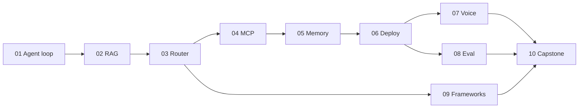

# Дизайн: навчально-продакшн репозиторій «Agentic AI: From Zero to Production»

- **Дата:** 2026-08-22
- **Статус:** на затвердження
- **Джерело:** 10 статей серії у [`docs/`](../docs/)
- **Попередній план:** `.cursor/plans/10-stage_agent_lab_4a43fc0d.plan.md` — частково скасований, див. §2

---

## 1. Що це і для кого

Репозиторій, у якому людина, що вміє написати функцію на Python і запустити скрипт,
за 10 етапів проходить шлях від «я користувався ChatGPT» до «я задеплоїв агента на
сервер і виміряв, наскільки він працює».

Два режими існування одного й того самого коду:

- **навчальний** — усе локально, безкоштовно, детерміновано, без API-ключа;
- **продакшн** — той самий код на VM за HTTPS, з реальним LLM, БД, метриками й трасуванням.

**Обіцянка читачеві.** Після кожного етапу він має щось робоче, що запустив сам, і може
словами пояснити, *чому* воно так влаштоване. Після етапів 6 і 10 — має публічний
HTTPS-ендпоінт, у який можна постукати з телефону.

**Аудиторія.** Python на рівні «функція, `import`, `pip install`». Не знає: embedding,
tool-call, state graph, MCP, barge-in, LLM-as-judge.

---

## 2. Зміни відносно попереднього плану (`.cursor/plans/...`)

Попередній план залишається основою. Вимога «має деплоїтись і тестуватись у реальних
умовах» скасовує три його рішення:

| # | Було в `.cursor`-плані | Стало | Причина |
|---|---|---|---|
| 1 | «Поза scope: GCP VM + systemd, Prometheus/ELK» | У scope: реальний деплой на VM, Caddy+HTTPS, Prometheus+Grafana, Langfuse | Прямий запит на продакшн |
| 2 | Етап 06: «Без GCP/systemd у коді — лише розділ *як би в проді*» | Етап 06 — справжній сервіс, який читач деплоїть і б'є ззовні | Те саме |
| 3 | Етап 07: «не production voice stack» | Мок-конвеєр лишається як **вимірювальний стенд**, поруч — реальний локальний STT/TTS, щоб читач справді поговорив | Те саме |
| 4 | «OpenAI API через `.env`» | Pluggable OpenAI-сумісний шим: Groq / OpenRouter / Ollama / OpenAI | Читач не має упиратись у платіжну картку на етапі 1 |
| 5 | `python -m stages.01...` | `python -m stages.s01_agent_loop.run` | Ім'я Python-пакета не може починатись із цифри — попередня команда не запустилась би |

Зі старого плану **беремо без змін**: структуру `stages/NN/` з `exercises.md`,
`solutions/`, `CHECKLIST.md`; правило «не копіювати текст статей, а переказувати ідеї»;
обов'язковий `max_steps` у кожному циклі; секрети лише в `.env`; глосарій;
`pyproject.toml` з extras на етап.

---

## 3. Головна структурна ідея — три акти

Серія має приховану драматургію. План її відтворює, інакше вийдуть 10 незв'язаних туторіалів.

```
Акт I   · Етапи 1–5  · БУДУЄМО      кожен етап додає нову здатність агенту
Акт II  · Етап  6    · ЗШИВАЄМО     блоки 1–5 стають одним задеплоєним сервісом
Акт III · Етапи 7–9  · ПЕРЕВІРЯЄМО  латентність, вимірювання, вибір інструмента
Фінал   · Етап  10   · ПЕРЕПИСУЄМО  чисто, з обґрунтуванням кожного рішення, і деплоїмо
```

Етапи 7–9 не додають функціоналу. Вони існують, щоб читач перестав собі брехати.



## 4. Як кожен етап стосується своєї статті

Кожен `README.md` етапу має дві частини:

1. **Канон** — код, який читач упізнає зі статті (погода, math/research-агенти). Якір довіри.
2. **Міст** — той самий патерн, перенесений на наскрізний домен. Тут читач вчиться
   *переносити*, а не копіювати.

Текст статей не копіюється. Переказуємо ідеї своїми словами, з посиланням на оригінал
у `docs/` та URL у його frontmatter.

**Наскрізний домен — `NovaShop`,** інтернет-магазин: замовлення, повернення, політики,
каталог. Обрано тому, що стаття 10 сама його обирає — тож етап 10 не сюрприз, а збірка
знайомих деталей.

---

## 5. П'ять архітектурних рішень

### 5.1 Один код, два профілі — не дві кодові бази

`APP_PROFILE=local|prod` перемикає **адаптери**, не гілки коду. Це головне рішення
всього репозиторію: «навчальна версія» і «продакшн-версія» як окремі дерева розійшлися б
за два тижні, і читач вчився б на коді, який ніколи не деплоїли.

| Підсистема | `local` | `prod` |
|---|---|---|
| LLM | `FakeLLM` у `check`; Ollama або Groq у `run` | Groq / OpenRouter / OpenAI / Anthropic |
| Embeddings | hash-детермінований / `fastembed` | `fastembed` на сервері / OpenAI |
| Vector store | in-memory NumPy | Postgres + `pgvector` |
| Memory store | dict у процесі | Postgres + Redis |
| STT / TTS | мок із керованою затримкою | `faster-whisper` + `piper` локально на VM |
| Trace | JSONL у `traces/` | Langfuse (self-hosted) |
| Metrics | лог | `/metrics` → Prometheus → Grafana |
| Auth / rate limit | вимкнено | API-key + Redis token bucket |

### 5.2 `shared/trace.py` існує з етапу 1, а не з етапу 8

Стаття 6 прямо кається: *«I'd instrument tracing before the system got complex, not
after»*. Виконуємо буквально. Кожен етап пише кроки в трейс. Наслідок: етап 8
(evaluation) не потребує переписування нічого — дані вже накопичені з першого дня.
Читач на власному репозиторії відчуває, чому ця порада коштує грошей.

### 5.3 `shared/fake_llm.py` — і кожен `check.py` працює на ньому

`python scripts/check_all.py` проходить зелено **без жодного API-ключа**, офлайн, за
секунди. Реальний прогін — окремо, через `run.py`.

Фейковий LLM — не мок заради тесту, а дидактичний інструмент: він дає змогу написати
перевірку на **режим відмови**, а не лише на щасливий шлях. Фейк, що *завжди* просить
черговий tool-call, доводить, що ліміт кроків працює. Справжнім LLM таку перевірку не
напишеш — він недетермінований.

Те саме з детермінованим hash-ембеддером на етапі 2: retrieval стає тестованим, і читач
бачить, що RAG — це сортування за скалярним добутком, а не магія.

### 5.4 Етапи самодостатні; capstone імпортує, а не копіює

Етапи 1–9 навмисне дублюють трохи коду між собою — читач має могти почати з етапу 5, не
проходячи 1–4. Етап 10 натомість **імпортує** зрілі модулі: це і є урок про те, чим
навчальний код відрізняється від продакшн-коду.

### 5.5 Нудна інфраструктура навмисне

Одна VM, `docker compose`, Caddy для TLS. Ніякого Kubernetes. Це не компроміс — це
прямий висновок статті 6 («boring on purpose»), і читач має побачити, що продакшн
починається саме тут, а не з кластера.

---

## 6. Структура репозиторію

```text
Agentic-AI/
├── README.md                  UA — вхід, карта курсу, порядок етапів
├── README.en.md               EN — дзеркало
├── CURRICULUM.md              UA — програма, залежності, оцінка часу, статус
├── GLOSSARY.md                UA+EN — терміни з посиланням на етап, де вводяться
├── SETUP.md                   UA — venv, .env, вибір провайдера, «як перевірити»
├── SECURITY.md                UA — модель загроз публічного ендпоінта
├── pyproject.toml             один пакет, extras на етап
├── .env.example
├── docs/                      оригінальні 10 статей — read-only
├── planning/                  ця спека + план імплементації
├── shared/
│   ├── config.py              профілі, читання .env
│   ├── llm.py                 OpenAI-сумісний шим (base_url з .env)
│   ├── fake_llm.py            детермінований фейк для check.py
│   ├── embeddings.py          hash / fastembed / openai
│   ├── trace.py               трасувальник кроків (JSONL | Langfuse)
│   └── stores/                memory · vector (in-memory | postgres)
├── stages/
│   ├── s01_agent_loop/
│   │   ├── README.md          UA — урок: канон + міст
│   │   ├── README.en.md       EN — 1 екран: що це, як запустити, чого навчить
│   │   ├── exercises.md       UA — завдання без спойлерів
│   │   ├── solutions/         еталонні розв'язки
│   │   ├── CHECKLIST.md       «я зрозумів / я запустив / я пояснив»
│   │   ├── __init__.py
│   │   ├── agent.py tools.py  код етапу — прямо в пакеті, не в src/
│   │   ├── run.py             демо: python -m stages.s01_agent_loop.run
│   │   ├── check.py           self-check на fake_llm, офлайн, без ключа
│   │   ├── data/              фікстури
│   │   └── solutions/         еталонні розв'язки вправ
│   ├── s02_rag/  s03_router/  s04_mcp/  s05_memory/
│   ├── s06_platform/  s07_voice/  s08_eval/  s09_frameworks/
│   └── s10_capstone/
├── deploy/
│   ├── Dockerfile
│   ├── docker-compose.yml           dev: app + postgres + redis
│   ├── docker-compose.prod.yml      + caddy; профілі observability / langfuse
│   ├── Caddyfile
│   ├── systemd/                     альтернатива без Docker (як у статті 6)
│   ├── prometheus/ grafana/         конфіги й дашборд
│   ├── .env.prod.example
│   ├── RUNBOOK.md                   від чистої Ubuntu VM до живого HTTPS
│   ├── smoke.sh                     перевірка проти реального URL
│   └── loadtest/                    locust-сценарій
├── scripts/
│   ├── check_all.py                 усі check.py послідовно
│   └── migrate.py                   застосовує пронумеровані .sql
└── .github/workflows/ci.yml         check_all на fake-провайдерах + збірка образу
```

**Чому `s01_`, а не `01-`:** ім'я Python-пакета не може починатися з цифри, а дефіс у
ньому заборонений. `python -m stages.s01_agent_loop.run` працює; `stages.01-...` — ні.

---

## 7. Технологічний стек

| Шар | Вибір | Чому саме він |
|---|---|---|
| Мова | Python 3.11+ | статті на Python |
| Пакет | `pyproject.toml`, extras `[s03]`, `[s09]`, `[voice]`, `[prod]` | одна встановлювана бібліотека → етап 10 імпортує етапи 1–9 |
| LLM SDK | `openai` | один клієнт покриває OpenAI, Groq, OpenRouter, Ollama, LM Studio через `base_url` |
| Embeddings | `fastembed` | ONNX, без torch, працює на CPU, ~50 МБ проти ~2 ГБ |
| Web | FastAPI + uvicorn | стаття 6 |
| Планувальник | APScheduler | потрібен, щоб **відтворити пастку** з кількома воркерами |
| БД | Postgres 16 + `pgvector` | одна БД замість «Postgres + окремий векторний сервіс» |
| Кеш / ліміти | Redis 7 | rate limit і бюджет мають працювати між воркерами |
| Міграції | пронумеровані `.sql` + 20-рядковий раннер | Alembic — коли схема почне часто змінюватись; поки що зайвий шар |
| TLS | Caddy | автоматичний Let's Encrypt, конфіг на 5 рядків |
| Трасування | власний JSONL → Langfuse | стаття 6 |
| Метрики | `prometheus-client` → Prometheus → Grafana | стаття 6 |
| Голос локально | `faster-whisper` (STT) + `piper` (TTS) | CPU-придатні, безкоштовні |
| Голосовий транспорт | WebSocket + мікрофон у браузері | телефонія коштує; браузер дає справжню розмову безкоштовно |
| Фреймворки (етап 9) | `langgraph`, `crewai`, `google-adk` (за флагом) | стаття 9 |
| Навантаження | `locust` | ставиться через pip, без окремого бінарника |
| Перевірки | `assert` у `check.py` + `scripts/check_all.py` | без тест-фреймворка; pytest — коли з'явиться потреба |

---

## 8. Продакшн-трек

### 8.1 Деплой

Читач деплоїть **двічі**: на етапі 6 — вперше й невпевнено, на етапі 10 — усвідомлено.

Цільова конфігурація: одна Ubuntu 22.04/24.04 VM, ≥4 ГБ RAM (~€4–8/міс), будь-який
провайдер. `RUNBOOK.md` — провайдер-агностичний, з короткими нотатками для Hetzner і GCP.

`docker compose` має три профілі, щоб читач вмикав лише те, що тягне його VM:

| Профіль | Сервіси | RAM |
|---|---|---|
| `core` | app, postgres, redis, caddy | ~2 ГБ |
| `observability` | + prometheus, grafana | ~3 ГБ |
| `full` | + langfuse | ~6 ГБ |

Systemd-варіант без Docker описаний і покладений у `deploy/systemd/` — саме так робить
стаття 6, і читач має побачити обидва шляхи.

### 8.2 Безпека — не опційна

Публічний ендпоінт, що витрачає токени, — це рахунок і зловживання. У базовій поставці:

- **Автентифікація:** `X-API-Key`, ключі з `.env`, порівняння через `secrets.compare_digest`.
- **Rate limit:** token bucket у Redis, на ключ і на IP.
- **Бюджетний запобіжник:** ліміт вартості на сесію та на добу, лічильник у Redis;
  перевищення → відмова, не мовчазний рахунок.
- **Ліміти вводу:** максимальна довжина повідомлення, максимальна тривалість аудіо.
- **CORS** лише на налаштовані origin.
- **`docs_url=None`** у профілі `prod` — жодного відкритого Swagger.
- **HITL-гейт** для незворотних інструментів (`initiate_return`) — прямо з режиму
  відмови №3 статті 1.
- **Секрети** лише в `.env` поза git; `chmod 600`; `.env.prod.example` як шаблон.

`SECURITY.md` описує модель загроз простою мовою — це теж частина навчання.

### 8.3 Обсервабельність

Дві різні речі, як наполягає стаття 6:

- **Prometheus + Grafana** — *чи здорова система*: RPS, латентність, помилки, RAM.
- **Langfuse** — *чому агент вирішив саме так*: трейс кроків, обраний інструмент, токени, вартість.

Читач бачить обидва дашборди й формулює різницю власними словами — це критерій
проходження етапу 6.

---

## 9. Десять етапів

Позначення: **Б** — що будуємо, **У** — чого вчить, **П** — критична перевірка в `check.py`.

### s01 — Agent loop
- **Б:** ReAct-цикл з нуля, без фреймворку. Валідація аргументів за JSON-схемою, ліміт
  кроків, HITL-гейт для незворотних дій. Канон: `get_weather`. Міст: `get_order_status`.
- **У:** чому LLM сам не виконує функції; анатомія `tool_call`; три режими відмови зі статті.
- **П:** фейк, що зациклюється, → доводить, що ліміт кроків спрацьовує; фейк із кривими
  аргументами → доводить, що валідація ловить.

### s02 — RAG
- **Б:** embed → cosine → top-k → stuff → generate; чанкінг; цитування джерела.
  `DECISION.md` — дерево «RAG чи fine-tune» зі статті як робочий чекліст.
- **У:** embedding як «математичний відбиток змісту»; чому чанкінг міняє відповіді;
  чому provenance важить.
- **П:** детермінований ембеддер → на «скільки днів на повернення» топ-1 = політика
  повернень; відповідь містить посилання на джерело.

### s03 — Router
- **Б:** спочатку **власний міні-граф на ~60 рядків**, потім той самий результат на
  LangGraph. State-схема проєктується свідомо, лічильник round-trips у стані.
- **У:** supervisor = агент, чиї інструменти — інші агенти; чому state-схема — найдорожче
  для зміни рішення; коли supervisor надлишковий.
- **П:** 6 запитів → правильні спеціалісти; revision-loop зупиняється на ліміті.

### s04 — MCP
- **Б:** MCP-сервер + stdio-клієнт; агент етапу 3 переходить із локальних функцій на
  MCP. Явний стан через ID у payload (stateless-специфікація).
- **У:** host/client/server; tools/resources/prompts; чому `list_tools()` робить інтеграцію
  дискаверабельною; чому «менше добре спроєктованих інструментів» краще за «мапу всіх ендпоінтів».
- **П:** сервер у підпроцесі: `list_tools` → `call_tool`; парсер ігнорує narration-блоки
  і робить `json.loads` на `mcp_tool_result` — точна пастка зі статті 6.

### s05 — Memory
- **Б:** short-term (вікно + сумаризація при переповненні) + long-term
  (extract → store → retrieve), спершу dict, потім семантичний пошук на ембеддерах етапу 2.
- **У:** «зберегти все» = context rot; дедуплікація і конфлікти фактів; TTL.
- **П:** дві «сесії»: факт із першої доступний у другій **і** нерелевантний факт НЕ
  потрапив у контекст — це перевіряє селективність, а не просто збереження.

### s06 — Integration & Deploy ← перший реальний деплой
- **Б:** FastAPI зшиває 1–5: classifier → agent → MCP-tools → memory → trace. Auth,
  rate limit, бюджет, `/healthz`, `/metrics`. `docker compose` + Caddy + HTTPS на VM.
  Пастка APScheduler демонструється на **двох реальних воркерах**, потім планувальник
  виноситься в окремий процес.
- **У:** класифікатор vs supervisor — справжній компроміс, не догма; чому Prometheus не
  відповідає на питання «чому агент так вирішив»; чому `--workers 2` зламав джобу.
- **П:** `TestClient`: 3 запити → 3 різні гілки; трейс містить очікувані вузли.
  Після деплою — `deploy/smoke.sh` проти реального URL.

### s07 — Voice
- **Б:** той самий конвеєр двічі: батчевий → міряємо; стрімінговий → міряємо. Barge-in із
  VAD-порогом і мінімальною тривалістю. Async prefetch для повільного інструмента.
  Реальний режим: мікрофон у браузері → WebSocket → `faster-whisper` → LLM → `piper`.
- **У:** чому 600 мс; time-to-first-audio; чому p95 важливіший за середнє; ціна
  синхронного tool-call у голосі.
- **П:** time-to-first-audio у стрімінгу щонайменше **вдвічі** нижчий за батч
  (очікувано ~1500 мс проти ~400 мс на дефолтних мок-затримках); 100 мс шуму не
  перериває, 300 мс мовлення — перериває.

### s08 — Evaluation
- **Б:** харнес на 3 рівнях **поверх трейсів з етапу 1**. ~20 кейсів, включно з крайніми.
  Детермінований чек + LLM-as-judge. Length- і position-bias демонструються **наживо на
  власних даних**. Online-семплінг 10% реального трафіку з задеплоєного сервісу етапу 6.
- **У:** шлях важливіший за пункт призначення; коли суддя-LLM виправданий, а коли це
  дорога заміна `==`.
- **П:** своп порядку відповідей реально змінює вердикт судді — читач бачить біас на
  своїх даних, а не читає про нього.

### s09 — Frameworks
- **Б:** один таск (research → writer) тричі: LangGraph / CrewAI / ADK (за флагом).
  Міряємо токени й рядки коду → `COMPARISON.md` із **власними** числами.
- **У:** явна vs неявна координація; фреймворк — це риштування, а не архітектура.
- **П:** смоук кожної реалізації; ADK пропускається без залежності, а не падає.

### s10 — Capstone ← другий деплой, усвідомлений
- **Б:** чистий support-агент, що **імпортує** зрілі модулі. Повний продакшн-обвіс:
  auth, ліміти, бюджет, метрики, трасування, бекап БД, CI. Голос — опційний адаптер.
  Навантажувальний тест `locust` проти живого URL, дашборд Grafana.
  `ARCHITECTURE.md` обґрунтовує **кожне** рішення з посиланням на етап-джерело.
- **У:** судження, а не факти — це фінальна теза статті 10.
- **П:** e2e на фейку, 5 сценаріїв: правильна гілка + правильний фінальний стан.
  Після деплою — smoke + навантажувальний прогін із зафіксованими p50/p95.

---

## 10. Двомовність

**Українська — основна.** Англійська — дзеркало для навігації.

| Артефакт | UA | EN |
|---|---|---|
| Кореневий README | `README.md` — повний | `README.en.md` — повний |
| Урок етапу | `README.md` — повний | `README.en.md` — 1 екран: що це, як запустити, чого навчить |
| `CURRICULUM`, `GLOSSARY`, `SETUP`, `SECURITY` | повні | — (глосарій двомовний за побудовою) |
| `RUNBOOK`, `ARCHITECTURE`, `COMPARISON` | повні | — |
| Код, імена файлів, docstrings, комміти | — | англійською |

Дублювати кожне слово двома мовами не будемо: другий переклад завжди відстає, і читач
починає не довіряти обом.

---

## 11. Definition of Done для етапу

Етап вважається завершеним, коли виконано **всі** пункти:

1. `README.md` (UA): «що ти зможеш після цього етапу» → канон → міст → «що зламати».
2. `README.en.md` (EN) — один екран.
3. `python -m stages.sNN_slug.run` запускається на профілі `local` без API-ключа.
4. `python -m stages.sNN_slug.check` зелений офлайн, і серед перевірок є **хоча б одна на
   режим відмови**, а не лише на щасливий шлях.
5. `exercises.md` — 3–4 завдання з очікуваним результатом; `solutions/` — еталони.
6. `CHECKLIST.md` — «я зрозумів / я запустив / я пояснив».
7. Нові терміни додані в `GLOSSARY.md` з посиланням на цей етап.
8. Статус етапу оновлений у `CURRICULUM.md`.
9. Для етапів 6 і 10 додатково: `deploy/smoke.sh` проходить проти реального URL.

---

## 12. Ризики і пом'якшення

| Ризик | Пом'якшення |
|---|---|
| VM не тягне Postgres+Redis+Langfuse+Prometheus+Grafana+app | Три профілі compose (`core` / `observability` / `full`); `RUNBOOK` називає RAM для кожного |
| Локальний Whisper на CPU повільний | Це не баг уроку, а його зміст: читач бачить, чому стрімінг критичний. У `README` — чесне попередження й очікувані числа |
| Free tier Groq має ліміти запитів | `check_all.py` не ходить у мережу взагалі, тож CI не залежить від вендора |
| CrewAI / LangGraph ламають API між версіями | Версії запінені в `pyproject.toml`; смоук у `check.py` ловить розрив рано |
| Google ADK потребує креденшелів | За фіче-флагом; `check.py` пропускає, а не падає |
| Статті писані під MCP-специфікацію `2026-07-28` | Перед етапом 4 звіряємо чинну специфікацію; у `README` — позначка «станом на дату» |
| Публічний ендпоінт зловживається і генерує рахунок | Бюджетний запобіжник + rate limit у базовій поставці, до першого деплою (§8.2) |
| Обсяг: 10 етапів × (урок + код + вправи + рішення + чек) | Етапи незалежні; впроваджуємо строго по одному, кожен закривається за §11 перш ніж почати наступний |

---

## 13. Поза обсягом (свідомо)

- Тренування або файн-тюнінг моделей. Етап 2 вчить **вибирати** між RAG і fine-tuning,
  а не файн-тюнити.
- Kubernetes, автоскейлінг, мультирегіон. Стаття 6 прямо аргументує проти на цьому масштабі.
- Телефонія (Twilio) — лишається як задокументована точка розширення в етапі 7.
- Платні керовані БД і керована обсервабельність — усе self-hosted на одній VM.
- Реальні сторонні API (Swiggy тощо) — замінені на `NovaShop` зі стабільними фікстурами.
- Повний A2A-протокол — оглядово в етапі 9, без реалізації.

---

## 14. Права на матеріал джерела — прапорець

`docs/` містить **повні копії 10 статей** Sai Bhargav Rallapalli з Medium/GoPenAI.
Це нормально, поки репозиторій приватний і використовується як робочий конспект.

Якщо репозиторій публікуватиметься, з цим треба щось зробити — це рішення власника, не
технічне. Три варіанти:

1. Замінити повні тексти на **посилання + власні короткі конспекти** (URL уже є у
   frontmatter кожного файлу). Найбезпечніше і найдешевше.
2. Запитати в автора дозвіл на дзеркалювання і додати його явно у `docs/README.md`.
3. Лишити `docs/` поза публічним репозиторієм (у `.gitignore`), а курс посилатиметься
   на оригінальні URL.

**На дизайн це не впливає:** етапи за правилом §4 і так не копіюють текст, а переказують
ідеї своїми словами. Курс залишиться повноцінним, навіть якщо `docs/` зникне — зміняться
лише посилання «джерело» з локальних на зовнішні.

**Рекомендація:** варіант 1 перед першою публікацією.
